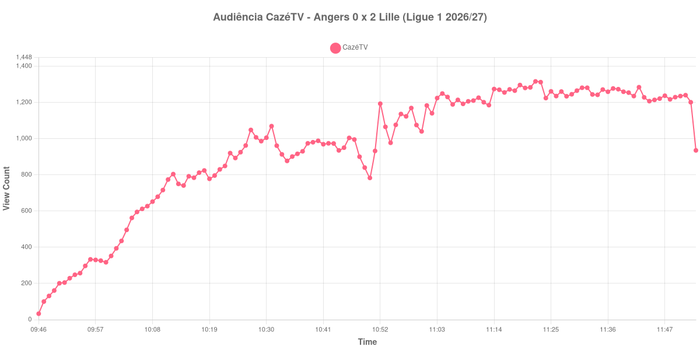

+++
date = 2026-08-24T04:56:00-03:00
draft = false
title = "Confira como foi a audiência de Angers X Lille na CazéTV - 23-08-2026"
author = 'Instituto Cambacica de Audiência'
summary = "Veja como foi a audiência do jogo de domingo pela manhã na CazéTV, com o público praticamente parado durante todo o segundo tempo"
tags = ['YouTube', 'Analytics', 'Audiência', 'CazeTV', 'Angers', 'Lille', 'Ligue 1']
categories = ['Audiência']
canais = ['CazeTV']
campeonatos = ['Ligue 1 2026']
data_evento = 2026-08-23
+++

Neste texto, vamos informar os resultados da audiência em tempo real obtidos pela CazéTV, durante a transmissão de Angers X Lille, jogo da 1ª rodada da Ligue 1 de 2026/27, no Stade Raymond Kopa, em Angers, em 23/08/2026. O Angers, mandante, perdeu por 2 a 0, com gols de Olivier Giroud aos 11 minutos e de Tiago Santos aos 31. O público presente foi de 12.330 pessoas. Pelo fuso, a bola rolou às dez da manhã no horário de Brasília, o que faz desta a partida mais cedo de todo o lote.

A audiência começou a ser medida às 23/08/2026 09:46:55 (Horário de Brasília). Como a coleta começou menos de duas horas antes do apito inicial, o gráfico e os números abaixo partem do primeiro registro disponível; a medição também terminou antes de completar duas horas após o apito final, de modo que o recorte vai até o último dado coletado. Os principais pontos da audiência são (em aparelhos conectados):

* **Início da Medição (09:46:55): 33**
* **Início da partida (10:00:55): 352**
* Após o gol de Olivier Giroud, do Lille, aos 11 minutos do primeiro tempo (10:11:55): 774
* Após o gol de Tiago Santos, do Lille, aos 31 minutos do primeiro tempo (10:31:55): 1.069
* Durante o intervalo (10:50:55): 783
* **Início do segundo tempo (11:01:55): 1.183**
* **Final da partida (11:49:55): 1.229**
* **Final da Medição (11:53:55): 935**

O pico de audiência foi às 11:22:55, no meio do segundo tempo, com **1.316** aparelhos conectados simultâneos.

O primeiro tempo desta transmissão tem todo o movimento, e o segundo praticamente nenhum. Os dois gols do Lille, aos 11 e aos 31 minutos, levaram a audiência de 352 para 1.069 aparelhos conectados, triplicando o público inicial. Depois do intervalo, a curva se estabiliza: 1.183 aparelhos conectados no recomeço, 1.229 no apito final, uma variação de 4% em quarenta e cinco minutos de jogo sem gols e com o resultado encaminhado.

O horário ajuda a explicar a escala modesta. Foi a partida mais cedo do lote, com apito inicial às dez da manhã de domingo em Brasília, e o público simultâneo nunca passou de 1.316 aparelhos conectados. Em escala, é a 33ª entre as 39 medições do conjunto e a 6ª das 9 transmissões da Ligue 1, com os 1.316 do pico ficando 96% abaixo dos 35.705 aparelhos conectados de média das outras oito partidas da competição. No mesmo canal e no mesmo dia, [Le Havre X Mônaco](/posts/2026-08-23-le-havre-x-monaco-cazetv/) chegou a 59.121 aparelhos conectados e [Paris Saint-Germain X Rennes](/posts/2026-08-23-paris-saint-germain-x-rennes-cazetv/), a 147.277.

No gráfico a seguir, mostramos a evolução da audiência entre o primeiro registro da medição e o último registro coletado:

Para você verificar os metadados desta medição, você pode consultar o [repositório contendo o CSV com os dados e com os prints do minuto a minuto da medição](https://github.com/institutocambacica/audiencias_20_23_08_2026/tree/main/2026-08-23_angers-x-lille_gcW4KK1W4rw).

---

*Para mais informações sobre nossa metodologia, visite nossa página [Sobre](/sobre).*
