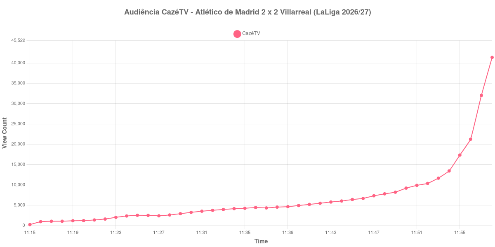

+++
date = 2026-08-24T05:00:00-03:00
draft = false
title = "Confira como foi a audiência de Atlético de Madrid X Villarreal na CazéTV - 23-08-2026"
author = 'Instituto Cambacica de Audiência'
summary = "Veja a única medição do lote que terminou antes de a bola rolar: 44 minutos de pré-transmissão da CazéTV, e nenhum minuto de jogo"
tags = ['YouTube', 'Analytics', 'Audiência', 'CazeTV', 'Atletico de Madrid', 'Villarreal', 'LaLiga']
categories = ['Audiência']
campeonatos = ['LaLiga 2026']
data_evento = 2026-08-23
+++

Neste texto, vamos informar os resultados da audiência em tempo real obtidos pela CazéTV, durante a transmissão de Atlético de Madrid X Villarreal, jogo da 2ª rodada de LaLiga de 2026/27, no Riyadh Air Metropolitano, em Madri, em 23/08/2026. A partida terminou empatada em 2 a 2, com o Atlético, mandante, terminando com um a menos após a expulsão de Robin Le Normand aos 76 minutos. O público presente foi de 61.978 pessoas.

Esta é a única medição do lote que **não cobre nenhum minuto de jogo**, e isso precisa ficar claro antes dos números. A transmissão entrou no ar às 11:15 e o apito inicial foi às 12:00, no horário de Brasília; nossa coleta se encerrou às 11:58:55, cerca de um minuto antes de a bola rolar. Tudo o que o gráfico e a lista abaixo mostram é a subida da pré-transmissão: não há apito inicial, intervalo, gols nem apito final a registrar, e o que chamamos de pico é apenas o último valor que conseguimos capturar antes de a medição parar, com a curva ainda em plena ascensão.

A audiência começou a ser medida às 23/08/2026 11:15:55 (Horário de Brasília). Como a coleta começou menos de duas horas antes do apito inicial, o gráfico e os números abaixo partem do primeiro registro disponível, e o recorte vai até o último dado coletado. Os principais pontos da audiência são (em aparelhos conectados):

* **Início da Medição (11:15:55): 247**
* **Final da Medição (11:58:55): 41.383**

O pico de audiência foi às 11:58:55, o último registro da medição, com **41.383** aparelhos conectados simultâneos.

O que estes 44 minutos de dados mostram é a formação de plateia antes de um jogo grande, e o formato é característico: a curva parte de 247 aparelhos conectados, avança devagar durante meia hora e depois dispara nos minutos finais que antecedem o apito. É justamente essa aceleração que torna o número final pouco informativo como medida de audiência da partida — quase certamente o jogo em si reuniu bem mais que os 41.383 aparelhos conectados do último registro, mas não temos como afirmar quanto.

Registramos a medição assim mesmo, incompleta, porque a alternativa seria omiti-la do levantamento. Em escala, o valor observado a colocaria na 17ª posição entre as 39 medições do lote, mas essa comparação não é justa com as demais: aqui o número é o de um jogo que ainda não havia começado, e nas outras é o de um jogo inteiro. Nas outras seis transmissões de LaLiga que acompanhamos, a média de pico foi de 375.840 aparelhos conectados.

No gráfico a seguir, mostramos a evolução da audiência entre o primeiro registro da medição e o último registro coletado:

Para você verificar os metadados desta medição, você pode consultar o [repositório contendo o CSV com os dados e com os prints do minuto a minuto da medição](https://github.com/institutocambacica/audiencias_20_23_08_2026/tree/main/2026-08-23_atletico-de-madrid-x-villarreal_U1ar65xJMd0).

---

*Para mais informações sobre nossa metodologia, visite nossa página [Sobre](/sobre).*
