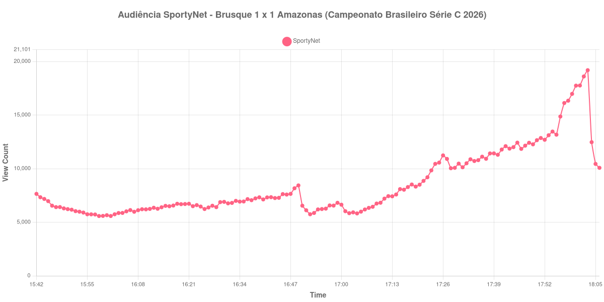

+++
date = 2026-08-24T05:08:00-03:00
draft = false
title = "Confira como foi a audiência de Brusque X Amazonas na SportyNet - 23-08-2026"
author = 'Instituto Cambacica de Audiência'
summary = "Veja como foi a audiência de um empate da Série C na SportyNet, com a curva triplicando na última meia hora de jogo"
tags = ['YouTube', 'Analytics', 'Audiência', 'SportyNet', 'Brusque', 'Amazonas', 'Serie-C']
categories = ['Audiência']
campeonatos = ['Serie C 2026']
data_evento = 2026-08-23
+++

Neste texto, vamos informar os resultados da audiência em tempo real obtidos pela SportyNet, durante a transmissão de Brusque X Amazonas, jogo da 18ª rodada do Campeonato Brasileiro Série C de 2026, na Arena Simon, em Brusque, em 23/08/2026. O Brusque, mandante, empatou em 1 a 1, com gol de Ariel aos 21 minutos do primeiro tempo; Adrien Graffin empatou para o Amazonas aos 28. O público pagante foi de 2.235 pessoas.

A audiência começou a ser medida às 23/08/2026 15:42:55 (Horário de Brasília). Como a coleta começou menos de duas horas antes do apito inicial, o gráfico e os números abaixo partem do primeiro registro disponível; a medição também terminou antes de completar duas horas após o apito final, de modo que o recorte vai até o último dado coletado. Os principais pontos da audiência são (em aparelhos conectados):

* **Início da Medição (15:42:55): 7.646**
* **Início da partida (16:00:55): 5.656**
* Após o gol de Ariel, do Brusque, aos 21 minutos do primeiro tempo (16:21:55): 6.723
* Após o gol de Adrien Graffin, do Amazonas, aos 28 minutos do primeiro tempo (16:28:55): 6.408
* Durante o intervalo (16:52:55): 5.743
* **Início do segundo tempo (17:04:55): 5.822**
* **Final da partida (18:01:55): 17.755**
* **Final da Medição (18:06:55): 10.075**

O pico de audiência foi às 18:03:55, logo após o apito final, com **19.182** aparelhos conectados simultâneos.

Duas coisas chamam atenção nesta curva, e a primeira aparece antes de a bola rolar: a audiência no primeiro registro da medição, 7.646 aparelhos conectados, é maior que a do apito inicial, 5.656. A transmissão já estava no ar antes do jogo, e o público caiu na transição — comportamento que costuma indicar espectadores remanescentes de outro conteúdo do canal, e não gente chegando para esta partida.

A segunda é o que acontece no fim. Durante quase todo o jogo a curva se manteve numa faixa estreita, entre 5.656 e 6.723 aparelhos conectados, sem reagir aos dois gols do primeiro tempo. Então, na última meia hora, ela triplica: sai de 5.822 aparelhos conectados no recomeço para 17.755 no apito final, um crescimento de 205%, e o máximo da medição chega depois do fim da partida. Em escala, é a 24ª entre as 39 medições do lote e a menor das duas transmissões de Série C que acompanhamos: os 19.182 do pico ficam 87% abaixo dos 148.836 aparelhos conectados de [Santa Cruz X Caxias](/posts/2026-08-22-santa-cruz-x-caxias-sportynet/), na véspera e no mesmo canal.

No gráfico a seguir, mostramos a evolução da audiência entre o primeiro registro da medição e o último registro coletado:

Para você verificar os metadados desta medição, você pode consultar o [repositório contendo o CSV com os dados e com os prints do minuto a minuto da medição](https://github.com/institutocambacica/audiencias_20_23_08_2026/tree/main/2026-08-23_brusque-x-amazonas_7Ac9A09FxEU).

---

*Para mais informações sobre nossa metodologia, visite nossa página [Sobre](/sobre).*
