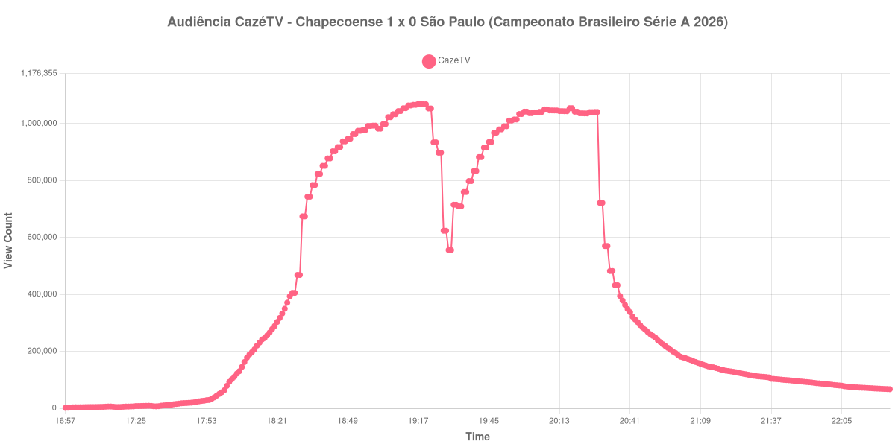

+++
date = 2026-08-24T05:16:00-03:00
draft = false
title = "Confira como foi a audiência de Chapecoense X São Paulo na CazéTV - 23-08-2026"
author = 'Instituto Cambacica de Audiência'
summary = "Veja como foi a audiência da vitória da Chapecoense sobre o São Paulo na CazéTV, terceira maior medição do lote e a única acima de um milhão no canal"
tags = ['YouTube', 'Analytics', 'Audiência', 'CazeTV', 'Chapecoense', 'Sao Paulo', 'Brasileirão']
categories = ['Audiência']
campeonatos = ['Brasileirao 2026']
data_evento = 2026-08-23
+++

Neste texto, vamos informar os resultados da audiência em tempo real obtidos pela CazéTV, durante a transmissão de Chapecoense X São Paulo, jogo da 24ª rodada do Campeonato Brasileiro Série A de 2026, na Arena Condá, em Chapecó, em 23/08/2026. A Chapecoense, mandante, venceu por 1 a 0, com gol de Bruno Pacheco aos 26 minutos do primeiro tempo. O público pagante foi de 12.404 pessoas.

A audiência começou a ser medida às 23/08/2026 16:57:55 (Horário de Brasília). Como a coleta começou menos de duas horas antes do apito inicial, o gráfico e os números abaixo partem do primeiro registro disponível. Os principais pontos da audiência são (em aparelhos conectados):

* **Início da Medição (16:57:55): 1.442**
* **Início da partida (18:30:55): 468.414**
* Após o gol de Bruno Pacheco, do Chapecoense, aos 26 minutos do primeiro tempo (18:56:55): 977.435
* Durante o intervalo (19:29:55): 555.843
* **Início do segundo tempo (19:33:55): 709.449**
* **Final da partida (20:26:55): 1.040.424**
* **Final da Medição (22:24:55): 67.005**

O pico de audiência foi às 19:17:55, ainda no primeiro tempo, com **1.069.413** aparelhos conectados simultâneos.

O gol solitário de Bruno Pacheco, aos 26 minutos, é o eixo desta curva. A transmissão saltou de 468.414 aparelhos conectados no apito inicial para 977.435 logo depois dele, e o máximo da medição chegou vinte minutos mais tarde, ainda na primeira etapa. Um 1 a 0 da lanterna sobre um time grande é exatamente o cenário que segura audiência, e o segundo tempo confirma isso: crescimento de 47% entre o recomeço e o apito final, de 709.449 para 1.040.424 aparelhos conectados, sem que nenhum gol tenha saído nesse período.

Vale isolar o comportamento do intervalo, que foi severo: dos 1.069.413 do pico a curva caiu para 555.843 aparelhos conectados no fundo do vale, quase metade do público. A recuperação também foi rápida, e o encerramento devolveu a transmissão ao patamar de um milhão. O esvaziamento veio depois do apito: trinta minutos após o fim restavam 212.114 aparelhos conectados, ou 20% dos 1.040.424 do encerramento, e uma hora depois, 121.002. Em escala, esta é a 3ª maior das 39 medições do lote e a 2ª das 19 transmissões da CazéTV: os 1.069.413 do pico ficam 13% abaixo dos 1.229.213 de [Palmeiras X Vasco](/posts/2026-08-23-palmeiras-x-vasco-getv/), o outro jogo de Série A da mesma noite.

No gráfico a seguir, mostramos a evolução da audiência entre o primeiro registro da medição e duas horas após o encerramento da partida:

Para você verificar os metadados desta medição, você pode consultar o [repositório contendo o CSV com os dados e com os prints do minuto a minuto da medição](https://github.com/institutocambacica/audiencias_20_23_08_2026/tree/main/2026-08-23_chapecoense-x-sao-paulo_FYdll9LanTc).

---

*Para mais informações sobre nossa metodologia, visite nossa página [Sobre](/sobre).*
