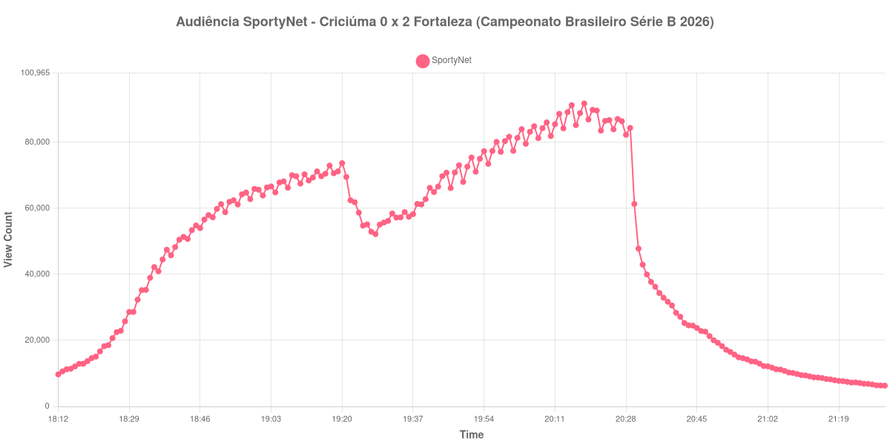

+++
date = 2026-08-24T05:18:00-03:00
draft = false
title = "Confira como foi a audiência de Criciúma X Fortaleza na SportyNet - 23-08-2026"
author = 'Instituto Cambacica de Audiência'
summary = "Veja como foi a audiência do confronto entre líder e quarto colocado da Série B na SportyNet, com pico logo após o gol que liquidou o jogo"
tags = ['YouTube', 'Analytics', 'Audiência', 'SportyNet', 'Criciuma', 'Fortaleza', 'Serie-B']
categories = ['Audiência']
campeonatos = ['Serie B 2026']
data_evento = 2026-08-23
+++

Neste texto, vamos informar os resultados da audiência em tempo real obtidos pela SportyNet, durante a transmissão de Criciúma X Fortaleza, jogo da 24ª rodada do Campeonato Brasileiro Série B de 2026, no Estádio Heriberto Hülse, em Criciúma, em 23/08/2026. O Criciúma, mandante e líder da competição, perdeu por 2 a 0 para o Fortaleza, com gols de Pedro Henrique aos 42 minutos do primeiro tempo e de Paulo Baya aos 87. O público pagante foi de 10.581 pessoas.

A audiência começou a ser medida às 23/08/2026 18:12:55 (Horário de Brasília). Como a coleta começou menos de duas horas antes do apito inicial, o gráfico e os números abaixo partem do primeiro registro disponível; a medição também terminou antes de completar duas horas após o apito final, de modo que o recorte vai até o último dado coletado. Os principais pontos da audiência são (em aparelhos conectados):

* **Início da Medição (18:12:55): 9.706**
* **Início da partida (18:30:55): 28.635**
* Após o gol de Pedro Henrique, do Fortaleza, aos 42 minutos do primeiro tempo (19:12:55): 68.454
* Durante o intervalo (19:28:55): 52.207
* **Início do segundo tempo (19:33:55): 57.212**
* Após o gol de Paulo Baya, do Fortaleza, aos 87 minutos do segundo tempo (20:15:55): 91.258
* **Final da partida (20:27:55): 86.410**
* **Final da Medição (21:30:55): 6.308**

O pico de audiência foi às 20:18:55, logo depois do segundo gol do Fortaleza, com **91.786** aparelhos conectados simultâneos.

Os dois gols do Fortaleza definem a forma desta curva, e o segundo é o mais eloquente. Ele sai aos 87 minutos, com o Criciúma pressionando para empatar, e é acompanhado por 91.258 aparelhos conectados — o momento de maior audiência da transmissão. Até ali, o segundo tempo vinha subindo de 57.212 no recomeço, num crescimento de 51% que se manteve até o apito final, com 86.410 aparelhos conectados.

O confronto entre o líder e o quarto colocado da Série B ajuda a explicar o tamanho da medição. Os 91.786 aparelhos conectados do pico fazem desta a maior das 3 transmissões da Série B que acompanhamos, 166% acima dos 34.514 de média das outras duas, e a 13ª entre as 39 medições do lote. O esvaziamento pós-jogo, por outro lado, foi acentuado: dos 86.410 aparelhos conectados do encerramento restavam 14.255 meia hora depois, ou 16%, e 6.653 uma hora depois.

No gráfico a seguir, mostramos a evolução da audiência entre o primeiro registro da medição e o último registro coletado:

Para você verificar os metadados desta medição, você pode consultar o [repositório contendo o CSV com os dados e com os prints do minuto a minuto da medição](https://github.com/institutocambacica/audiencias_20_23_08_2026/tree/main/2026-08-23_criciuma-x-fortaleza_qntal_DNxMU).

---

*Para mais informações sobre nossa metodologia, visite nossa página [Sobre](/sobre).*
