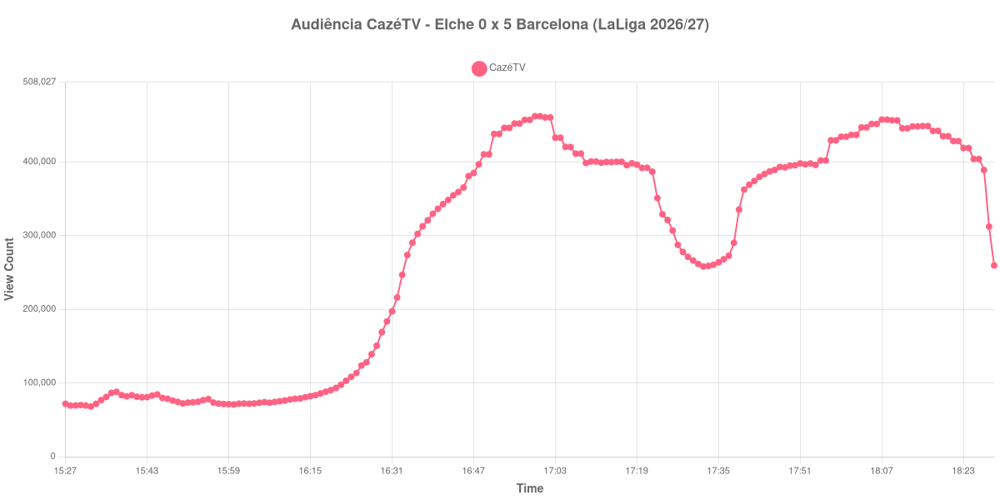

+++
date = 2026-08-24T05:12:00-03:00
draft = false
title = "Confira como foi a audiência de Elche X Barcelona na CazéTV - 23-08-2026"
author = 'Instituto Cambacica de Audiência'
summary = "Veja como foi a audiência da goleada do Barcelona na CazéTV, com a curva subindo a cada gol do segundo tempo sem voltar ao pico do primeiro"
tags = ['YouTube', 'Analytics', 'Audiência', 'CazeTV', 'Elche', 'Barcelona', 'LaLiga']
categories = ['Audiência']
canais = ['CazeTV']
campeonatos = ['LaLiga 2026']
data_evento = 2026-08-23
+++

Neste texto, vamos informar os resultados da audiência em tempo real obtidos pela CazéTV, durante a transmissão de Elche X Barcelona, jogo da 2ª rodada de LaLiga de 2026/27, no Estádio Manuel Martínez Valero, em Elche, em 23/08/2026. O Elche, mandante, perdeu por 5 a 0, com dois gols de Raphinha, dois de Fermín López e um de Karim Adeyemi. O público presente foi de 30.704 pessoas.

A audiência começou a ser medida às 23/08/2026 15:27:55 (Horário de Brasília). Como a coleta começou menos de duas horas antes do apito inicial, o gráfico e os números abaixo partem do primeiro registro disponível; a medição também terminou antes de completar duas horas após o apito final, de modo que o recorte vai até o último dado coletado. Os principais pontos da audiência são (em aparelhos conectados):

* **Início da Medição (15:27:55): 71.699**
* **Início da partida (16:30:55): 183.432**
* Após o gol de Raphinha, do FC Barcelona, aos 14 minutos do primeiro tempo (16:44:55): 359.044
* Após o gol de Karim Adeyemi, do FC Barcelona, aos 45+3 minutos do primeiro tempo (17:18:55): 397.981
* Durante o intervalo (17:32:55): 257.975
* **Início do segundo tempo (17:36:55): 267.795**
* Após o gol de Raphinha, do FC Barcelona, aos 67 minutos do segundo tempo (17:58:55): 429.137
* Após o gol de Fermín López, do FC Barcelona, aos 71 minutos do segundo tempo (18:02:55): 436.528
* Após o gol de Fermín López, do FC Barcelona, aos 79 minutos do segundo tempo (18:10:55): 456.271
* **Final da partida (18:17:55): 441.929**
* **Final da Medição (18:29:55): 259.405**

O pico de audiência foi às 16:59:55, ainda no primeiro tempo, com **461.842** aparelhos conectados simultâneos.

Uma goleada de 5 a 0 que não espantou público: esta curva é a exceção ao padrão que se repete em boa parte do lote. Cada gol do segundo tempo é acompanhado por mais gente que o anterior — 429.137 aparelhos conectados aos 67 minutos, 436.528 aos 71, 456.271 aos 79 —, e a etapa final cresce 65% entre o recomeço e o apito, de 267.795 para 441.929. Mesmo com o placar em 4 a 0 e depois 5 a 0, a audiência continuou subindo.

O que nenhum desses momentos alcançou foi o topo do primeiro tempo. O máximo da medição, 461.842 aparelhos conectados, aconteceu aos trinta minutos de jogo, com o Barcelona ganhando por 1 a 0, e permaneceu acima de tudo o que veio depois. Em escala, esta é a 5ª maior das 39 medições do lote e a 2ª das 7 transmissões de LaLiga que acompanhamos, com os 461.842 do pico ficando 51% acima dos 305.764 aparelhos conectados de média das outras seis partidas da competição.

No gráfico a seguir, mostramos a evolução da audiência entre o primeiro registro da medição e o último registro coletado:

Para você verificar os metadados desta medição, você pode consultar o [repositório contendo o CSV com os dados e com os prints do minuto a minuto da medição](https://github.com/institutocambacica/audiencias_20_23_08_2026/tree/main/2026-08-23_elche-x-barcelona_SexZS1j7teY).

---

*Para mais informações sobre nossa metodologia, visite nossa página [Sobre](/sobre).*
