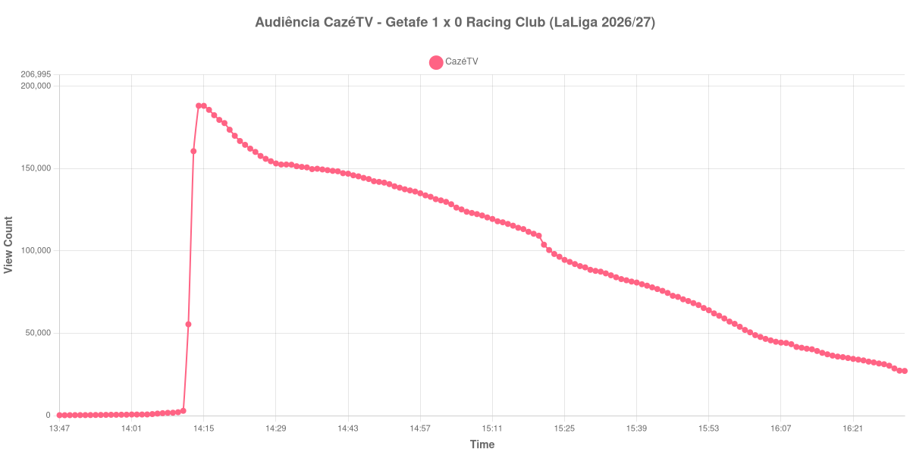

+++
date = 2026-08-24T05:04:00-03:00
draft = false
title = "Confira como foi a audiência de Getafe X Racing Club na CazéTV - 23-08-2026"
author = 'Instituto Cambacica de Audiência'
summary = "Veja a medição mais atípica do lote na CazéTV: o pico aconteceu dezesseis minutos antes do apito inicial, e a curva só caiu daí em diante"
tags = ['YouTube', 'Analytics', 'Audiência', 'CazeTV', 'Getafe', 'Racing Club', 'LaLiga']
categories = ['Audiência']
canais = ['CazeTV']
campeonatos = ['LaLiga 2026']
data_evento = 2026-08-23
+++

Neste texto, vamos informar os resultados da audiência em tempo real obtidos pela CazéTV, durante a transmissão de Getafe X Racing Club, jogo da 2ª rodada de LaLiga de 2026/27, no Estádio Coliseum, em Getafe, em 23/08/2026. O Getafe, mandante, venceu por 1 a 0, com gol de Enes Ünal aos 81 minutos. O visitante é o Real Racing Club de Santander, recém-promovido à primeira divisão espanhola, e não o clube argentino de mesmo nome. O público presente foi de 7.005 pessoas.

A audiência começou a ser medida às 23/08/2026 13:47:55 (Horário de Brasília). Como a coleta começou menos de duas horas antes do apito inicial, o gráfico e os números abaixo partem do primeiro registro disponível; a medição também terminou antes de completar duas horas após o apito final, de modo que o recorte vai até o último dado coletado. Esta é a única medição do lote em que **a curva não sustenta os marcos internos da partida**: não há vale de intervalo nem recuperação de segundo tempo identificáveis, e por isso os horários de início e fim da partida abaixo vêm das fontes da competição, e não da audiência. Os principais pontos da audiência são (em aparelhos conectados):

* **Início da Medição (13:47:55): 217**
* **Início da partida (14:30:55): 152.478**
* Após o gol de Enes Ünal, do Getafe CF, aos 81 minutos do segundo tempo (16:08:55): 44.079
* **Final da partida (16:17:55): 36.415**
* **Final da Medição (16:31:55): 27.110**

O pico de audiência foi às 14:14:55, **dezesseis minutos antes do apito inicial**, com **188.177** aparelhos conectados simultâneos.

Esta é a medição mais atípica do conjunto, e convém descrever o que os dados mostram sem ir além disso. Até as 14:11 a transmissão tinha audiência de três dígitos. Entre 14:08 e 14:12 ela salta de 1.665 para 55.443 aparelhos conectados, e dois minutos depois alcança 188.177 — o máximo de toda a medição, atingido antes de a bola rolar. A partir daí a curva decai de forma contínua até o fim, sem nenhuma interrupção: 152.478 aparelhos conectados no apito inicial, 44.079 no gol de Enes Ünal aos 81 minutos, 36.415 no encerramento.

Um salto de duas ordens de grandeza em quatro minutos não é público chegando para uma partida. É o que chamamos de troca de live: quando um canal transmite vários jogos em paralelo, o encerramento de uma transmissão empurra espectadores para a seguinte, e o degrau que aparece na curva não tem relação com o que acontece em campo. Não vamos especular de qual transmissão esse público veio. O efeito prático é que a maior parte do que a medição registra a partir das 14:14 é o esvaziamento gradual dessa audiência herdada, e ele encobre qualquer sinal do jogo — inclusive o intervalo, que em todas as outras 34 medições do lote desenha um vale visível.

Por isso, tratamos com reserva a posição desta partida no ranking. Os 188.177 aparelhos conectados do pico a colocariam em 8º entre as 39 medições do conjunto, mas esse número mede sobretudo uma migração de público, não o interesse pelo jogo. No mesmo canal e no mesmo dia, [Paris Saint-Germain X Rennes](/posts/2026-08-23-paris-saint-germain-x-rennes-cazetv/) chegou a 147.277 aparelhos conectados numa curva de comportamento convencional.

No gráfico a seguir, mostramos a evolução da audiência entre o primeiro registro da medição e o último registro coletado:

Para você verificar os metadados desta medição, você pode consultar o [repositório contendo o CSV com os dados e com os prints do minuto a minuto da medição](https://github.com/institutocambacica/audiencias_20_23_08_2026/tree/main/2026-08-23_getafe-x-racing-club_eYgY4y7lx70).

---

*Para mais informações sobre nossa metodologia, visite nossa página [Sobre](/sobre).*
