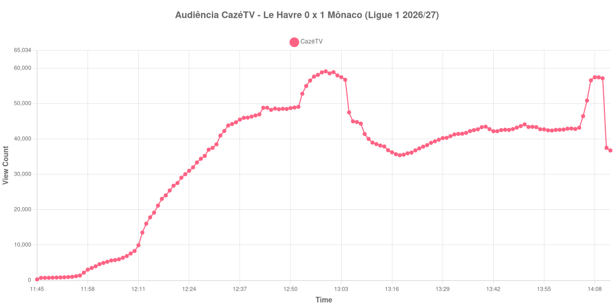

+++
date = 2026-08-24T05:02:00-03:00
draft = false
title = "Confira como foi a audiência de Le Havre X Mônaco na CazéTV - 23-08-2026"
author = 'Instituto Cambacica de Audiência'
summary = "Veja como foi a audiência de um 1 a 0 da Ligue 1 na CazéTV, com o segundo tempo crescendo 62% num jogo sem gols na etapa"
tags = ['YouTube', 'Analytics', 'Audiência', 'CazeTV', 'Le Havre', 'Monaco', 'Ligue 1']
categories = ['Audiência']
campeonatos = ['Ligue 1 2026']
data_evento = 2026-08-23
+++

Neste texto, vamos informar os resultados da audiência em tempo real obtidos pela CazéTV, durante a transmissão de Le Havre X Mônaco, jogo da 1ª rodada da Ligue 1 de 2026/27, no Stade Océane, em Le Havre, em 23/08/2026. O Le Havre, mandante, perdeu por 1 a 0, com gol de Eric Dier aos 14 minutos do primeiro tempo, de cabeça, em cobrança de escanteio. O público presente não foi divulgado por nenhuma das fontes que consultamos.

A audiência começou a ser medida às 23/08/2026 11:45:55 (Horário de Brasília). Como a coleta começou menos de duas horas antes do apito inicial, o gráfico e os números abaixo partem do primeiro registro disponível; a medição também terminou antes de completar duas horas após o apito final, de modo que o recorte vai até o último dado coletado. Os principais pontos da audiência são (em aparelhos conectados):

* **Início da Medição (11:45:55): 287**
* **Início da partida (12:15:55): 19.165**
* Após o gol de Eric Dier, do Monaco, aos 14 minutos do primeiro tempo (12:29:55): 36.973
* Durante o intervalo (13:18:55): 35.407
* **Início do segundo tempo (13:19:55): 35.556**
* **Final da partida (14:08:55): 57.458**
* **Final da Medição (14:12:55): 36.747**

O pico de audiência foi às 12:59:55, ainda no primeiro tempo, com **59.121** aparelhos conectados simultâneos.

O intervalo desta transmissão quase não existe como evento: a audiência estava em 35.407 aparelhos conectados no ponto mais baixo da pausa e voltou com 35.556 no recomeço, uma diferença desprezível. É uma das quedas de intervalo mais suaves de todo o lote, e o contraste com a final da Supercopa da Alemanha, no dia anterior e no mesmo canal, é grande: lá quase metade do público sumiu durante a pausa.

O segundo tempo cresce sem gols para justificá-lo, de 35.556 para 57.458 aparelhos conectados, uma alta de 62% numa etapa em que o placar não se moveu. O ponto mais alto da medição, no entanto, ficou no primeiro tempo, já perto do apito do intervalo. Em escala, os 59.121 do pico colocam a partida na 15ª posição entre as 39 do lote e fazem dela a 2ª maior das 9 transmissões da Ligue 1 que acompanhamos, 108% acima dos 28.479 aparelhos conectados de média das outras oito.

No gráfico a seguir, mostramos a evolução da audiência entre o primeiro registro da medição e o último registro coletado:

Para você verificar os metadados desta medição, você pode consultar o [repositório contendo o CSV com os dados e com os prints do minuto a minuto da medição](https://github.com/institutocambacica/audiencias_20_23_08_2026/tree/main/2026-08-23_le-havre-x-monaco_jmNzFYNKE1c).

---

*Para mais informações sobre nossa metodologia, visite nossa página [Sobre](/sobre).*
