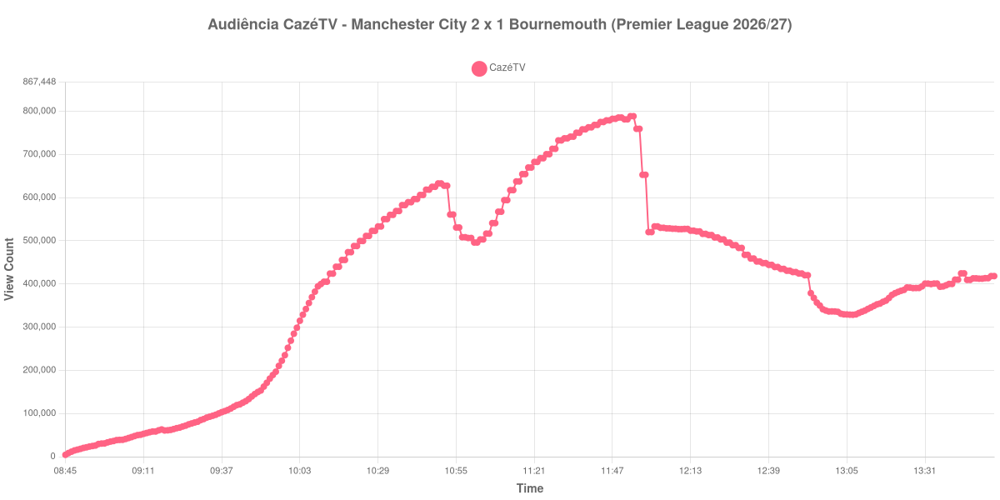

+++
date = 2026-08-24T04:58:00-03:00
draft = false
title = "Confira como foi a audiência de Manchester City X Bournemouth na CazéTV - 23-08-2026"
author = 'Instituto Cambacica de Audiência'
summary = "Veja como foi a audiência da estreia da Premier League na CazéTV, com uma virada nos últimos sete minutos levando a curva ao pico"
tags = ['YouTube', 'Analytics', 'Audiência', 'CazeTV', 'Manchester City', 'Bournemouth', 'Premier League']
categories = ['Audiência']
canais = ['CazeTV']
campeonatos = ['Premier League 2026']
data_evento = 2026-08-23
+++

Neste texto, vamos informar os resultados da audiência em tempo real obtidos pela CazéTV, durante a transmissão de Manchester City X Bournemouth, jogo da 1ª rodada da Premier League de 2026/27, no Etihad Stadium, em Manchester, em 23/08/2026. O Manchester City, mandante, venceu por 2 a 1 de virada, num desfecho concentrado no fim: Marcus Tavernier abriu o placar para o Bournemouth aos 26 minutos, Marc Guéhi empatou aos 84 e Josko Gvardiol decidiu aos 90+1. O público presente foi de 60.645 pessoas.

A audiência começou a ser medida às 23/08/2026 08:45:55 (Horário de Brasília). Como a coleta começou menos de duas horas antes do apito inicial, o gráfico e os números abaixo partem do primeiro registro disponível. Os principais pontos da audiência são (em aparelhos conectados):

* **Início da Medição (08:45:55): 4.262**
* **Início da partida (10:00:55): 268.655**
* Após o gol de Marcus Tavernier, do Bournemouth, aos 26 minutos do primeiro tempo (10:26:55): 511.284
* Durante o intervalo (11:01:55): 496.048
* **Início do segundo tempo (11:05:55): 516.626**
* Após o gol de Marc Guéhi, do Manchester City, aos 84 minutos do segundo tempo (11:44:55): 775.157
* Após o gol de Josko Gvardiol, do Manchester City, aos 90+1 minutos do segundo tempo (11:51:55): 781.348
* **Final da partida (11:52:55): 781.348**
* **Final da Medição (13:54:55): 418.241**

O pico de audiência foi às 11:53:55, no minuto seguinte ao apito final, com **788.589** aparelhos conectados simultâneos.

Esta medição tem uma peculiaridade que vale explicar, porque ela afeta a leitura do gráfico. A janela recortada cobre mais do que esta partida: a CazéTV emendou outras transmissões na sequência, e o vale mais profundo que aparece na curva, já depois das treze horas, não é o intervalo deste jogo — é o de outra partida exibida logo em seguida. O intervalo de Manchester City x Bournemouth é o vale bem mais raso que se forma por volta das onze da manhã, e foi ele que usamos para posicionar os marcos acima, com o apito inicial das dez horas confirmado por três fontes independentes.

A curva do jogo em si é de crescimento contínuo, com o desfecho concentrando o público. Do recomeço ao apito final a audiência sobe de 516.626 para 781.348 aparelhos conectados, uma alta de 51%, e o pico chega no minuto seguinte ao fim, quando a virada já estava consumada. A retenção posterior é a segunda mais alta do lote: trinta minutos depois do apito ainda havia 507.727 aparelhos conectados, ou 65% dos 781.348 do encerramento, e uma hora depois, 420.264. Em escala, esta é a 4ª maior das 39 medições do conjunto e a 3ª das 19 da CazéTV, com os 788.589 do pico ficando 246% acima dos 228.205 aparelhos conectados de média das outras dezoito medições do canal.

No gráfico a seguir, mostramos a evolução da audiência entre o primeiro registro da medição e duas horas após o encerramento da partida:

Para você verificar os metadados desta medição, você pode consultar o [repositório contendo o CSV com os dados e com os prints do minuto a minuto da medição](https://github.com/institutocambacica/audiencias_20_23_08_2026/tree/main/2026-08-23_manchester-city-x-bournemouth_2XfDrmDWSiQ).

---

*Para mais informações sobre nossa metodologia, visite nossa página [Sobre](/sobre).*
