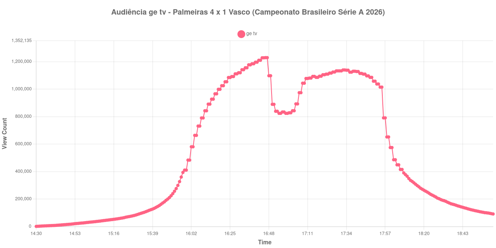

+++
date = 2026-08-24T05:10:00-03:00
draft = false
title = "Confira como foi a audiência de Palmeiras X Vasco na ge tv - 23-08-2026"
author = 'Instituto Cambacica de Audiência'
summary = "Veja como foi a maior audiência de todo o lote na ge tv, com o pico chegando antes do intervalo e antes de qualquer gol"
tags = ['YouTube', 'Analytics', 'Audiência', 'GETV', 'Palmeiras', 'Vasco', 'Brasileirão']
categories = ['Audiência']
campeonatos = ['Brasileirao 2026']
data_evento = 2026-08-23
+++

Neste texto, vamos informar os resultados da audiência em tempo real obtidos pela ge tv, durante a transmissão de Palmeiras X Vasco, jogo da 24ª rodada do Campeonato Brasileiro Série A de 2026, no Allianz Parque, em São Paulo, em 23/08/2026. O Palmeiras, mandante, venceu por 4 a 1, com dois gols de Flaco López e um de Vitor Roque, de pênalti, e Maurício; Facundo Colidio descontou nos acréscimos. O primeiro tempo terminou sem gols. O público pagante foi de 36.382 pessoas.

A audiência começou a ser medida às 23/08/2026 14:30:55 (Horário de Brasília). Como a coleta começou menos de duas horas antes do apito inicial, o gráfico e os números abaixo partem do primeiro registro disponível; a medição também terminou antes de completar duas horas após o apito final, de modo que o recorte vai até o último dado coletado. Os principais pontos da audiência são (em aparelhos conectados):

* **Início da Medição (14:30:55): 910**
* **Início da partida (16:00:55): 483.411**
* Durante o intervalo (16:58:55): 823.822
* **Início do segundo tempo (17:04:55): 892.462**
* Após o gol de Flaco López, do Palmeiras, aos 46 minutos do segundo tempo (17:05:55): 892.462
* Após o gol de Vitor Roque (pênalti), do Palmeiras, aos 50 minutos do segundo tempo (17:09:55): 1.043.173
* Após o gol de Maurício, do Palmeiras, aos 55 minutos do segundo tempo (17:14:55): 1.092.738
* Após o gol de Flaco López, do Palmeiras, aos 89 minutos do segundo tempo (17:48:55): 1.085.620
* Após o gol de Facundo Colidio, do Vasco da Gama, aos 90+3 minutos do segundo tempo (17:52:55): 1.037.341
* **Final da partida (17:53:55): 1.037.341**
* **Final da Medição (19:01:55): 91.238**

O pico de audiência foi às 16:46:55, ainda no primeiro tempo, com **1.229.213** aparelhos conectados simultâneos.

Esta é a maior audiência de todo o lote, e o detalhe mais interessante é onde o topo aconteceu: perto do fim do primeiro tempo, com o placar em 0 a 0 e nenhum gol marcado até ali. Os 1.229.213 aparelhos conectados do pico nunca voltaram a ser alcançados, mesmo com os quatro gols do Palmeiras na etapa final.

O que a curva sugere é que o público se formou pela expectativa do jogo, e não pelo que ele entregou. O intervalo custou pouco em termos relativos, com 823.822 aparelhos conectados no ponto mais baixo, e o segundo tempo cresceu 16% entre o recomeço e o apito final, de 892.462 para 1.037.341. Note também que o quarto gol do Palmeiras, aos 89 minutos, foi acompanhado por menos gente que o terceiro: goleada consumada já dispersava público antes mesmo do fim.

O esvaziamento posterior é típico das transmissões grandes: trinta minutos após o apito final restavam 242.362 aparelhos conectados, ou 23% dos 1.037.341 do encerramento, e uma hora depois, 108.194. Em escala, além de liderar as 39 medições do lote, os 1.229.213 aparelhos conectados desta partida ficaram 15% acima dos 1.069.413 de [Chapecoense X São Paulo](/posts/2026-08-23-chapecoense-x-sao-paulo-cazetv/), o outro jogo de Série A que acompanhamos, disputado na mesma noite.

No gráfico a seguir, mostramos a evolução da audiência entre o primeiro registro da medição e o último registro coletado:

Para você verificar os metadados desta medição, você pode consultar o [repositório contendo o CSV com os dados e com os prints do minuto a minuto da medição](https://github.com/institutocambacica/audiencias_20_23_08_2026/tree/main/2026-08-23_palmeiras-x-vasco_YXH_s6XP0R0).

---

*Para mais informações sobre nossa metodologia, visite nossa página [Sobre](/sobre).*
