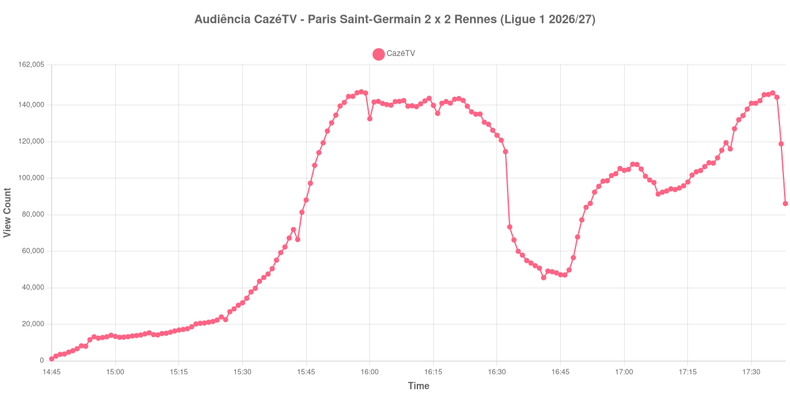

+++
date = 2026-08-24T05:06:00-03:00
draft = false
title = "Confira como foi a audiência de Paris Saint-Germain X Rennes na CazéTV - 23-08-2026"
author = 'Instituto Cambacica de Audiência'
summary = "Veja como foi a audiência do jogo com a maior queda de intervalo de todo o lote na CazéTV, num empate em que o mando foi invertido às vésperas"
tags = ['YouTube', 'Analytics', 'Audiência', 'CazeTV', 'Paris Saint-Germain', 'Rennes', 'Ligue 1']
categories = ['Audiência']
canais = ['CazeTV']
campeonatos = ['Ligue 1 2026']
data_evento = 2026-08-23
+++

Neste texto, vamos informar os resultados da audiência em tempo real obtidos pela CazéTV, durante a transmissão de Paris Saint-Germain X Rennes, jogo da 1ª rodada da Ligue 1 de 2026/27, em 23/08/2026. A ordem do título da transmissão não corresponde ao mando de campo: quem recebeu foi o Rennes, no Roazhon Park, depois de a liga francesa inverter o mando na semana da partida por causa das condições do gramado do Parc des Princes. O jogo terminou empatado em 2 a 2, com gols de Sebastian Szymański e Esteban Lepaul para o Rennes no primeiro tempo, e dois de Ferran Torres para o PSG na etapa final. O público presente não foi divulgado em número oficial pelas fontes que consultamos.

A audiência começou a ser medida às 23/08/2026 14:45:55 (Horário de Brasília). Como a coleta começou menos de duas horas antes do apito inicial, o gráfico e os números abaixo partem do primeiro registro disponível; a medição também terminou antes de completar duas horas após o apito final, de modo que o recorte vai até o último dado coletado. Os principais pontos da audiência são (em aparelhos conectados):

* **Início da Medição (14:45:55): 1.027**
* **Início da partida (15:45:55): 88.017**
* Após o gol de Sebastian Szymański, do Rennes, aos 9 minutos do primeiro tempo (15:54:55): 141.458
* Após o gol de Esteban Lepaul, do Rennes, aos 38 minutos do primeiro tempo (16:23:55): 139.401
* Durante o intervalo (16:41:55): 45.497
* **Início do segundo tempo (16:47:55): 49.717**
* Após o gol de Ferran Torres, do Paris Saint-Germain, aos 70 minutos do segundo tempo (17:12:55): 93.752
* Após o gol de Ferran Torres, do Paris Saint-Germain, aos 82 minutos do segundo tempo (17:24:55): 119.443
* **Final da partida (17:34:55): 145.819**
* **Final da Medição (17:38:55): 86.074**

O pico de audiência foi às 15:58:55, nos primeiros minutos de jogo, com **147.277** aparelhos conectados simultâneos.

O intervalo desta partida produziu a queda mais acentuada de todas as 34 medições do lote em que conseguimos marcar a pausa. A audiência despencou 60% entre o apito do primeiro tempo e o fundo do vale, e a passagem é abrupta ao extremo: em um único minuto a transmissão perdeu mais de um terço do que tinha. É o tipo de degrau que a curva registra quando um público inteiro decide sair ao mesmo tempo.

O segundo tempo é a história inversa. Com o PSG perdendo por 2 a 0 e correndo atrás, a audiência quase triplicou entre o recomeço e o apito final, de 49.717 para 145.819 aparelhos conectados, uma alta de 193% — a maior recuperação de segunda etapa do conjunto. Os dois gols de Ferran Torres marcam o caminho: 93.752 aparelhos conectados aos 70 minutos, 119.443 aos 82. Em escala, esta é a maior das 9 transmissões da Ligue 1 que acompanhamos, na 11ª posição entre as 39 medições do lote, com os 147.277 do pico ficando 744% acima dos 17.460 aparelhos conectados de média das outras oito partidas da competição.

No gráfico a seguir, mostramos a evolução da audiência entre o primeiro registro da medição e o último registro coletado:

Para você verificar os metadados desta medição, você pode consultar o [repositório contendo o CSV com os dados e com os prints do minuto a minuto da medição](https://github.com/institutocambacica/audiencias_20_23_08_2026/tree/main/2026-08-23_paris-saint-germain-x-rennes_nyXX7v1q-xY).

---

*Para mais informações sobre nossa metodologia, visite nossa página [Sobre](/sobre).*
