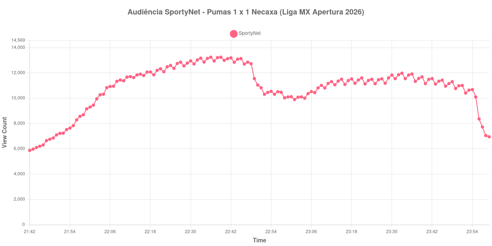

+++
date = 2026-08-24T05:20:00-03:00
draft = false
title = "Confira como foi a audiência de Pumas X Necaxa na SportyNet - 23-08-2026"
author = 'Instituto Cambacica de Audiência'
summary = "Veja como foi a audiência do empate agônico da Liga MX na SportyNet, num intervalo que não custou nada à transmissão"
tags = ['YouTube', 'Analytics', 'Audiência', 'SportyNet', 'Pumas', 'Necaxa', 'Campeonato Mexicano']
categories = ['Audiência']
campeonatos = ['Campeonato Mexicano 2026']
data_evento = 2026-08-23
+++

Neste texto, vamos informar os resultados da audiência em tempo real obtidos pela SportyNet, durante a transmissão de Pumas X Necaxa, jogo da 5ª rodada do Apertura 2026 da Liga MX, no Estádio Olímpico Universitário, na Cidade do México, em 23/08/2026. Os Pumas, mandantes, empataram em 1 a 1, com gol de Julián Carranza para o Necaxa aos 76 minutos e empate de Luciano Herrera aos 88, sob chuva forte. O público presente não foi divulgado por nenhuma das fontes que consultamos.

A audiência começou a ser medida às 23/08/2026 21:42:55 (Horário de Brasília). Como a coleta começou menos de duas horas antes do apito inicial, o gráfico e os números abaixo partem do primeiro registro disponível; a medição também terminou antes de completar duas horas após o apito final, de modo que o recorte vai até o último dado coletado. Os principais pontos da audiência são (em aparelhos conectados):

* **Início da Medição (21:42:55): 5.871**
* **Início da partida (22:00:55): 9.302**
* Durante o intervalo (23:01:55): 9.897
* **Início do segundo tempo (23:02:55): 10.079**
* Após o gol de Julián Carranza, do Necaxa, aos 76 minutos do segundo tempo (23:33:55): 11.979
* Após o gol de Luciano Herrera, do Pumas, aos 88 minutos do segundo tempo (23:45:55): 11.424
* **Final da partida (23:50:55): 10.985**
* **Final da Medição (23:59:55): 6.953**

O pico de audiência foi às 22:36:55, ainda no primeiro tempo, com **13.244** aparelhos conectados simultâneos.

Aqui a pausa entre os tempos praticamente não existiu como evento: a audiência estava em 9.897 aparelhos conectados no ponto mais baixo da pausa e recomeçou com 10.079, ou seja, subiu. É a menor perda de intervalo entre todas as medições brasileiras e latino-americanas deste lote, e contrasta com o comportamento das transmissões europeias, em que a pausa costuma custar de um terço a metade do público.

O restante da curva é discreto. O gol do Necaxa, aos 76 minutos, leva a transmissão a 11.979 aparelhos conectados, e o empate dos Pumas, aos 88, é acompanhado por 11.424 — menos que o gol anterior, apesar de ser o lance que salvou o time da casa. O ponto mais alto ficou no primeiro tempo, com 13.244 aparelhos conectados, quando o jogo ainda estava 0 a 0. Em escala, é a 25ª entre as 39 medições do lote e a maior das duas partidas da Liga MX que acompanhamos, 34% acima dos 9.868 aparelhos conectados de [Cruz Azul X Atlas](/posts/2026-08-22-cruz-azul-x-atlas-sportynet/), na véspera e no mesmo canal.

No gráfico a seguir, mostramos a evolução da audiência entre o primeiro registro da medição e o último registro coletado:

Para você verificar os metadados desta medição, você pode consultar o [repositório contendo o CSV com os dados e com os prints do minuto a minuto da medição](https://github.com/institutocambacica/audiencias_20_23_08_2026/tree/main/2026-08-23_pumas-x-necaxa_LGdXb6BhX2s).

---

*Para mais informações sobre nossa metodologia, visite nossa página [Sobre](/sobre).*
