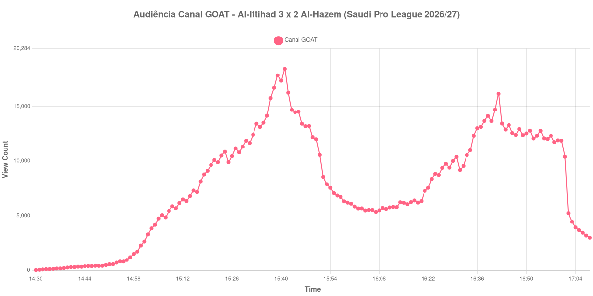

+++
date = 2026-08-25T07:06:00-03:00
draft = false
title = "Confira como foi a audiência de Al-Ittihad X Al-Hazem no Canal GOAT - 24-08-2026"
author = 'Instituto Cambacica de Audiência'
summary = "Veja como foi a audiência do hat-trick de Bergwijn no Canal GOAT, numa curva que dobrou de tamanho no segundo tempo depois de perder metade do público no intervalo"
tags = ['YouTube', 'Analytics', 'Audiência', 'Canal-GOAT', 'Al-Ittihad', 'Al-Hazem', 'Saudi Pro League']
categories = ['Audiência']
canais = ['Canal GOAT']
campeonatos = ['Saudi Pro League 2026']
data_evento = 2026-08-24
+++

Neste texto, vamos informar os resultados da audiência em tempo real obtidos pelo Canal GOAT, durante a transmissão de Al-Ittihad X Al-Hazem, jogo da 3ª rodada da Saudi Pro League de 2026/27, no Estádio Príncipe Abdullah Al Faisal, em Jeddah, em 24/08/2026. O Al-Ittihad, mandante, venceu por 3 a 2 com um hat-trick de Steven Bergwijn, dois deles de pênalti — o último aos 81 minutos, confirmado por revisão do VAR. O Al-Hazem esteve à frente com Abdulaziz Al-Dhuwayhi e empatou de novo com Sofiane Bendebka antes de o jogo virar em definitivo. O público presente não foi divulgado por nenhuma das fontes que consultamos.

A audiência começou a ser medida às 24/08/2026 14:30:55 (Horário de Brasília). Como a coleta começou menos de duas horas antes do apito inicial, o gráfico e os números abaixo partem do primeiro registro disponível; a medição também terminou antes de completar duas horas após o apito final, de modo que o recorte vai até o último dado coletado. Os principais pontos da audiência são (em aparelhos conectados):

* **Início da Medição (14:30:55): 25**
* **Início da partida (15:00:55): 2.274**
* Após o gol de Abdulaziz Al-Dhuwayhi, do Al-Hazem, aos 18 minutos do primeiro tempo (15:18:55): 8.779
* Após o gol de Steven Bergwijn, do Al-Ittihad, aos 34 minutos do primeiro tempo (15:34:55): 13.110
* Após o gol de Steven Bergwijn, do Al-Ittihad, aos 41 minutos do primeiro tempo (15:41:55): 18.440
* **Fim do primeiro tempo (15:51:55): 10.556**
* Durante o intervalo (16:04:55): 5.479
* **Início do segundo tempo (16:06:55): 5.521**
* Após o gol de Sofiane Bendebka, do Al-Hazem, aos 59 minutos do segundo tempo (16:16:55): 6.046
* Após o gol de Steven Bergwijn, do Al-Ittihad, aos 81 minutos do segundo tempo (16:38:55): 13.670
* **Final da partida (16:52:55): 12.074**
* **Final da Medição (17:08:55): 2.984**

O pico de audiência foi às 15:41:55, no minuto do pênalti que colocou o Al-Ittihad na frente pela primeira vez, com **18.440** aparelhos conectados simultâneos.

Esta medição tem duas metades quase simétricas e um abismo entre elas. O primeiro tempo é uma escalada contínua, marcada de gol em gol — 8.779 aparelhos conectados depois do tento do Al-Hazem, 13.110 depois do empate de Bergwijn, 18.440 depois do pênalti que virou o jogo. O intervalo desfez metade disso: os 10.556 do apito viraram 5.479 no registro do intervalo, uma queda de 48%. E o esvaziamento não parou na pausa — o fundo do vale só chegou às 16:07:55, com 5.345 aparelhos conectados, um minuto depois de a bola já ter voltado a rolar.

Depois disso a curva refaz quase tudo. Entre o recomeço e o apito final a audiência cresceu 119%, de 5.521 para 12.074 aparelhos conectados, e o ponto mais alto da etapa foi 16.154, às 16:42:55, quatro minutos depois do pênalti decisivo de Bergwijn. O que a transmissão não sustentou foi o pós-jogo: ela manteve cerca de doze mil aparelhos por quase dez minutos e então caiu dos 10.392 registrados às 17:01:55 para 5.236 no minuto seguinte, uma perda de 50% de uma só vez, e terminou com 2.984 aparelhos conectados, 25% dos 12.074 do apito final. Em escala, esta é a 4ª maior das 8 medições da Saudi Pro League do nosso levantamento e a 6ª das 12 transmissões do Canal GOAT, com os 18.440 do pico ficando 23% abaixo dos 24.040 aparelhos conectados de média das outras sete partidas sauditas. Três dias antes, no mesmo canal, [Al-Qadsiah X Al-Ittihad](/posts/2026-08-21-al-qadsiah-x-al-ittihad-canal-goat/) tinha chegado a 39.084 aparelhos conectados.

No gráfico a seguir, mostramos a evolução da audiência entre o primeiro registro da medição e o último registro coletado:

Para você verificar os metadados desta medição, você pode consultar o [repositório contendo o CSV com os dados e com os prints do minuto a minuto da medição](https://github.com/institutocambacica/audiencias_24_08_2026/tree/main/2026-08-24_al-ittihad-x-al-hazem_M-RJYH63xpQ).

---

*Para mais informações sobre nossa metodologia, visite nossa página [Sobre](/sobre).*
