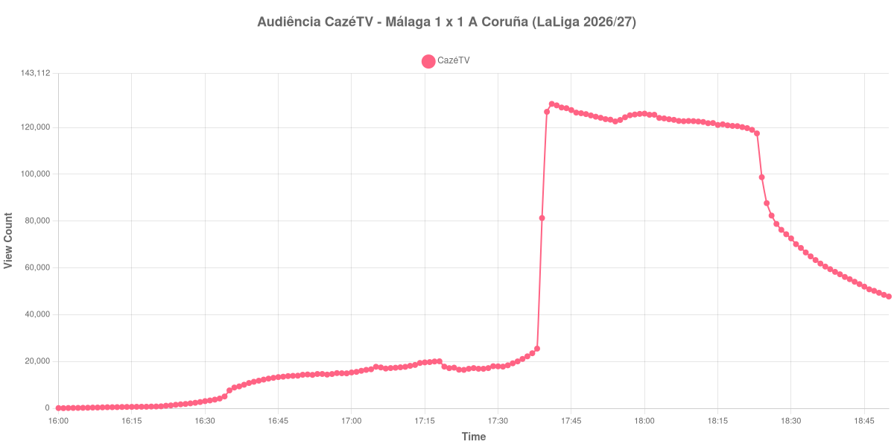

+++
date = 2026-08-25T07:12:00-03:00
draft = false
title = "Confira como foi a audiência de Málaga X A Coruña na CazéTV - 24-08-2026"
author = 'Instituto Cambacica de Audiência'
summary = "Veja como foi a audiência do duelo entre os dois recém-promovidos na CazéTV, numa medição em que o máximo mede troca de live e não interesse pela partida"
tags = ['YouTube', 'Analytics', 'Audiência', 'CazeTV', 'Malaga', 'Deportivo A Coruna', 'LaLiga']
categories = ['Audiência']
campeonatos = ['LaLiga 2026']
data_evento = 2026-08-24
+++

Neste texto, vamos informar os resultados da audiência em tempo real obtidos pela CazéTV, durante a transmissão de Málaga X A Coruña, jogo da 2ª rodada de LaLiga de 2026/27, em La Rosaleda, em Málaga, em 24/08/2026. O Málaga, mandante, empatou em 1 a 1 com o Deportivo diante de 29.014 pessoas, no reencontro de La Rosaleda com uma noite de primeira divisão depois de oito anos. Pierre-Emerick Aubameyang abriu o placar para os galegos aos 21 minutos e Carlos Ruiz, o Chupe, empatou de pênalti aos 34. Não houve expulsões.

A audiência começou a ser medida às 24/08/2026 16:00:55 (Horário de Brasília). Como a coleta começou menos de duas horas antes do apito inicial, o gráfico e os números abaixo partem do primeiro registro disponível; a medição também terminou antes de completar duas horas após o apito final, de modo que o recorte vai até o último dado coletado. Esta medição exige ainda um aviso: a partir das 17:39:55 a curva registra um degrau de troca de live, e os números a partir daí não são comparáveis aos anteriores. Os principais pontos da audiência são (em aparelhos conectados):

* **Início da Medição (16:00:55): 85**
* **Início da partida (16:30:55): 3.051**
* Após o gol de Pierre-Emerick Aubameyang, do Deportivo A Coruña, aos 21 minutos do primeiro tempo (16:51:55): 14.445
* Após o gol de Carlos Ruiz "Chupe", do Málaga, aos 34 minutos do primeiro tempo (17:04:55): 16.663
* **Fim do primeiro tempo (17:18:55): 20.075**
* Durante o intervalo (17:23:55): 16.408
* **Início do segundo tempo (17:33:55): 19.214**
* **Final da partida (18:23:55): 117.494**
* **Final da Medição (18:50:55): 47.774**

O pico de audiência foi às 17:41:55, três minutos depois do degrau de troca de live, com **130.101** aparelhos conectados simultâneos.

O salto que separa o recomeço do apito final não tem relação com o que acontecia em campo. Até 17:38:55 a transmissão tinha 25.493 aparelhos conectados; um minuto depois, 81.314; no seguinte, 126.724 — uma alta de 397% em dois minutos. É exatamente o minuto em que [Roma X Fiorentina](/posts/2026-08-24-roma-x-fiorentina-cazetv/), transmitido em paralelo pelo mesmo canal, encerrou a sua medição com 143.847 aparelhos conectados. A coincidência de horário e a ordem de grandeza do público que chega são o que temos; descrevemos o degrau como o que ele é, uma troca de live, e não especulamos sobre o mecanismo.

A consequência prática é que o máximo desta medição mede migração de público, e não interesse pela partida. Tudo o que o jogo em si produziu está abaixo dos 20.075 aparelhos conectados do fim do primeiro tempo — a curva do Málaga andou entre dezesseis e vinte mil aparelhos do primeiro gol até o recomeço, com o intervalo custando 18% entre esses mesmos 20.075 e os 16.408 do fundo do vale. Por isso a posição no ranking merece ressalva: em números brutos esta é a 7ª maior das 15 medições de LaLiga que já publicamos e a 22ª das 39 transmissões da CazéTV, com os 130.101 do pico ficando 38% abaixo dos 210.942 aparelhos conectados de média das outras catorze partidas do campeonato espanhol — mas essa colocação é obra do degrau, não da audiência que a partida atraiu por conta própria. Depois do apito final a curva desce de forma contínua, dos 117.494 aparelhos conectados do encerramento do jogo até os 47.774 do último registro — 41% do que a transmissão tinha quando a bola parou de rolar.

No gráfico a seguir, mostramos a evolução da audiência entre o primeiro registro da medição e o último registro coletado:

Para você verificar os metadados desta medição, você pode consultar o [repositório contendo o CSV com os dados e com os prints do minuto a minuto da medição](https://github.com/institutocambacica/audiencias_24_08_2026/tree/main/2026-08-24_malaga-x-a-coruna_uNcdTH-2ZCQ).

---

*Para mais informações sobre nossa metodologia, visite nossa página [Sobre](/sobre).*
