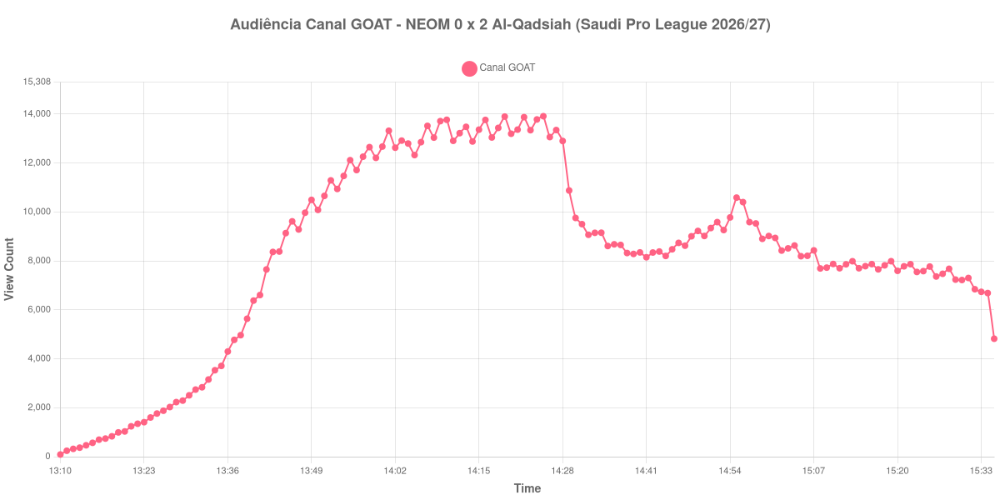

+++
date = 2026-08-25T07:00:00-03:00
draft = false
title = "Confira como foi a audiência de NEOM X Al-Qadsiah no Canal GOAT - 24-08-2026"
author = 'Instituto Cambacica de Audiência'
summary = "Veja como foi a audiência de um jogo cujo máximo ficou no apagar do primeiro tempo no Canal GOAT, com a etapa final inteira abaixo do que a inicial já tinha alcançado"
tags = ['YouTube', 'Analytics', 'Audiência', 'Canal-GOAT', 'NEOM', 'Al-Qadsiah', 'Saudi Pro League']
categories = ['Audiência']
campeonatos = ['Saudi Pro League 2026']
data_evento = 2026-08-24
+++

Neste texto, vamos informar os resultados da audiência em tempo real obtidos pelo Canal GOAT, durante a transmissão de NEOM X Al-Qadsiah, jogo da 3ª rodada da Saudi Pro League de 2026/27, no King Khalid Sport City Stadium, em Tabuk, em 24/08/2026. O NEOM, mandante, perdeu por 2 a 0: Tijjani Reijnders abriu o placar aos 29 minutos e Mateo Retegui ampliou de pênalti aos 56. O público presente não foi divulgado por nenhuma das fontes que consultamos.

A audiência começou a ser medida às 24/08/2026 13:10:55 (Horário de Brasília). Como a coleta começou menos de duas horas antes do apito inicial, o gráfico e os números abaixo partem do primeiro registro disponível; a medição também terminou antes de completar duas horas após o apito final, de modo que o recorte vai até o último dado coletado. Os principais pontos da audiência são (em aparelhos conectados):

* **Início da Medição (13:10:55): 88**
* **Início da partida (13:40:55): 6.380**
* Após o gol de Tijjani Reijnders, do Al-Qadsiah, aos 29 minutos do primeiro tempo (14:09:55): 13.715
* **Fim do primeiro tempo (14:28:55): 12.904**
* Durante o intervalo (14:41:55): 8.151
* **Início do segundo tempo (14:43:55): 8.385**
* Após o gol de Mateo Retegui, do Al-Qadsiah, aos 56 minutos do segundo tempo (14:53:55): 9.263
* **Final da partida (15:32:55): 6.844**
* **Final da Medição (15:35:55): 4.821**

O pico de audiência foi às 14:25:55, aos 45 minutos do primeiro tempo, com **13.916** aparelhos conectados simultâneos.

O desenho desta curva se resolve inteiro antes do intervalo. A transmissão subiu de forma contínua durante os primeiros trinta minutos de jogo, encontrou um patamar em torno de treze mil aparelhos conectados depois do gol de Reijnders e ficou ali até o apito. A partir daí só perdeu: os 12.904 aparelhos conectados do fim do primeiro tempo viraram 8.151 no registro do intervalo, uma queda de 37%, e o recomeço trouxe de volta menos gente do que a pausa tinha levado.

O pênalti de Retegui, que liquidou o jogo, não mudou esse quadro. O ponto mais alto de toda a etapa final foi 10.589 aparelhos conectados, registrado às 14:55:55, dois minutos depois do gol, um valor que os 13.916 do pico ainda superam em 31%. E o jogo terminou mais fraco do que recomeçou: dos 8.385 do início do segundo tempo para os 6.844 do apito final, a audiência recuou 18%. Em escala, esta é a 5ª maior das 8 medições da Saudi Pro League que já acompanhamos e a 7ª das 12 transmissões do Canal GOAT, com os 13.916 do pico ficando 44% abaixo dos 24.686 aparelhos conectados de média das outras sete partidas sauditas. Vale o contraste com a outra medição do NEOM no nosso levantamento: em [Al-Faisaly X NEOM](/posts/2026-08-21-al-faisaly-x-neom-canal-goat/) o máximo foi de 1.864 aparelhos conectados, número que os 13.916 desta segunda-feira superam em 647%.

No gráfico a seguir, mostramos a evolução da audiência entre o primeiro registro da medição e o último registro coletado:

Para você verificar os metadados desta medição, você pode consultar o [repositório contendo o CSV com os dados e com os prints do minuto a minuto da medição](https://github.com/institutocambacica/audiencias_24_08_2026/tree/main/2026-08-24_neom-x-al-qadsiah_Czp8AYU1Hok).

---

*Para mais informações sobre nossa metodologia, visite nossa página [Sobre](/sobre).*
