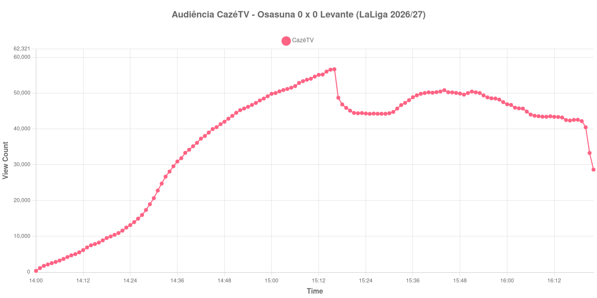

+++
date = 2026-08-25T07:03:00-03:00
draft = false
title = "Confira como foi a audiência de Osasuna X Levante na CazéTV - 24-08-2026"
author = 'Instituto Cambacica de Audiência'
summary = "Veja como foi a audiência de um 0 a 0 na CazéTV, numa curva que atingiu o seu máximo exatamente no apito do intervalo e nunca mais voltou àquele patamar"
tags = ['YouTube', 'Analytics', 'Audiência', 'CazeTV', 'Osasuna', 'Levante', 'LaLiga']
categories = ['Audiência']
campeonatos = ['LaLiga 2026']
data_evento = 2026-08-24
+++

Neste texto, vamos informar os resultados da audiência em tempo real obtidos pela CazéTV, durante a transmissão de Osasuna X Levante, jogo da 2ª rodada de LaLiga de 2026/27, em El Sadar, em Pamplona, em 24/08/2026. O Osasuna, mandante, empatou sem gols diante de 20.241 pessoas, num jogo em que dominou e parou no goleiro Ryan; era a estreia dos navarros na temporada, porque a partida da rodada de abertura contra o Celta havia sido adiada. Brugué acertou o travessão aos 34 minutos, e não houve expulsões.

A audiência começou a ser medida às 24/08/2026 14:00:55 (Horário de Brasília). Como a coleta começou menos de duas horas antes do apito inicial, o gráfico e os números abaixo partem do primeiro registro disponível; a medição também terminou antes de completar duas horas após o apito final, de modo que o recorte vai até o último dado coletado. Os principais pontos da audiência são (em aparelhos conectados):

* **Início da Medição (14:00:55): 364**
* **Início da partida (14:30:55): 20.662**
* **Fim do primeiro tempo (15:16:55): 56.655**
* Durante o intervalo (15:25:55): 44.210
* **Início do segundo tempo (15:31:55): 44.750**
* **Final da partida (16:20:55): 40.448**
* **Final da Medição (16:22:55): 28.631**

O pico de audiência foi às 15:16:55, no apito do intervalo, com **56.655** aparelhos conectados simultâneos.

Poucas curvas do nosso levantamento marcam o máximo num ponto tão preciso. A audiência cresceu sem interrupção durante todo o primeiro tempo, do apito inicial até o último minuto antes da pausa, e o valor mais alto da medição é justamente o registro imediatamente anterior ao degrau do intervalo: dos 56.655 aparelhos conectados do apito aos 44.210 do fundo do vale, uma queda de 22%. Nada do que veio depois recuperou aquele patamar — o ponto mais alto da etapa final foi 50.808 aparelhos conectados, às 15:44:55.

Sem gols para segurar a audiência, o segundo tempo se comportou como um platô em declínio lento: começou com 44.750 aparelhos conectados e chegou ao apito final com 40.448, 10% abaixo. Em escala, esta é a 13ª maior das 15 medições de LaLiga que já publicamos e a 29ª das 39 transmissões da CazéTV, com os 56.655 do pico ficando 74% abaixo dos 216.188 aparelhos conectados de média das outras catorze partidas do campeonato espanhol. A comparação mais direta é com a outra medição do Levante nesta temporada: em [Espanyol X Levante](/posts/2026-08-16-espanyol-x-levante-cazetv/) o máximo tinha sido de 5.714 aparelhos conectados, e os 56.655 desta segunda-feira estão 892% acima daquele número.

No gráfico a seguir, mostramos a evolução da audiência entre o primeiro registro da medição e o último registro coletado:

Para você verificar os metadados desta medição, você pode consultar o [repositório contendo o CSV com os dados e com os prints do minuto a minuto da medição](https://github.com/institutocambacica/audiencias_24_08_2026/tree/main/2026-08-24_osasuna-x-levante_pUt5kbM8Qdg).

---

*Para mais informações sobre nossa metodologia, visite nossa página [Sobre](/sobre).*
