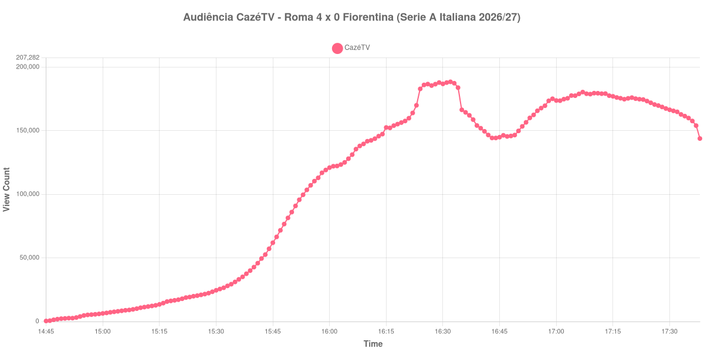

+++
date = 2026-08-25T07:09:00-03:00
draft = false
title = "Confira como foi a audiência de Roma X Fiorentina na CazéTV - 24-08-2026"
author = 'Instituto Cambacica de Audiência'
summary = "Veja como foi a audiência da estreia da Serie A na CazéTV, a maior das cinco medições do dia, com o máximo cravado no apito do intervalo"
tags = ['YouTube', 'Analytics', 'Audiência', 'CazeTV', 'Roma', 'Fiorentina', 'Serie A Italiana']
categories = ['Audiência']
canais = ['CazeTV']
campeonatos = ['Serie A Italiana 2026']
data_evento = 2026-08-24
+++

Neste texto, vamos informar os resultados da audiência em tempo real obtidos pela CazéTV, durante a transmissão de Roma X Fiorentina, jogo da 1ª rodada da Serie A italiana de 2026/27, no Estádio Olímpico, em Roma, em 24/08/2026. A Roma, mandante, venceu por 4 a 0, com um hat-trick de Donyell Malen — todos servidos por Paulo Dybala — e um gol de Niccolò Pisilli aos 86 minutos. O público presente foi de 67.598 pessoas, com o estádio esgotado na estreia de Gian Piero Gasperini pelo clube e na de Fabio Grosso à frente da Fiorentina.

A audiência começou a ser medida às 24/08/2026 14:45:55 (Horário de Brasília). Como a coleta começou menos de duas horas antes do apito inicial, o gráfico e os números abaixo partem do primeiro registro disponível; a medição também terminou antes de completar duas horas após o apito final, de modo que o recorte vai até o último dado coletado — neste caso, um único minuto depois do apito. Os principais pontos da audiência são (em aparelhos conectados):

* **Início da Medição (14:45:55): 416**
* **Início da partida (15:45:55): 61.927**
* Após o gol de Donyell Malen, da Roma, aos 27 minutos do primeiro tempo (16:12:55): 143.731
* **Fim do primeiro tempo (16:32:55): 188.438**
* Durante o intervalo (16:44:55): 144.289
* **Início do segundo tempo (16:47:55): 145.497**
* Após o gol de Donyell Malen, da Roma, aos 52 minutos do segundo tempo (16:54:55): 162.427
* Após o gol de Donyell Malen, da Roma, aos 60 minutos do segundo tempo (17:02:55): 174.801
* Após o gol de Niccolò Pisilli, da Roma, aos 86 minutos do segundo tempo (17:28:55): 168.671
* **Final da partida (17:37:55): 154.000**
* **Final da Medição (17:38:55): 143.847**

O pico de audiência foi às 16:32:55, no apito do intervalo, com **188.438** aparelhos conectados simultâneos.

A goleada não trouxe a audiência de volta ao topo. O máximo da medição acontece no último registro do primeiro tempo, com o placar em 1 a 0, e nenhum dos três gols da etapa final o alcançou: o ponto mais alto de todo o segundo tempo foi 180.368 aparelhos conectados, às 17:07:55, poucos minutos depois do terceiro gol de Malen, e ainda assim 8.070 abaixo dos 188.438 do pico. O intervalo tinha custado 23% à transmissão, dos mesmos 188.438 para os 144.289 do fundo do vale, e a etapa final devolveu apenas parte disso.

O que a curva mostra com nitidez é a diferença entre um jogo aberto e um jogo resolvido. A audiência subiu com os dois primeiros gols do segundo tempo — 162.427 aparelhos conectados aos 52 minutos, 174.801 aos 60 — e passou a recuar a partir dali, com o quarto gol, aos 86, já registrando 168.671, abaixo do que a transmissão tinha meia hora antes. Ainda assim, é a maior das cinco medições que fizemos nesta segunda-feira e a 18ª das 39 transmissões da CazéTV no nosso levantamento. É também a primeira curva de Serie A italiana que conseguimos registrar: a única medição anterior da competição, [Frosinone X Juventus](/posts/2026-08-23-frosinone-x-juventus-sportynet/), terminou sem nenhuma amostra coletada.

No gráfico a seguir, mostramos a evolução da audiência entre o primeiro registro da medição e o último registro coletado:

Para você verificar os metadados desta medição, você pode consultar o [repositório contendo o CSV com os dados e com os prints do minuto a minuto da medição](https://github.com/institutocambacica/audiencias_24_08_2026/tree/main/2026-08-24_roma-x-fiorentina_P2zX1MvKxpY).

---

*Para mais informações sobre nossa metodologia, visite nossa página [Sobre](/sobre).*
