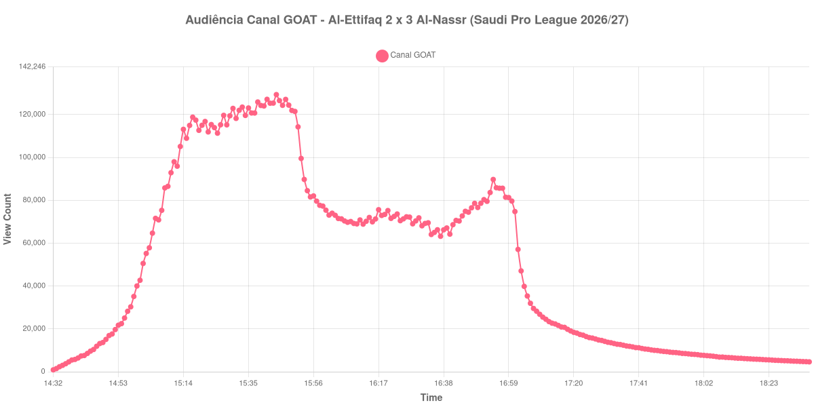

+++
date = 2026-08-25T21:35:00-03:00
draft = false
title = "Confira como foi a audiência de Al-Ettifaq X Al-Nassr no Canal GOAT - 25-08-2026"
author = 'Instituto Cambacica de Audiência'
summary = "Veja a maior audiência que já medimos no Canal GOAT, numa virada do Al-Nassr em que o pico ficou todo no primeiro tempo"
tags = ['YouTube', 'Analytics', 'Audiência', 'Canal-GOAT', 'Al-Ettifaq', 'Al-Nassr', 'Saudi Pro League']
categories = ['Audiência']
campeonatos = ['Saudi Pro League 2026']
data_evento = 2026-08-25
+++

Neste texto, vamos informar os resultados da audiência em tempo real obtidos pelo Canal GOAT, durante a transmissão de Al-Ettifaq X Al-Nassr, jogo da 3ª rodada da Saudi Pro League de 2026/27, no Estádio Príncipe Mohammed bin Fahd, em Dammam, em 25/08/2026. O Al-Ettifaq, mandante, abriu 2 a 0 e acabou derrotado por 2 a 3 diante de um adversário que jogou quase toda a partida com 10 jogadores: o goleiro Bento foi expulso aos 12 minutos por falta em Moussa Dembélé fora da área. Ondrej Duda e Álvaro Medrán colocaram o mandante em vantagem ainda no primeiro tempo, e a virada veio com dois gols de Sadio Mané e um de Abdulelah Al-Amri, deixando o Al-Nassr com 9 pontos na competição. O público presente não foi divulgado por nenhuma das fontes que consultamos.

A audiência começou a ser medida às 25/08/2026 14:32:55 (Horário de Brasília). Como a coleta começou menos de duas horas antes do apito inicial, o gráfico e os números abaixo partem do primeiro registro disponível; a medição também terminou antes de completar duas horas após o apito final, de modo que o recorte vai até o último dado coletado. Os principais pontos da audiência são (em aparelhos conectados):

* **Início da Medição (14:32:55): 878**
* **Início da partida (15:00:55): 42.675**
* Após o gol de Ondrej Duda, do Al-Ettifaq, aos 31 minutos do primeiro tempo (15:31:55): 118.211
* Após o gol de Álvaro Medrán, do Al-Ettifaq, aos 45+3 minutos do primeiro tempo (15:48:55): 124.400
* **Fim do primeiro tempo (15:51:55): 114.260**
* Durante o intervalo (16:05:55): 71.326
* **Início do segundo tempo (16:06:55): 70.364**
* Após o gol de Sadio Mané, do Al-Nassr, aos 74 minutos do segundo tempo (16:31:55): 68.089
* Após o gol de Abdulelah Al-Amri, do Al-Nassr, aos 77 minutos do segundo tempo (16:34:55): 64.041
* Após o gol de Sadio Mané, do Al-Nassr, aos 90 minutos do segundo tempo (16:47:55): 76.489
* **Final da partida (16:52:55): 79.518**
* **Final da Medição (18:36:55): 4.612**

O pico de audiência foi às 15:44:55, aos 44 minutos de jogo, com **129.314** aparelhos conectados simultâneos.

Esta é a maior audiência que já registramos para uma transmissão do Canal GOAT: 1ª entre as 14 medições que temos do canal e 1ª entre as 10 da Saudi Pro League, com os 129.314 do pico ficando 454% acima dos 23.327 aparelhos conectados de média das outras nove partidas do campeonato saudita. Nem a comparação mais próxima chega perto: no jogo anterior do Al-Nassr que acompanhamos, contra o [Al-Riyadh](/posts/2026-08-21-al-riyadh-x-al-nassr-canal-goat/), o máximo foi de 69.463 aparelhos conectados, e os 129.314 desta terça-feira estão 86% acima daquele número. A escalada foi rápida: os 129.314 do pico ficaram 203% acima dos 42.675 registrados no apito inicial, meia hora depois de a medição começar em 878.

O detalhe que a curva torna difícil de ignorar é que tudo isso aconteceu antes do intervalo. O máximo da medição caiu aos 44 minutos, com o Al-Ettifaq vencendo por 2 a 0 e o adversário com um jogador a menos, e a partir dali a transmissão nunca mais voltou àquele patamar — o melhor momento do segundo tempo inteiro foi de 80.317 aparelhos conectados, pouco mais da metade do pico. O intervalo levou 38% da audiência, dos 114.260 do apito para os 71.326 do registro do intervalo, e o esvaziamento nem parou com a bola de volta: o fundo do vale só chegou às 16:12:55, com 68.873 aparelhos conectados, seis minutos depois do recomeço. A virada devolveu pouco. Os três gols do Al-Nassr aparecem na lista com valores abaixo dos 70.364 do recomeço ou muito perto deles, e os 79.518 do apito final são apenas 13% acima daquele mesmo recomeço. É um contraste que vale registrar: o público chegou para ver o jogo grande e foi embora antes da parte emocionante dele. Registramos também que Cristiano Ronaldo foi substituído no intervalo, por opção tática, e não voltou para o segundo tempo — a curva mostra o que mostra, e não temos como atribuir a queda a uma causa única.

Depois do apito final a transmissão manteve cobertura por alguns minutos e então cortou: às 17:01:55 ainda havia 74.747 aparelhos conectados e no minuto seguinte já eram 57.079. Daí em diante a curva desce sem interrupção pelas quase duas horas restantes de medição, até os 4.612 do último registro, que são 6% dos 79.518 do encerramento da partida.

No gráfico a seguir, mostramos a evolução da audiência entre o primeiro registro da medição e o último registro coletado, num total de 245 registros:

Para você verificar os metadados desta medição, você pode consultar o [repositório contendo o CSV com os dados e com os prints do minuto a minuto da medição](https://github.com/institutocambacica/audiencias_25_08_2026/tree/main/2026-08-25_al-ettifaq-x-al-nassr_onsQ_f4BqgQ).

---

*Para mais informações sobre nossa metodologia, visite nossa página [Sobre](/sobre).*
