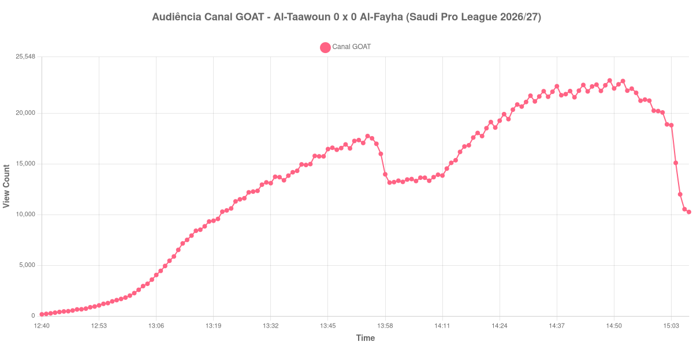

+++
date = 2026-08-25T21:30:00-03:00
draft = false
title = "Confira como foi a audiência de Al-Taawoun X Al-Fayha no Canal GOAT - 25-08-2026"
author = 'Instituto Cambacica de Audiência'
summary = "Veja como foi a audiência de um 0 a 0 saudita no Canal GOAT, medição em que o pico só apareceu aos 99 minutos de jogo"
tags = ['YouTube', 'Analytics', 'Audiência', 'Canal-GOAT', 'Al-Taawoun', 'Al-Fayha', 'Saudi Pro League']
categories = ['Audiência']
campeonatos = ['Saudi Pro League 2026']
data_evento = 2026-08-25
+++

Neste texto, vamos informar os resultados da audiência em tempo real obtidos pelo Canal GOAT, durante a transmissão de Al-Taawoun X Al-Fayha, jogo da 3ª rodada da Saudi Pro League de 2026/27, no Estádio do Al-Taawoun, em Buraydah, em 25/08/2026. O Al-Taawoun, mandante, empatou em 0 a 0 diante de 3.431 pessoas, num jogo em que finalizou 26 vezes contra 12 do adversário sem conseguir abrir o placar.

A audiência começou a ser medida às 25/08/2026 12:40:55 (Horário de Brasília). Como a coleta começou menos de duas horas antes do apito inicial, o gráfico e os números abaixo partem do primeiro registro disponível; a medição também terminou antes de completar duas horas após o apito final, de modo que o recorte vai até o último dado coletado. Os principais pontos da audiência são (em aparelhos conectados):

* **Início da Medição (12:40:55): 164**
* **Início da partida (13:10:55): 5.869**
* **Fim do primeiro tempo (13:57:55): 15.986**
* Durante o intervalo (13:59:55): 13.155
* **Início do segundo tempo (14:12:55): 14.534**
* **Final da partida (15:02:55): 18.893**
* **Final da Medição (15:07:55): 10.257**

O pico de audiência foi às 14:49:55, já nos minutos finais do segundo tempo, com **23.225** aparelhos conectados simultâneos.

O que chama atenção nesta curva é a ordem em que as coisas acontecem. Num jogo sem gol, seria razoável esperar que a audiência se cansasse; aqui ela fez o contrário. O melhor momento do primeiro tempo foi de 17.743 aparelhos conectados, e o segundo tempo passou disso com folga: a transmissão saiu dos 14.534 do recomeço para os 18.893 do apito final, alta de 30%, e o máximo da medição só apareceu aos 99 minutos de jogo. A pausa custou pouco: o intervalo levou 18%, dos 15.986 do fim do primeiro tempo aos 13.155 do fundo do vale, e o recomeço já devolveu boa parte disso.

Em escala, esta é a 5ª maior das 10 medições da Saudi Pro League que já publicamos, com os 23.225 do pico ficando 34% abaixo dos 35.115 aparelhos conectados de média das outras nove. A comparação mais útil, porém, é com o próprio Al-Taawoun: três dias antes, quando o time visitou o [Al-Kholood](/posts/2026-08-22-al-kholood-x-al-taawoun-canal-goat/), a transmissão inteira não passou de 1.090 aparelhos conectados. A diferença de escala entre as duas medições é grande demais para ser atribuída ao que aconteceu em campo, e não vamos especular sobre a causa. Depois do apito final a curva não desabou de imediato — os 10.257 do último registro ainda são 54% dos 18.893 do encerramento da partida —, mas o degrau que a encerra é nítido: às 15:03:55 a transmissão tinha 18.812 aparelhos conectados e um minuto depois já marcava 15.098, quando a cobertura de pós-jogo saiu do ar.

No gráfico a seguir, mostramos a evolução da audiência entre o primeiro registro da medição e o último registro coletado, num total de 148 registros:

Para você verificar os metadados desta medição, você pode consultar o [repositório contendo o CSV com os dados e com os prints do minuto a minuto da medição](https://github.com/institutocambacica/audiencias_25_08_2026/tree/main/2026-08-25_al-taawoun-x-al-fayha_Kneh0jivrNs).

---

*Para mais informações sobre nossa metodologia, visite nossa página [Sobre](/sobre).*
