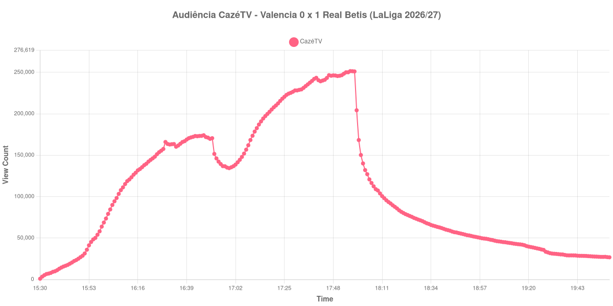

+++
date = 2026-08-25T21:40:00-03:00
draft = false
title = "Confira como foi a audiência de Valencia X Real Betis na CazéTV - 25-08-2026"
author = 'Instituto Cambacica de Audiência'
summary = "Veja a maior medição do dia: um jogo atrasado da 1ª rodada de LaLiga na CazéTV, com a audiência subindo até o apito final"
tags = ['YouTube', 'Analytics', 'Audiência', 'CazeTV', 'Valencia', 'Real Betis', 'LaLiga']
categories = ['Audiência']
campeonatos = ['LaLiga 2026']
data_evento = 2026-08-25
+++

Neste texto, vamos informar os resultados da audiência em tempo real obtidos pela CazéTV, durante a transmissão de Valencia X Real Betis, jogo atrasado da 1ª rodada de LaLiga de 2026/27, no Mestalla, em Valência, em 25/08/2026. O Valencia, mandante, perdeu por 0 a 1 diante de 45.472 pessoas, com gol de Pablo García aos 83 minutos, num cruzamento rasteiro de Fran García — os dois recém-entrados. Não houve expulsões, e o time da casa não marcou pelo segundo jogo seguido em seus domínios.

A audiência começou a ser medida às 25/08/2026 15:30:55 (Horário de Brasília). Como a coleta começou menos de duas horas antes do apito inicial, o gráfico e os números abaixo partem do primeiro registro disponível. Do outro lado, a transmissão seguiu no ar bem além do fim do jogo, e por isso o recorte para exatamente duas horas depois do apito final, descartando os 67 registros posteriores, que já não dizem respeito à partida. Os principais pontos da audiência são (em aparelhos conectados):

* **Início da Medição (15:30:55): 938**
* **Início da partida (16:00:55): 68.737**
* **Fim do primeiro tempo (16:51:55): 170.526**
* Durante o intervalo (16:59:55): 134.381
* **Início do segundo tempo (17:06:55): 151.941**
* Após o gol de Pablo García, do Real Betis, aos 83 minutos do segundo tempo (17:40:55): 243.395
* **Final da partida (17:58:55): 251.066**
* **Duas horas após o apito final (19:58:55): 26.761**

O pico de audiência foi às 17:56:55, aos 116 minutos de jogo, com **251.471** aparelhos conectados simultâneos.

A forma desta curva é simples de descrever: ela sobe. Do apito inicial ao apito final a audiência só interrompe a subida uma vez, no intervalo, e a interrupção foi curta — o intervalo custou 21%, dos 170.526 do fim do primeiro tempo aos 134.381 do fundo do vale, e a recuperação começou antes de a bola voltar a rolar, com 135.430 aparelhos conectados já às 17:00:55. O segundo tempo foi todo de crescimento: a transmissão saiu dos 151.941 do recomeço para os 251.066 do apito final, alta de 65%, e o máximo da medição caiu aos 116 minutos de jogo, com o Betis segurando a vantagem sob pressão. Comparado ao começo, os 251.471 do pico ficaram 266% acima dos 68.737 registrados no apito inicial.

Em números absolutos, é a 4ª maior das 16 medições de LaLiga que já publicamos, com os 251.471 do pico ficando 22% acima dos 205.553 aparelhos conectados de média das outras quinze partidas do campeonato espanhol. O Betis também aparece do lado alto da comparação mais direta: na estreia contra o [Real Sociedad](/posts/2026-08-21-real-betis-x-real-sociedad-cazetv/), quatro dias antes, o máximo tinha sido de 212.232 aparelhos conectados, e os 251.471 desta terça-feira estão 18% acima daquele número. Vale registrar que o jogo anterior do Valencia em casa, contra o [Celta de Vigo](/posts/2026-08-22-valencia-x-celta-de-vigo-cazetv/), ficou sem medição por uma falha nossa de coleta, de modo que não temos com que comparar dentro do próprio Mestalla. Depois do apito final o esvaziamento é rápido e contínuo: duas horas depois restavam 26.761 aparelhos conectados, ou 11% dos 251.066 do encerramento da partida.

No gráfico a seguir, mostramos a evolução da audiência entre o primeiro registro da medição e duas horas após o apito final, num total de 269 registros:

Para você verificar os metadados desta medição, você pode consultar o [repositório contendo o CSV com os dados e com os prints do minuto a minuto da medição](https://github.com/institutocambacica/audiencias_25_08_2026/tree/main/2026-08-25_valencia-x-real-betis_PGa-aoyy7gA).

---

*Para mais informações sobre nossa metodologia, visite nossa página [Sobre](/sobre).*
