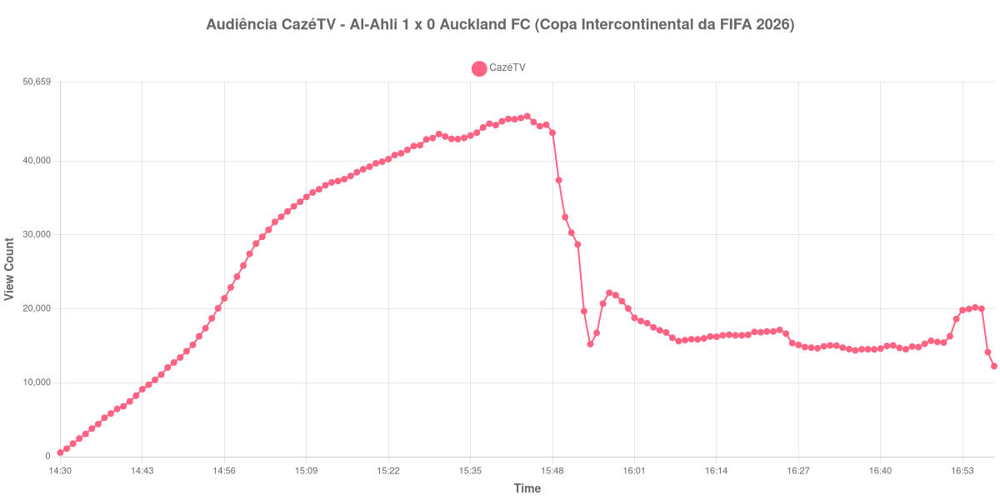

+++
date = 2026-08-28T05:00:00-03:00
draft = false
title = "Confira como foi a audiência de Al-Ahli X Auckland FC na CazéTV - 26-08-2026"
author = 'Instituto Cambacica de Audiência'
summary = "Veja como foi a audiência de Al-Ahli X Auckland FC na CazéTV"
tags = ['YouTube', 'Analytics', 'Audiência', 'CazeTV', 'Al-Ahli', 'Auckland FC', 'Copa Intercontinental']
categories = ['Audiência']
canais = ['CazeTV']
campeonatos = ['Copa Intercontinental 2026']
data_evento = 2026-08-26
+++

Neste texto, vamos informar os resultados da audiência em tempo real obtidos na CazéTV, durante a transmissão de Al-Ahli X Auckland FC, play-off da Copa África-Ásia-Pacífico da Copa Intercontinental da FIFA 2026, no King Abdullah Sports City, em Jidá, em 26/08/2026. O Al-Ahli venceu por 1 a 0, diante de 45.000 pessoas.

A audiência começou a ser medida às 26/08/2026 14:30:55 (Horário de Brasília). Como a coleta começou menos de duas horas antes do início do evento, o gráfico e os números abaixo partem do primeiro registro disponível; o recorte vai até o último dado coletado. Os principais pontos da audiência são (em aparelhos conectados):

* **Início da Medição (14:30:55): 545**
* **Início da partida (15:00:55): 27.438**
* **Fim do primeiro tempo (15:52:55): 28.701**
* Durante o intervalo (15:54:55): 15.229
* **Início do segundo tempo (16:07:55): 16.082**
* Após o gol de Saleh Abu Al-Shamat, do Al-Ahli, aos 63 minutos (16:20:55): 16.875
* **Final da partida (16:52:55): 18.623**
* **Final da Medição (16:58:55): 12.237**

O pico de audiência foi às 15:44:55, durante o primeiro tempo, com **46.053** aparelhos conectados simultâneos.

A pausa aparece com nitidez na curva: a audiência estava em 28.701 aparelhos no fim do primeiro tempo, chegou a 15.229 durante o intervalo e marcou 16.082 no recomeço. O máximo de 46.053 aparelhos ocorreu durante o primeiro tempo.

A medição terminou com 12.237 aparelhos conectados. O valor pertence ao contador ao vivo e não a visualizações do vídeo gravado; não encontramos cauda de VOD neste lote.

No gráfico a seguir, mostramos a evolução da audiência entre o primeiro registro da medição e o último registro coletado, num total de 149 registros:

Para você verificar os metadados desta medição, você pode consultar o [repositório contendo o CSV com os dados e com os prints do minuto a minuto da medição](https://github.com/institutocambacica/audiencias_26_27_08_2026/tree/main/2026-08-26_al-ahli-x-auckland-fc_L4TAakwlQHM).

---

*Para mais informações sobre nossa metodologia, visite nossa página [Sobre](/sobre).*
