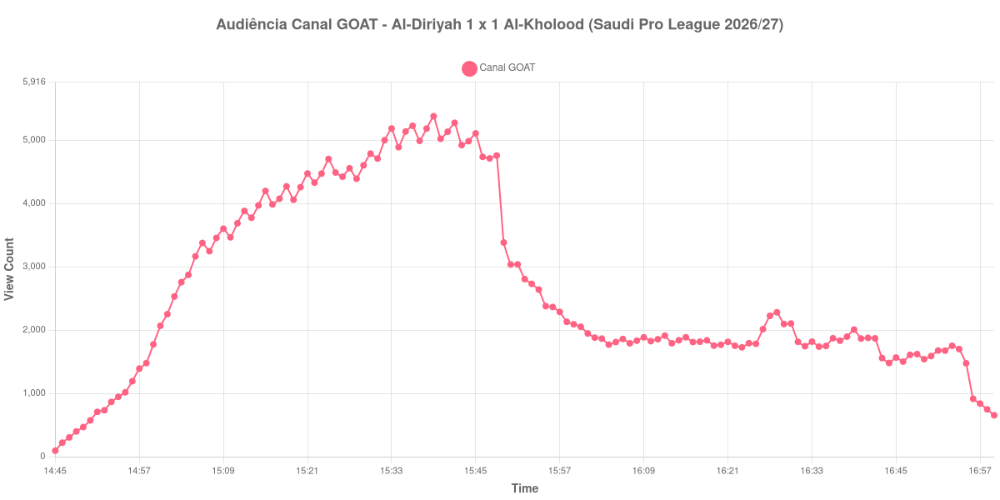

+++
date = 2026-08-28T05:05:00-03:00
draft = false
title = "Confira como foi a audiência de Al-Diriyah X Al-Kholood no Canal GOAT - 26-08-2026"
author = 'Instituto Cambacica de Audiência'
summary = "Veja como foi a audiência de Al-Diriyah X Al-Kholood no Canal GOAT"
tags = ['YouTube', 'Analytics', 'Audiência', 'Canal-GOAT', 'Al-Diriyah', 'Al-Kholood', 'Saudi Pro League']
categories = ['Audiência']
canais = ['Canal GOAT']
campeonatos = ['Saudi Pro League 2026']
data_evento = 2026-08-26
+++

Neste texto, vamos informar os resultados da audiência em tempo real obtidos no Canal GOAT, durante a transmissão de Al-Diriyah X Al-Kholood, 3ª rodada da Saudi Pro League 2026/27, no Al-Awwal Park, em Riade, em 26/08/2026. Al-Diriyah e Al-Kholood empataram em 1 a 1.

A audiência começou a ser medida às 26/08/2026 14:45:55 (Horário de Brasília). Como a coleta começou menos de duas horas antes do início do evento, o gráfico e os números abaixo partem do primeiro registro disponível; o recorte vai até o último dado coletado. Os principais pontos da audiência são (em aparelhos conectados):

* **Início da Medição (14:45:55): 94**
* **Início da partida (15:00:55): 2.067**
* **Fim do primeiro tempo (15:48:55): 4.757**
* Durante o intervalo (16:02:55): 1.880
* **Início do segundo tempo (16:03:55): 1.865**
* Após o gol de Abdulaziz Al-Aliwah, do Al-Kholood, aos 71 minutos (16:28:55): 2.281
* Após o gol de Meshari Al-Nemer, do Al-Diriyah, aos 83 minutos (16:40:55): 1.866
* **Final da partida (16:52:55): 1.675**
* **Final da Medição (16:59:55): 654**

O pico de audiência foi às 15:39:55, durante o primeiro tempo, com **5.378** aparelhos conectados simultâneos.

A pausa aparece com nitidez na curva: a audiência estava em 4.757 aparelhos no fim do primeiro tempo, chegou a 1.880 durante o intervalo e marcou 1.865 no recomeço. O máximo de 5.378 aparelhos ocorreu durante o primeiro tempo.

A medição terminou com 654 aparelhos conectados. O valor pertence ao contador ao vivo e não a visualizações do vídeo gravado; não encontramos cauda de VOD neste lote.

No gráfico a seguir, mostramos a evolução da audiência entre o primeiro registro da medição e o último registro coletado, num total de 135 registros:

Para você verificar os metadados desta medição, você pode consultar o [repositório contendo o CSV com os dados e com os prints do minuto a minuto da medição](https://github.com/institutocambacica/audiencias_26_27_08_2026/tree/main/2026-08-26_al-diriyah-x-al-kholood_3avNMVWCwf0).

---

*Para mais informações sobre nossa metodologia, visite nossa página [Sobre](/sobre).*
