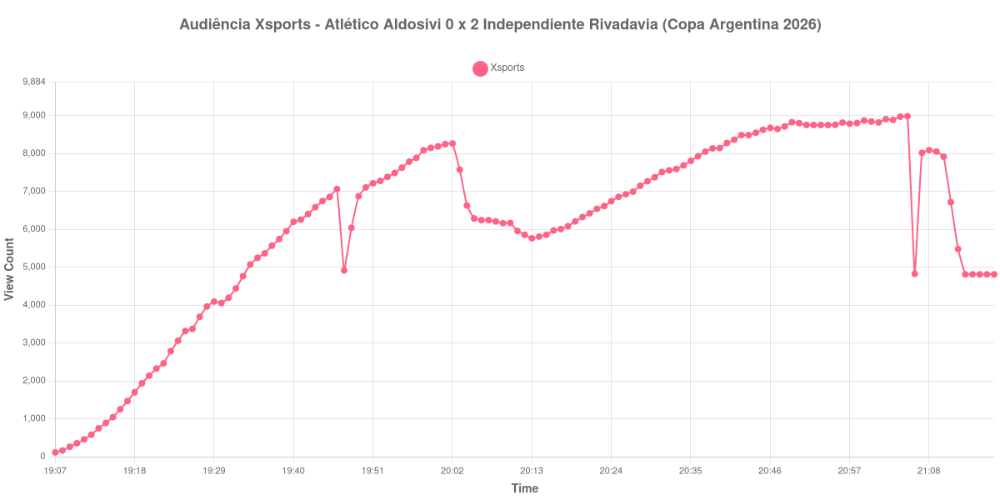

+++
date = 2026-08-28T05:20:00-03:00
draft = false
title = "Confira como foi a audiência de Atlético Aldosivi X Independiente Rivadavia na Xsports - 26-08-2026"
author = 'Instituto Cambacica de Audiência'
summary = "Veja como foi a audiência de Atlético Aldosivi X Independiente Rivadavia na Xsports"
tags = ['YouTube', 'Analytics', 'Audiência', 'Xsports', 'Atlético Aldosivi', 'Independiente Rivadavia', 'Copa Argentina']
categories = ['Audiência']
canais = ['Xsports']
campeonatos = ['Copa Argentina 2026']
data_evento = 2026-08-26
+++

Neste texto, vamos informar os resultados da audiência em tempo real obtidos na Xsports, durante a transmissão de Atlético Aldosivi X Independiente Rivadavia, oitavas de final da Copa Argentina 2026, no Estádio Florencio Sola, em Banfield, em 26/08/2026. O Independiente Rivadavia venceu por 2 a 0.

A audiência começou a ser medida às 26/08/2026 19:07:55 (Horário de Brasília). Como a coleta começou menos de duas horas antes do início do evento, o gráfico e os números abaixo partem do primeiro registro disponível; o recorte vai até o último dado coletado. Os principais pontos da audiência são (em aparelhos conectados):

* **Início da Medição (19:07:55): 114**
* **Início da partida (19:15:55): 1.045**
* Após o gol de Gonzalo Ríos, do Independiente Rivadavia, aos 17 minutos (19:32:55): 4.439
* **Fim do primeiro tempo (20:03:55): 7.576**
* Durante o intervalo (20:13:55): 5.764
* **Início do segundo tempo (20:18:55): 6.082**
* Após o gol de José Florentín, do Independiente Rivadavia, aos 90+4 minutos (21:06:55): 4.827
* **Final da partida (21:07:55): 8.020**
* **Final da Medição (21:17:55): 4.811**

O pico de audiência foi às 21:05:55, durante o segundo tempo, com **8.985** aparelhos conectados simultâneos.

A pausa aparece com nitidez na curva: a audiência estava em 7.576 aparelhos no fim do primeiro tempo, chegou a 5.764 durante o intervalo e marcou 6.082 no recomeço. O máximo de 8.985 aparelhos ocorreu durante o segundo tempo.

A medição terminou com 4.811 aparelhos conectados. O valor pertence ao contador ao vivo e não a visualizações do vídeo gravado; não encontramos cauda de VOD neste lote.

No gráfico a seguir, mostramos a evolução da audiência entre o primeiro registro da medição e o último registro coletado, num total de 131 registros:

Para você verificar os metadados desta medição, você pode consultar o [repositório contendo o CSV com os dados e com os prints do minuto a minuto da medição](https://github.com/institutocambacica/audiencias_26_27_08_2026/tree/main/2026-08-26_atletico-aldosivi-x-independiente-rivadavia_7NQnWNMeQnc).

---

*Para mais informações sobre nossa metodologia, visite nossa página [Sobre](/sobre).*
