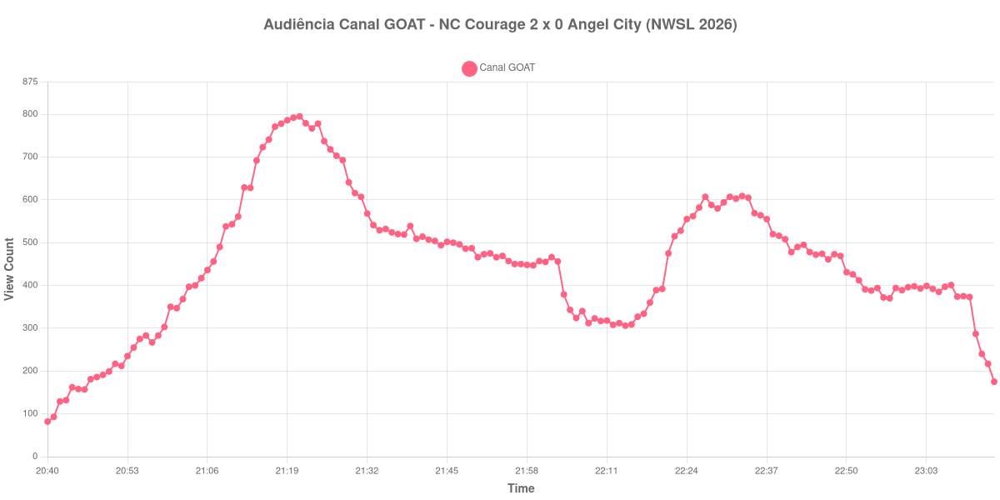

+++
date = 2026-08-28T05:25:00-03:00
draft = false
title = "Confira como foi a audiência de NC Courage X Angel City no Canal GOAT - 26-08-2026"
author = 'Instituto Cambacica de Audiência'
summary = "Veja como foi a audiência de NC Courage X Angel City no Canal GOAT"
tags = ['YouTube', 'Analytics', 'Audiência', 'Canal-GOAT', 'NC Courage', 'Angel City', 'NWSL']
categories = ['Audiência']
campeonatos = ['NWSL 2026']
data_evento = 2026-08-26
+++

Neste texto, vamos informar os resultados da audiência em tempo real obtidos no Canal GOAT, durante a transmissão de NC Courage X Angel City, temporada regular da NWSL 2026, no First Horizon Stadium, em Cary, em 26/08/2026. O NC Courage venceu por 2 a 0.

A audiência começou a ser medida às 26/08/2026 20:40:55 (Horário de Brasília). Como a coleta começou menos de duas horas antes do início do evento, o gráfico e os números abaixo partem do primeiro registro disponível; o recorte vai até o último dado coletado; o intervalo não deixou assinatura identificável na curva e, por isso, não foi transformado em marco. Os principais pontos da audiência são (em aparelhos conectados):

* **Início da Medição (20:40:55): 82**
* **Início da partida (21:00:55): 350**
* Após o gol de Ashley Sanchez, do NC Courage, aos 41 minutos (21:41:55): 514
* Após o gol de Ashley Sanchez, do NC Courage, aos 78 minutos (22:35:55): 569
* **Final da partida (22:56:55): 372**
* **Final da Medição (23:14:55): 175**

O pico de audiência foi às 21:21:55, durante o primeiro tempo, com **795** aparelhos conectados simultâneos.

A curva não sustenta um marco de intervalo, mas permite registrar o máximo de 795 aparelhos, alcançado durante o primeiro tempo, sem inventar uma pausa que os dados não mostram.

A medição terminou com 175 aparelhos conectados. O valor pertence ao contador ao vivo e não a visualizações do vídeo gravado; não encontramos cauda de VOD neste lote.

No gráfico a seguir, mostramos a evolução da audiência entre o primeiro registro da medição e o último registro coletado, num total de 155 registros:

Para você verificar os metadados desta medição, você pode consultar o [repositório contendo o CSV com os dados e com os prints do minuto a minuto da medição](https://github.com/institutocambacica/audiencias_26_27_08_2026/tree/main/2026-08-26_nc-courage-x-angel-city_r7GV2v4mAEg).

---

*Para mais informações sobre nossa metodologia, visite nossa página [Sobre](/sobre).*
