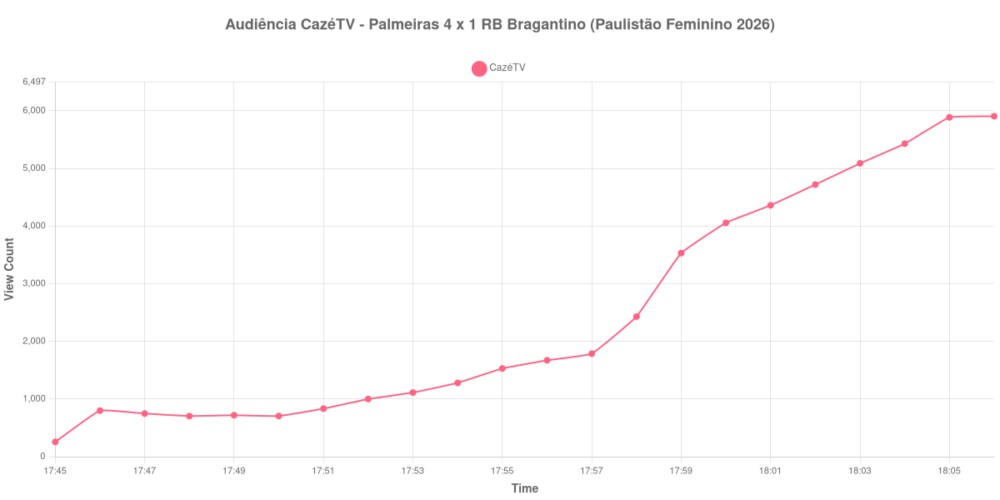

+++
date = 2026-08-28T05:15:00-03:00
draft = false
title = "Confira como foi a audiência de Palmeiras X RB Bragantino na CazéTV - 26-08-2026"
author = 'Instituto Cambacica de Audiência'
summary = "Veja como foi a audiência de Palmeiras X RB Bragantino na CazéTV"
tags = ['YouTube', 'Analytics', 'Audiência', 'CazeTV', 'Palmeiras', 'RB Bragantino', 'Paulistão Feminino']
categories = ['Audiência']
campeonatos = ['Paulistao Feminino 2026']
data_evento = 2026-08-26
+++

Neste texto, vamos informar os resultados da audiência em tempo real obtidos na CazéTV, durante a transmissão de Palmeiras X RB Bragantino, 7ª rodada da Paulistão Feminino 2026, na Arena Barueri, em 26/08/2026. O Palmeiras venceu por 4 a 1 na Arena Barueri.

A audiência começou a ser medida às 26/08/2026 17:45:55 (Horário de Brasília). A coleta foi interrompida antes do apito inicial e não cobre nenhum minuto de jogo. Os principais pontos da audiência são (em aparelhos conectados):

* **Início da Medição (17:45:55): 256**
* **Final da Medição (18:06:55): 5.906**

O pico de audiência foi às 18:06:55, antes do início da partida, com **5.906** aparelhos conectados simultâneos.

A curva registra apenas a formação do público antes da transmissão ser interrompida: saiu de 256 aparelhos no primeiro registro e alcançou 5.906 no último minuto disponível. Como a bola ainda não havia rolado, esses números não descrevem a audiência da partida.

No gráfico a seguir, mostramos a evolução da audiência entre o primeiro registro da medição e o último registro coletado, num total de 22 registros:

Para você verificar os metadados desta medição, você pode consultar o [repositório contendo o CSV com os dados e com os prints do minuto a minuto da medição](https://github.com/institutocambacica/audiencias_26_27_08_2026/tree/main/2026-08-26_palmeiras-x-rb-bragantino_7OtXcAh6CB0).

---

*Para mais informações sobre nossa metodologia, visite nossa página [Sobre](/sobre).*
