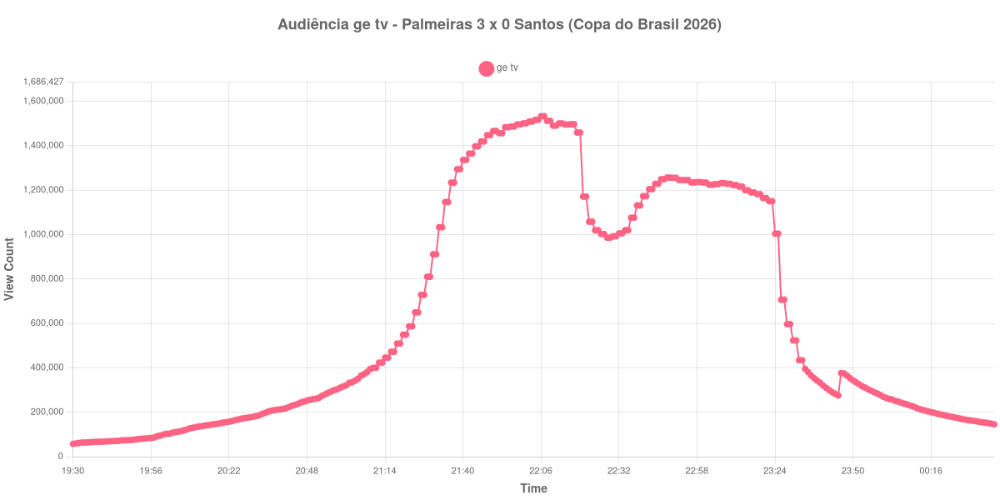

+++
date = 2026-08-28T05:30:00-03:00
draft = false
title = "Confira como foi a audiência de Palmeiras X Santos na ge tv - 26-08-2026"
author = 'Instituto Cambacica de Audiência'
summary = "Veja como foi a audiência de Palmeiras X Santos na ge tv"
tags = ['YouTube', 'Analytics', 'Audiência', 'GETV', 'Palmeiras', 'Santos', 'Copa do Brasil']
categories = ['Audiência']
campeonatos = ['Copa do Brasil 2026']
data_evento = 2026-08-26
+++

Neste texto, vamos informar os resultados da audiência em tempo real obtidos na ge tv, durante a transmissão de Palmeiras X Santos, jogo de ida das quartas de final da Copa do Brasil 2026, no Nubank Parque, em São Paulo, em 26/08/2026. O Palmeiras venceu por 3 a 0.

A audiência começou a ser medida às 26/08/2026 19:30:55 (Horário de Brasília). O recorte vai até o último dado coletado. Os principais pontos da audiência são (em aparelhos conectados):

* **Início da Medição (19:30:55): 57.517**
* **Início da partida (21:30:55): 911.156**
* Após o gol de Flaco López, do Palmeiras, aos 33 minutos (22:03:55): 1.509.193
* Após o gol de Andreas Pereira, do Palmeiras, aos 44 minutos (22:14:55): 1.495.612
* **Fim do primeiro tempo (22:19:55): 1.459.665**
* Durante o intervalo (22:28:55): 986.183
* **Início do segundo tempo (22:34:55): 1.019.781**
* Após o gol de Flaco López, do Palmeiras, aos 60 minutos (22:47:55): 1.249.370
* **Final da partida (23:22:55): 1.150.659**
* **Final da Medição (00:37:55): 145.461**

O pico de audiência foi às 22:06:55, durante o primeiro tempo, com **1.533.115** aparelhos conectados simultâneos.

A pausa aparece com nitidez na curva: a audiência estava em 1.459.665 aparelhos no fim do primeiro tempo, chegou a 986.183 durante o intervalo e marcou 1.019.781 no recomeço. O máximo de 1.533.115 aparelhos ocorreu durante o primeiro tempo.

A medição terminou com 145.461 aparelhos conectados. O valor pertence ao contador ao vivo e não a visualizações do vídeo gravado; não encontramos cauda de VOD neste lote.

No gráfico a seguir, mostramos a evolução da audiência na janela efetivamente coberta pela coleta, num total de 308 registros:

Para você verificar os metadados desta medição, você pode consultar o [repositório contendo o CSV com os dados e com os prints do minuto a minuto da medição](https://github.com/institutocambacica/audiencias_26_27_08_2026/tree/main/2026-08-26_palmeiras-x-santos_ljy_FTVY5Bo).

---

*Para mais informações sobre nossa metodologia, visite nossa página [Sobre](/sobre).*
