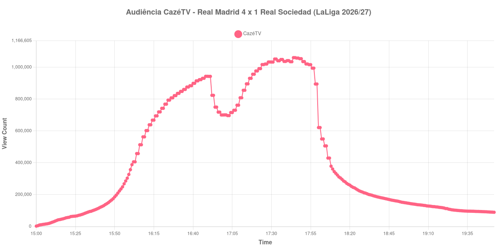

+++
date = 2026-08-28T05:10:00-03:00
draft = false
title = "Confira como foi a audiência de Real Madrid X Real Sociedad na CazéTV - 26-08-2026"
author = 'Instituto Cambacica de Audiência'
summary = "Veja como foi a audiência de Real Madrid X Real Sociedad na CazéTV"
tags = ['YouTube', 'Analytics', 'Audiência', 'CazeTV', 'Real Madrid', 'Real Sociedad', 'LaLiga']
categories = ['Audiência']
canais = ['CazeTV']
campeonatos = ['LaLiga 2026']
data_evento = 2026-08-26
+++

Neste texto, vamos informar os resultados da audiência em tempo real obtidos na CazéTV, durante a transmissão de Real Madrid X Real Sociedad, jogo atrasado da 1ª rodada da LaLiga 2026/27, no Santiago Bernabéu, em Madri, em 26/08/2026. O Real Madrid venceu por 4 a 1, diante de 72.226 pessoas.

A audiência começou a ser medida às 26/08/2026 15:00:55 (Horário de Brasília). Como a coleta começou menos de duas horas antes do início do evento, o gráfico e os números abaixo partem do primeiro registro disponível. Os principais pontos da audiência são (em aparelhos conectados):

* **Início da Medição (15:00:55): 2.550**
* **Início da partida (16:00:55): 357.027**
* Após o gol de Kylian Mbappé, do Real Madrid, aos 40 minutos (16:40:55): 899.163
* Após o gol de Luka Sučić, da Real Sociedad, aos 44 minutos (16:44:55): 922.314
* **Fim do primeiro tempo (16:51:55): 942.864**
* Durante o intervalo (17:02:55): 696.690
* **Início do segundo tempo (17:06:55): 730.258**
* Após o gol de Kylian Mbappé, do Real Madrid, aos 60 minutos (17:17:55): 930.574
* Após o gol de Vinícius Júnior, do Real Madrid, aos 68 minutos (17:25:55): 1.017.007
* Após o gol de Kylian Mbappé, do Real Madrid, aos 80 minutos (17:37:55): 1.048.887
* **Final da partida (17:52:55): 1.020.688**
* **Final da Medição (19:52:55): 89.426**

O pico de audiência foi às 17:44:55, durante o segundo tempo, com **1.060.550** aparelhos conectados simultâneos.

A pausa aparece com nitidez na curva: a audiência estava em 942.864 aparelhos no fim do primeiro tempo, chegou a 696.690 durante o intervalo e marcou 730.258 no recomeço. O máximo de 1.060.550 aparelhos ocorreu durante o segundo tempo.

A medição terminou com 89.426 aparelhos conectados. O valor pertence ao contador ao vivo e não a visualizações do vídeo gravado; não encontramos cauda de VOD neste lote.

No gráfico a seguir, mostramos a evolução da audiência entre o primeiro registro disponível e duas horas após o encerramento do evento, num total de 293 registros:

Para você verificar os metadados desta medição, você pode consultar o [repositório contendo o CSV com os dados e com os prints do minuto a minuto da medição](https://github.com/institutocambacica/audiencias_26_27_08_2026/tree/main/2026-08-26_real-madrid-x-real-sociedad_SWprYWItU4s).

---

*Para mais informações sobre nossa metodologia, visite nossa página [Sobre](/sobre).*
