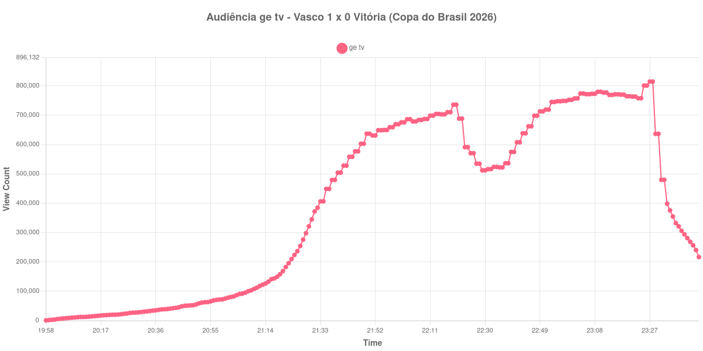

+++
date = 2026-08-28T05:35:00-03:00
draft = false
title = "Confira como foi a audiência de Vasco X Vitória na ge tv - 26-08-2026"
author = 'Instituto Cambacica de Audiência'
summary = "Veja como foi a audiência de Vasco X Vitória na ge tv"
tags = ['YouTube', 'Analytics', 'Audiência', 'GETV', 'Vasco', 'Vitória', 'Copa do Brasil']
categories = ['Audiência']
campeonatos = ['Copa do Brasil 2026']
data_evento = 2026-08-26
+++

Neste texto, vamos informar os resultados da audiência em tempo real obtidos na ge tv, durante a transmissão de Vasco X Vitória, jogo de ida das quartas de final da Copa do Brasil 2026, no Maracanã, no Rio de Janeiro, em 26/08/2026. O Vasco venceu por 1 a 0 no Maracanã.

A audiência começou a ser medida às 26/08/2026 19:58:55 (Horário de Brasília). Como a coleta começou menos de duas horas antes do início do evento, o gráfico e os números abaixo partem do primeiro registro disponível; o recorte vai até o último dado coletado. Os principais pontos da audiência são (em aparelhos conectados):

* **Início da Medição (19:58:55): 700**
* **Início da partida (21:30:55): 345.067**
* **Fim do primeiro tempo (22:22:55): 688.480**
* Durante o intervalo (22:29:55): 512.170
* **Início do segundo tempo (22:37:55): 536.327**
* Após o gol de Andrés Gómez, do Vasco, aos 59 minutos (22:46:55): 662.196
* **Final da partida (23:22:55): 763.599**
* **Final da Medição (23:44:55): 216.597**

O pico de audiência foi às 23:27:55, após o encerramento do evento, com **814.665** aparelhos conectados simultâneos.

A pausa aparece com nitidez na curva: a audiência estava em 688.480 aparelhos no fim do primeiro tempo, chegou a 512.170 durante o intervalo e marcou 536.327 no recomeço. O máximo de 814.665 aparelhos ocorreu após o encerramento do evento.

A medição terminou com 216.597 aparelhos conectados. O valor pertence ao contador ao vivo e não a visualizações do vídeo gravado; não encontramos cauda de VOD neste lote.

No gráfico a seguir, mostramos a evolução da audiência entre o primeiro registro da medição e o último registro coletado, num total de 227 registros:

Para você verificar os metadados desta medição, você pode consultar o [repositório contendo o CSV com os dados e com os prints do minuto a minuto da medição](https://github.com/institutocambacica/audiencias_26_27_08_2026/tree/main/2026-08-26_vasco-x-vitoria_2ocY9xQVQiE).

---

*Para mais informações sobre nossa metodologia, visite nossa página [Sobre](/sobre).*
