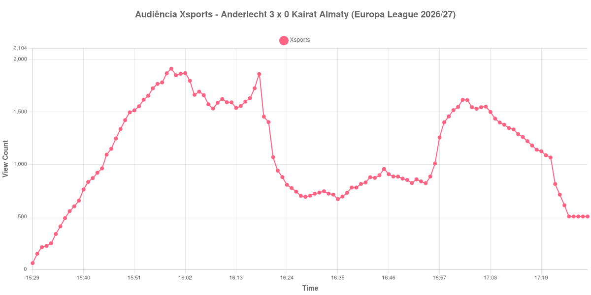

+++
date = 2026-08-28T05:40:00-03:00
draft = false
title = "Confira como foi a audiência de Anderlecht X Kairat Almaty na Xsports - 27-08-2026"
author = 'Instituto Cambacica de Audiência'
summary = "Veja como foi a audiência de Anderlecht X Kairat Almaty na Xsports"
tags = ['YouTube', 'Analytics', 'Audiência', 'Xsports', 'Anderlecht', 'Kairat Almaty', 'Europa League']
categories = ['Audiência']
canais = ['Xsports']
campeonatos = ['Europa League 2026']
data_evento = 2026-08-27
+++

Neste texto, vamos informar os resultados da audiência em tempo real obtidos na Xsports, durante a transmissão de Anderlecht X Kairat Almaty, volta dos play-offs da Europa League 2026/27, no Lotto Park, em Bruxelas, em 27/08/2026. O Anderlecht venceu por 3 a 0 e fechou o confronto em 6 a 0, diante de 16.861 pessoas.

A audiência começou a ser medida às 27/08/2026 15:29:55 (Horário de Brasília). Como a coleta começou menos de duas horas antes do início do evento, o gráfico e os números abaixo partem do primeiro registro disponível; o recorte vai até o último dado coletado. Os principais pontos da audiência são (em aparelhos conectados):

* **Início da Medição (15:29:55): 60**
* **Início da partida (15:30:55): 150**
* Após o gol de Mihajlo Cvetković, do Anderlecht, aos 45+3 minutos (16:18:55): 1.860
* **Fim do primeiro tempo (16:20:55): 1.403**
* Durante o intervalo (16:28:55): 692
* **Início do segundo tempo (16:35:55): 670**
* Após o gol de Danylo Sikan, do Anderlecht, aos 53 minutos (16:40:55): 814
* Após o gol de Giulian Biancone, do Anderlecht, aos 71 minutos (16:58:55): 1.401
* **Final da partida (17:22:55): 814**
* **Final da Medição (17:29:55): 504**

O pico de audiência foi às 15:59:55, durante o primeiro tempo, com **1.912** aparelhos conectados simultâneos.

A pausa aparece com nitidez na curva: a audiência estava em 1.403 aparelhos no fim do primeiro tempo, chegou a 692 durante o intervalo e marcou 670 no recomeço. O máximo de 1.912 aparelhos ocorreu durante o primeiro tempo.

A medição terminou com 504 aparelhos conectados. O valor pertence ao contador ao vivo e não a visualizações do vídeo gravado; não encontramos cauda de VOD neste lote.

No gráfico a seguir, mostramos a evolução da audiência entre o primeiro registro da medição e o último registro coletado, num total de 121 registros:

Para você verificar os metadados desta medição, você pode consultar o [repositório contendo o CSV com os dados e com os prints do minuto a minuto da medição](https://github.com/institutocambacica/audiencias_26_27_08_2026/tree/main/2026-08-27_anderlecht-x-kairat-almaty_1uiYY1DAKz0).

---

*Para mais informações sobre nossa metodologia, visite nossa página [Sobre](/sobre).*
