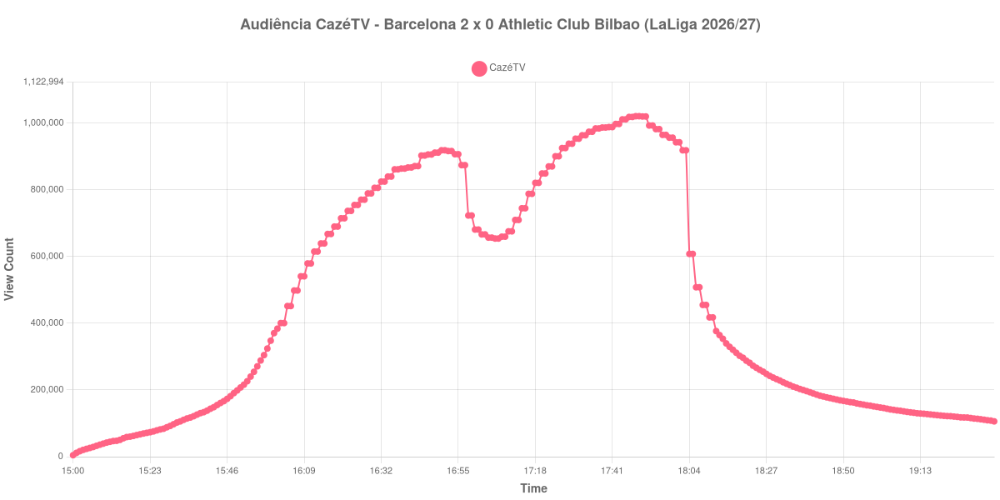

+++
date = 2026-08-28T05:45:00-03:00
draft = false
title = "Confira como foi a audiência de Barcelona X Athletic Club Bilbao na CazéTV - 27-08-2026"
author = 'Instituto Cambacica de Audiência'
summary = "Veja como foi a audiência de Barcelona X Athletic Club Bilbao na CazéTV"
tags = ['YouTube', 'Analytics', 'Audiência', 'CazeTV', 'Barcelona', 'Athletic Club Bilbao', 'LaLiga']
categories = ['Audiência']
canais = ['CazeTV']
campeonatos = ['LaLiga 2026']
data_evento = 2026-08-27
+++

Neste texto, vamos informar os resultados da audiência em tempo real obtidos na CazéTV, durante a transmissão de Barcelona X Athletic Club Bilbao, jogo atrasado da 1ª rodada da LaLiga 2026/27, no Spotify Camp Nou, em Barcelona, em 27/08/2026. O Barcelona venceu por 2 a 0.

A audiência começou a ser medida às 27/08/2026 15:00:55 (Horário de Brasília). Como a coleta começou menos de duas horas antes do início do evento, o gráfico e os números abaixo partem do primeiro registro disponível; o recorte vai até o último dado coletado. Os principais pontos da audiência são (em aparelhos conectados):

* **Início da Medição (15:00:55): 4.459**
* **Início da partida (16:00:55): 370.514**
* Após o gol de Raphinha, do Barcelona, aos 37 minutos (16:37:55): 861.639
* **Fim do primeiro tempo (16:51:55): 918.748**
* Durante o intervalo (17:04:55): 656.896
* **Início do segundo tempo (17:06:55): 654.099**
* Após o gol de Fermín López, do Barcelona, aos 82 minutos (17:39:55): 987.014
* **Final da partida (17:52:55): 993.060**
* **Final da Medição (19:35:55): 105.848**

O pico de audiência foi às 17:48:55, durante o segundo tempo, com **1.020.903** aparelhos conectados simultâneos.

A pausa aparece com nitidez na curva: a audiência estava em 918.748 aparelhos no fim do primeiro tempo, chegou a 656.896 durante o intervalo e marcou 654.099 no recomeço. O máximo de 1.020.903 aparelhos ocorreu durante o segundo tempo.

A medição terminou com 105.848 aparelhos conectados. O valor pertence ao contador ao vivo e não a visualizações do vídeo gravado; não encontramos cauda de VOD neste lote.

No gráfico a seguir, mostramos a evolução da audiência entre o primeiro registro da medição e o último registro coletado, num total de 276 registros:

Para você verificar os metadados desta medição, você pode consultar o [repositório contendo o CSV com os dados e com os prints do minuto a minuto da medição](https://github.com/institutocambacica/audiencias_26_27_08_2026/tree/main/2026-08-27_barcelona-x-athletic-club-bilbao_TDFBtodGRCs).

---

*Para mais informações sobre nossa metodologia, visite nossa página [Sobre](/sobre).*
