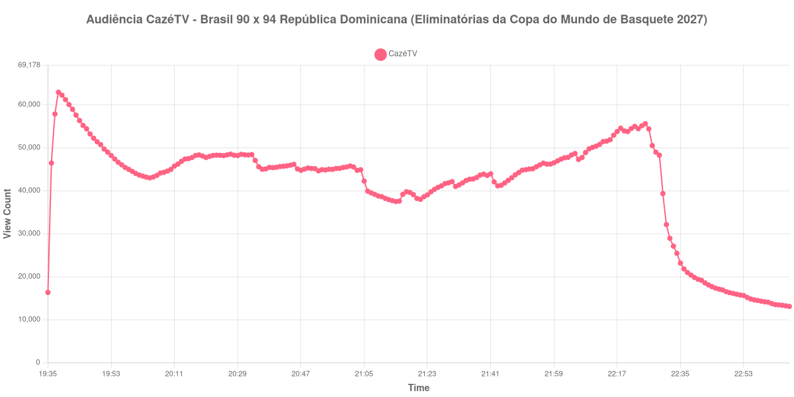

+++
date = 2026-08-28T06:00:00-03:00
draft = false
title = "Confira como foi a audiência de Brasil X República Dominicana na CazéTV - 27-08-2026"
author = 'Instituto Cambacica de Audiência'
summary = "Veja como foi a audiência de Brasil X República Dominicana na CazéTV"
tags = ['YouTube', 'Analytics', 'Audiência', 'CazeTV', 'Brasil', 'República Dominicana', 'Eliminatórias da Copa do Mundo de Basquete']
categories = ['Audiência']
canais = ['CazeTV']
campeonatos = ['Eliminatorias da Copa do Mundo de Basquete 2026']
data_evento = 2026-08-27
+++

Neste texto, vamos informar os resultados da audiência em tempo real obtidos na CazéTV, durante a transmissão de Brasil X República Dominicana, primeira rodada da segunda fase das Eliminatórias da Copa do Mundo de Basquete 2027, na Arena Nilson Nelson, em Brasília, em 27/08/2026. A República Dominicana venceu por 94 a 90, diante de 8.231 pessoas.

A audiência começou a ser medida às 27/08/2026 19:35:55 (Horário de Brasília). Como a coleta começou menos de duas horas antes do início do evento, o gráfico e os números abaixo partem do primeiro registro disponível; o recorte vai até o último dado coletado; o pico ocorreu antes do início da partida e coincide com uma troca de live da CazéTV. Os principais pontos da audiência são (em aparelhos conectados):

* **Início da Medição (19:35:55): 16.320**
* **Início da partida (20:10:55): 44.955**
* **Final da partida (22:29:55): 48.247**
* **Final da Medição (23:06:55): 13.065**

O pico de audiência foi às 19:38:55, antes do início da partida, com **62.889** aparelhos conectados simultâneos.

O máximo de 62.889 aparelhos apareceu antes do início do jogo. A medição do Barcelona X Athletic Club, também na CazéTV, terminou exatamente quando esta começou; a chegada abrupta do público caracteriza uma troca de live, por isso o pico não deve ser lido como interesse produzido pela partida de basquete.

A medição terminou com 13.065 aparelhos conectados. O valor pertence ao contador ao vivo e não a visualizações do vídeo gravado; não encontramos cauda de VOD neste lote.

No gráfico a seguir, mostramos a evolução da audiência entre o primeiro registro da medição e o último registro coletado, num total de 212 registros:

Para você verificar os metadados desta medição, você pode consultar o [repositório contendo o CSV com os dados e com os prints do minuto a minuto da medição](https://github.com/institutocambacica/audiencias_26_27_08_2026/tree/main/2026-08-27_brasil-x-republica-dominicana_sJBPyLS2MBo).

---

*Para mais informações sobre nossa metodologia, visite nossa página [Sobre](/sobre).*
