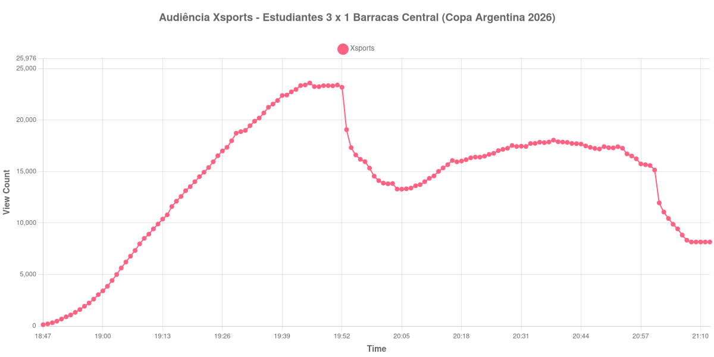

+++
date = 2026-08-28T05:55:00-03:00
draft = false
title = "Confira como foi a audiência de Estudiantes X Barracas Central na Xsports - 27-08-2026"
author = 'Instituto Cambacica de Audiência'
summary = "Veja como foi a audiência de Estudiantes X Barracas Central na Xsports"
tags = ['YouTube', 'Analytics', 'Audiência', 'Xsports', 'Estudiantes', 'Barracas Central', 'Copa Argentina']
categories = ['Audiência']
canais = ['Xsports']
campeonatos = ['Copa Argentina 2026']
data_evento = 2026-08-27
+++

Neste texto, vamos informar os resultados da audiência em tempo real obtidos na Xsports, durante a transmissão de Estudiantes X Barracas Central, oitavas de final da Copa Argentina 2026, no Estádio Norberto Tito Tomaghello, em Florencio Varela, em 27/08/2026. O Estudiantes venceu por 3 a 1.

A audiência começou a ser medida às 27/08/2026 18:47:55 (Horário de Brasília). Como a coleta começou menos de duas horas antes do início do evento, o gráfico e os números abaixo partem do primeiro registro disponível; o recorte vai até o último dado coletado. Os principais pontos da audiência são (em aparelhos conectados):

* **Início da Medição (18:47:55): 134**
* **Início da partida (19:00:55): 3.416**
* Após o gol de Nicolás Jappert (contra), do Barracas Central, aos 40 minutos (19:40:55): 22.440
* **Fim do primeiro tempo (19:52:55): 23.196**
* Durante o intervalo (20:05:55): 13.300
* **Após o gol de Lucas Rodríguez, do Estudiantes, aos 50 minutos; início do segundo tempo (20:07:55): 13.403**
* Após o gol de Norberto Briasco, do Barracas Central, aos 83 minutos (20:40:55): 17.876
* Após o gol de Guido Carrillo, do Estudiantes, aos 88 minutos (20:45:55): 17.502
* **Final da partida (20:52:55): 17.423**
* **Final da Medição (21:12:55): 8.167**

O pico de audiência foi às 19:45:55, durante o primeiro tempo, com **23.614** aparelhos conectados simultâneos.

A pausa aparece com nitidez na curva: a audiência estava em 23.196 aparelhos no fim do primeiro tempo, chegou a 13.300 durante o intervalo e marcou 13.403 no recomeço. O máximo de 23.614 aparelhos ocorreu durante o primeiro tempo.

A medição terminou com 8.167 aparelhos conectados. O valor pertence ao contador ao vivo e não a visualizações do vídeo gravado; não encontramos cauda de VOD neste lote.

No gráfico a seguir, mostramos a evolução da audiência entre o primeiro registro da medição e o último registro coletado, num total de 146 registros:

Para você verificar os metadados desta medição, você pode consultar o [repositório contendo o CSV com os dados e com os prints do minuto a minuto da medição](https://github.com/institutocambacica/audiencias_26_27_08_2026/tree/main/2026-08-27_estudiantes-x-barracas-central_pM2oD3PZp5o).

---

*Para mais informações sobre nossa metodologia, visite nossa página [Sobre](/sobre).*
