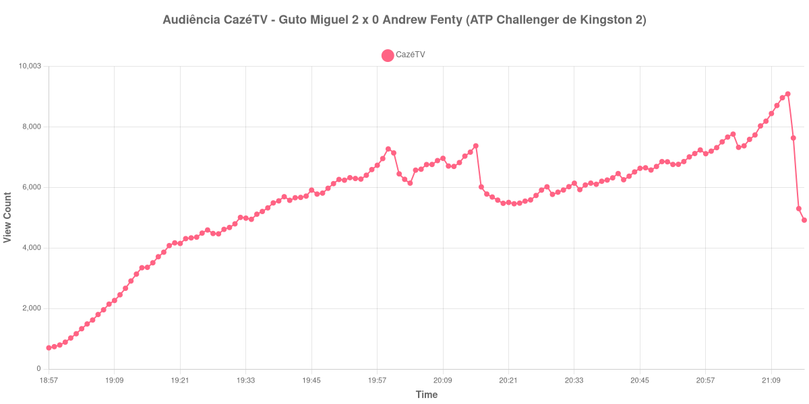

+++
date = 2026-08-28T05:50:00-03:00
draft = false
title = "Confira como foi a audiência de Guto Miguel X Andrew Fenty na CazéTV - 27-08-2026"
author = 'Instituto Cambacica de Audiência'
summary = "Veja como foi a audiência de Guto Miguel X Andrew Fenty na CazéTV"
tags = ['YouTube', 'Analytics', 'Audiência', 'CazeTV', 'Guto Miguel', 'Andrew Fenty', 'ATP Challenger']
categories = ['Audiência']
canais = ['CazeTV']
campeonatos = ['ATP Challenger 2026']
data_evento = 2026-08-27
+++

Neste texto, vamos informar os resultados da audiência em tempo real obtidos na CazéTV, durante a transmissão de Guto Miguel X Andrew Fenty, quartas de final da ATP Challenger de Kingston 2, em Kingston, na Jamaica, em 27/08/2026. Guto Miguel venceu por 2 sets a 0, com duplo 7 a 5.

A audiência começou a ser medida às 27/08/2026 18:57:55 (Horário de Brasília). Como a coleta começou menos de duas horas antes do início do evento, o gráfico e os números abaixo partem do primeiro registro disponível; o recorte vai até o último dado coletado. Os principais pontos da audiência são (em aparelhos conectados):

* **Início da Medição (18:57:55): 699**
* **Início da partida (19:09:55): 2.265**
* **Final da partida (21:12:55): 9.093**
* **Final da Medição (21:15:55): 4.921**

O pico de audiência foi às 21:12:55, durante a cobertura do evento, com **9.093** aparelhos conectados simultâneos.

No formato curto adotado para esta modalidade, o dado central é a trajetória entre os limites confirmados: o pico de 9.093 aparelhos ocorreu durante a cobertura do evento. No encerramento do evento havia 9.093 aparelhos conectados.

A medição terminou com 4.921 aparelhos conectados. O valor pertence ao contador ao vivo e não a visualizações do vídeo gravado; não encontramos cauda de VOD neste lote.

No gráfico a seguir, mostramos a evolução da audiência entre o primeiro registro da medição e o último registro coletado, num total de 139 registros:

Para você verificar os metadados desta medição, você pode consultar o [repositório contendo o CSV com os dados e com os prints do minuto a minuto da medição](https://github.com/institutocambacica/audiencias_26_27_08_2026/tree/main/2026-08-27_guto-miguel-x-andrew-fanty_bUo8iG8KoNs).

---

*Para mais informações sobre nossa metodologia, visite nossa página [Sobre](/sobre).*
