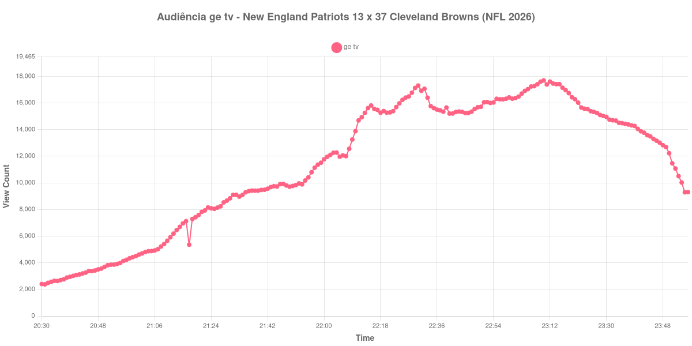

+++
date = 2026-08-28T06:05:00-03:00
draft = false
title = "Confira como foi a audiência de New England Patriots X Cleveland Browns na ge tv - 27-08-2026"
author = 'Instituto Cambacica de Audiência'
summary = "Veja como foi a audiência de New England Patriots X Cleveland Browns na ge tv"
tags = ['YouTube', 'Analytics', 'Audiência', 'GETV', 'New England Patriots', 'Cleveland Browns', 'NFL']
categories = ['Audiência']
campeonatos = ['NFL 2026']
data_evento = 2026-08-27
+++

Neste texto, vamos informar os resultados da audiência em tempo real obtidos na ge tv, durante a transmissão de New England Patriots X Cleveland Browns, terceira semana da pré-temporada da NFL 2026, no Huntington Bank Field, em Cleveland, em 27/08/2026. O Cleveland Browns venceu por 37 a 13.

A audiência começou a ser medida às 27/08/2026 20:30:55 (Horário de Brasília). Como a coleta começou menos de duas horas antes do início do evento, o gráfico e os números abaixo partem do primeiro registro disponível; o recorte vai até o último dado coletado. Os principais pontos da audiência são (em aparelhos conectados):

* **Início da Medição (20:30:55): 2.405**
* **Início da partida (21:00:55): 4.503**
* **Final da partida (23:50:55): 12.226**
* **Final da Medição (23:56:55): 9.307**

O pico de audiência foi às 23:10:55, durante a cobertura do evento, com **17.695** aparelhos conectados simultâneos.

No formato curto adotado para esta modalidade, o dado central é a trajetória entre os limites confirmados: o pico de 17.695 aparelhos ocorreu durante a cobertura do evento. No encerramento do evento havia 12.226 aparelhos conectados.

A medição terminou com 9.307 aparelhos conectados. O valor pertence ao contador ao vivo e não a visualizações do vídeo gravado; não encontramos cauda de VOD neste lote.

No gráfico a seguir, mostramos a evolução da audiência entre o primeiro registro da medição e o último registro coletado, num total de 207 registros:

Para você verificar os metadados desta medição, você pode consultar o [repositório contendo o CSV com os dados e com os prints do minuto a minuto da medição](https://github.com/institutocambacica/audiencias_26_27_08_2026/tree/main/2026-08-27_new-england-patriots-x-cleveland-browns_00BoR6Wax0M).

---

*Para mais informações sobre nossa metodologia, visite nossa página [Sobre](/sobre).*
