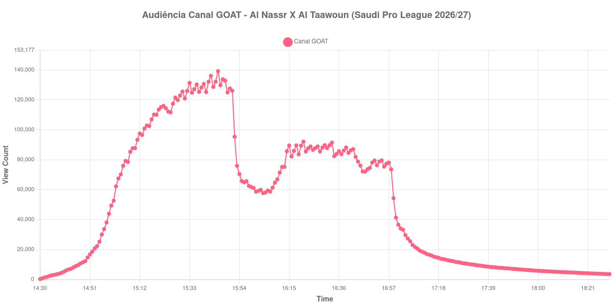

+++
date = 2026-08-31T00:11:00-03:00
draft = false
title = "Confira como foi a audiência de Al Nassr X Al Taawoun no Canal GOAT - 28-08-2026"
author = 'Instituto Cambacica de Audiência'
summary = "Veja como foi a audiência de Al Nassr X Al Taawoun no Canal GOAT"
tags = ['YouTube', 'Analytics', 'Audiência', 'Canal-GOAT', 'Al Nassr', 'Al Taawoun', 'Saudi Pro League']
categories = ['Audiência']
canais = ['Canal GOAT']
campeonatos = ['Saudi Pro League 2026']
data_evento = 2026-08-28
+++

Neste texto, vamos informar os resultados da audiência em tempo real obtidos no Canal GOAT, durante a transmissão de Al Nassr X Al Taawoun, apresentada como parte de Saudi Pro League 2026/27, em 28/08/2026. Não foi possível confirmar a cronologia completa do evento em fontes independentes; por isso, adotamos o formato curto e não atribuímos à curva horários de jogo, placares ou outros fatos não demonstrados pelos dados.

A audiência começou a ser medida às 28/08/2026 14:30:55 (Horário de Brasília). Os dados abaixo partem do primeiro registro disponível e o recorte vai até o último dado coletado. Os principais pontos da audiência são (em aparelhos conectados):

* **Início da Medição (14:30:55): 313**
* **Final da Medição (18:30:55): 3.617**

O pico de audiência foi às 15:45:55, com **139.251** aparelhos conectados simultâneos.

No registro de Al Nassr X Al Taawoun no Canal GOAT, a audiência inicial foi de 313 aparelhos e o teto foi de 139.251. No final da coleta, o contador registrava 3.617 aparelhos conectados.

Não encontramos cauda de VOD nesta medição. Os números representam o contador da transmissão ao vivo, não visualizações acumuladas do vídeo gravado.

No gráfico a seguir, mostramos a evolução da audiência entre o primeiro registro da medição e o último registro coletado, num total de 241 registros:

Para você verificar os metadados desta medição, você pode consultar o [repositório contendo o CSV com os dados e com os prints do minuto a minuto da medição](https://github.com/institutocambacica/audiencias_29_30_08_2026/tree/main/2026-08-28_al-nassr-x-al-taawoun_t4cUeB83NTc).

---

*Para mais informações sobre nossa metodologia, visite nossa página [Sobre](/sobre).*
