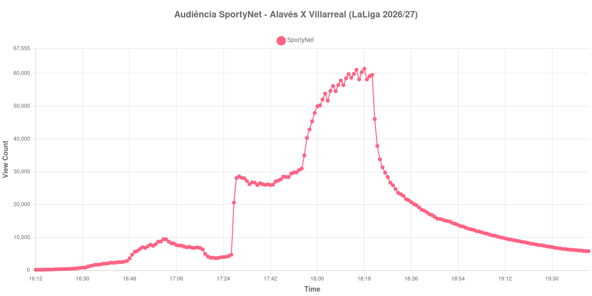

+++
date = 2026-08-31T00:17:00-03:00
draft = false
title = "Confira como foi a audiência de Alavés X Villarreal na SportyNet - 28-08-2026"
author = 'Instituto Cambacica de Audiência'
summary = "Veja como foi a audiência de Alavés X Villarreal na SportyNet"
tags = ['YouTube', 'Analytics', 'Audiência', 'SportyNet', 'Alavés', 'Villarreal', 'LaLiga']
categories = ['Audiência']
canais = ['SportyNet']
campeonatos = ['LaLiga 2026']
data_evento = 2026-08-28
+++

Neste texto, vamos informar os resultados da audiência em tempo real obtidos na SportyNet, durante a transmissão de Alavés X Villarreal, apresentada como parte de LaLiga 2026/27, em 28/08/2026. Não foi possível confirmar a cronologia completa do evento em fontes independentes; por isso, adotamos o formato curto e não atribuímos à curva horários de jogo, placares ou outros fatos não demonstrados pelos dados.

A audiência começou a ser medida às 28/08/2026 16:12:55 (Horário de Brasília). Os dados abaixo partem do primeiro registro disponível e o recorte vai até o último dado coletado. Os principais pontos da audiência são (em aparelhos conectados):

* **Início da Medição (16:12:55): 202**
* **Final da Medição (19:44:55): 5.851**

O pico de audiência foi às 18:18:55, com **61.413** aparelhos conectados simultâneos.

Durante a coleta de Alavés X Villarreal na SportyNet, os dados começaram em 202 aparelhos, chegaram ao pico de 61.413 e terminaram em 5.851. Sem cronologia confirmada, não relacionamos essas mudanças a momentos específicos do evento.

Não encontramos cauda de VOD nesta medição. Os números representam o contador da transmissão ao vivo, não visualizações acumuladas do vídeo gravado.

No gráfico a seguir, mostramos a evolução da audiência entre o primeiro registro da medição e o último registro coletado, num total de 213 registros:

Para você verificar os metadados desta medição, você pode consultar o [repositório contendo o CSV com os dados e com os prints do minuto a minuto da medição](https://github.com/institutocambacica/audiencias_29_30_08_2026/tree/main/2026-08-28_alaves-x-villareal_-J_eQ4A8hjc).

---

*Para mais informações sobre nossa metodologia, visite nossa página [Sobre](/sobre).*
