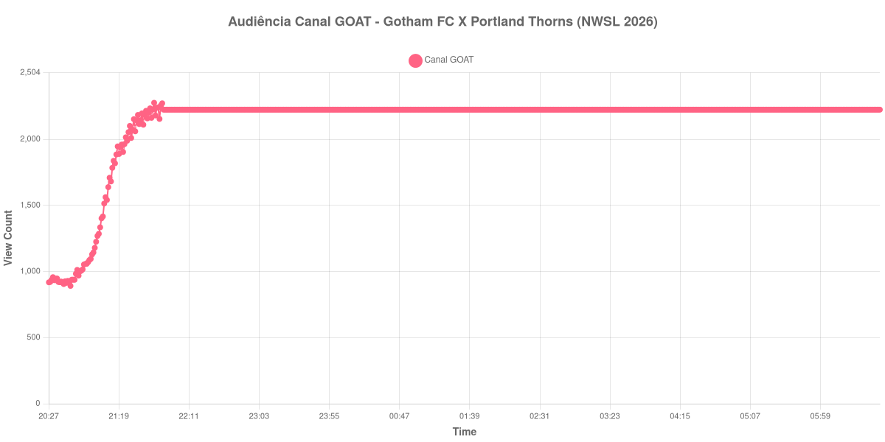

+++
date = 2026-08-31T00:21:00-03:00
draft = false
title = "Confira como foi a audiência de Gotham FC X Portland Thorns no Canal GOAT - 28-08-2026"
author = 'Instituto Cambacica de Audiência'
summary = "Veja como foi a audiência de Gotham FC X Portland Thorns no Canal GOAT"
tags = ['YouTube', 'Analytics', 'Audiência', 'Canal-GOAT', 'Gotham FC', 'Portland Thorns', 'NWSL']
categories = ['Audiência']
canais = ['Canal GOAT']
campeonatos = ['NWSL 2026']
data_evento = 2026-08-28
+++

Neste texto, vamos informar os resultados da audiência em tempo real obtidos no Canal GOAT, durante a transmissão de Gotham FC X Portland Thorns, apresentada como parte de NWSL 2026, em 28/08/2026. Não foi possível confirmar a cronologia completa do evento em fontes independentes; por isso, adotamos o formato curto e não atribuímos à curva horários de jogo, placares ou outros fatos não demonstrados pelos dados.

A audiência começou a ser medida às 28/08/2026 20:27:55 (Horário de Brasília). Os dados abaixo partem do primeiro registro disponível e o recorte vai até o último dado coletado. Os principais pontos da audiência são (em aparelhos conectados):

* **Início da Medição (20:27:55): 918**
* **Final da Medição (06:43:55): 2.224**

O pico de audiência foi às 21:45:55, com **2.276** aparelhos conectados simultâneos.

Na curva de Gotham FC X Portland Thorns no Canal GOAT, a coleta partiu de 918 aparelhos conectados e alcançou o máximo de 2.276. O último registro válido marcou 2.224 aparelhos.

Não encontramos cauda de VOD nesta medição. Os números representam o contador da transmissão ao vivo, não visualizações acumuladas do vídeo gravado.

No gráfico a seguir, mostramos a evolução da audiência entre o primeiro registro da medição e o último registro coletado, num total de 617 registros:

Para você verificar os metadados desta medição, você pode consultar o [repositório contendo o CSV com os dados e com os prints do minuto a minuto da medição](https://github.com/institutocambacica/audiencias_29_30_08_2026/tree/main/2026-08-28_gotham-fc-x-portland-thorns_A_l2XfC-EA4).

---

*Para mais informações sobre nossa metodologia, visite nossa página [Sobre](/sobre).*
