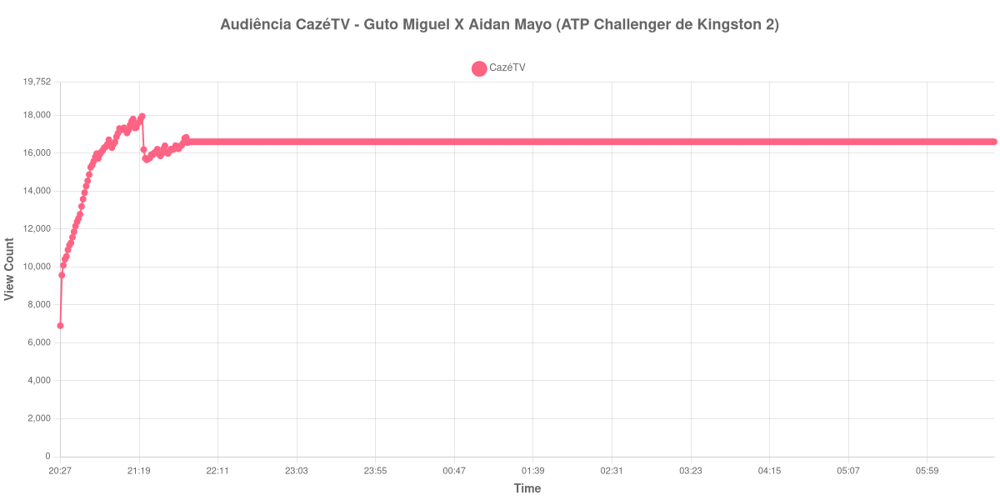

+++
date = 2026-08-31T00:23:00-03:00
draft = false
title = "Confira como foi a audiência de Guto Miguel X Aidan Mayo na CazéTV - 28-08-2026"
author = 'Instituto Cambacica de Audiência'
summary = "Veja como foi a audiência de Guto Miguel X Aidan Mayo na CazéTV"
tags = ['YouTube', 'Analytics', 'Audiência', 'CazeTV', 'Guto Miguel', 'Aidan Mayo', 'ATP Challenger']
categories = ['Audiência']
canais = ['CazeTV']
campeonatos = ['ATP Challenger 2026']
data_evento = 2026-08-28
+++

Neste texto, vamos informar os resultados da audiência em tempo real obtidos na CazéTV, durante a transmissão de Guto Miguel X Aidan Mayo, apresentada como parte de ATP Challenger de Kingston 2, em 28/08/2026. Não foi possível confirmar a cronologia completa do evento em fontes independentes; por isso, adotamos o formato curto e não atribuímos à curva horários de jogo, placares ou outros fatos não demonstrados pelos dados.

A audiência começou a ser medida às 28/08/2026 20:27:55 (Horário de Brasília). Os dados abaixo partem do primeiro registro disponível e o recorte vai até o último dado coletado. Os principais pontos da audiência são (em aparelhos conectados):

* **Início da Medição (20:27:55): 6.907**
* **Final da Medição (06:43:55): 16.607**

O pico de audiência foi às 21:21:55, com **17.956** aparelhos conectados simultâneos.

Para Guto Miguel X Aidan Mayo na CazéTV, o maior valor do período observado foi 17.956 aparelhos. A comparação segura é com os próprios limites da medição: 6.907 no início e 16.607 no encerramento.

Não encontramos cauda de VOD nesta medição. Os números representam o contador da transmissão ao vivo, não visualizações acumuladas do vídeo gravado.

No gráfico a seguir, mostramos a evolução da audiência entre o primeiro registro da medição e o último registro coletado, num total de 617 registros:

Para você verificar os metadados desta medição, você pode consultar o [repositório contendo o CSV com os dados e com os prints do minuto a minuto da medição](https://github.com/institutocambacica/audiencias_29_30_08_2026/tree/main/2026-08-28_guto-miguel-x-aidan-mayo_QNqqU5Gmek4).

---

*Para mais informações sobre nossa metodologia, visite nossa página [Sobre](/sobre).*
