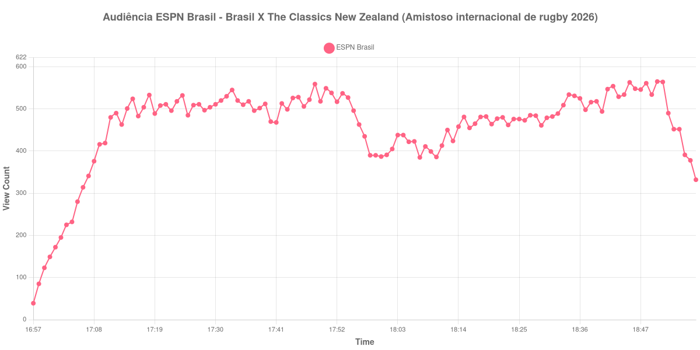

+++
date = 2026-08-31T01:11:00-03:00
draft = false
title = "Confira como foi a audiência de Brasil X The Classics New Zealand na ESPN Brasil - 29-08-2026"
author = 'Instituto Cambacica de Audiência'
summary = "Veja como foi a audiência de Brasil X The Classics New Zealand na ESPN Brasil"
tags = ['YouTube', 'Analytics', 'Audiência', 'ESPN Brasil', 'Brasil', 'The Classics New Zealand', 'Rugby']
categories = ['Audiência']
canais = ['ESPN Brasil']
campeonatos = ['Rugby 2026']
data_evento = 2026-08-29
+++

Neste texto, vamos informar os resultados da audiência em tempo real obtidos na ESPN Brasil, durante a transmissão de Brasil X The Classics New Zealand, apresentada como parte de Amistoso internacional de rugby 2026, em 29/08/2026. Não foi possível confirmar a cronologia completa do evento em fontes independentes; por isso, adotamos o formato curto e não atribuímos à curva horários de jogo, placares ou outros fatos não demonstrados pelos dados.

A audiência começou a ser medida às 29/08/2026 16:57:55 (Horário de Brasília). Os dados abaixo partem do primeiro registro disponível e o recorte vai até o último dado coletado. Os principais pontos da audiência são (em aparelhos conectados):

* **Início da Medição (16:57:55): 39**
* **Final da Medição (18:57:55): 332**

O pico de audiência foi às 18:50:55, com **565** aparelhos conectados simultâneos.

Para Brasil X The Classics New Zealand na ESPN Brasil, o maior valor do período observado foi 565 aparelhos. A comparação segura é com os próprios limites da medição: 39 no início e 332 no encerramento.

Não encontramos cauda de VOD nesta medição. Os números representam o contador da transmissão ao vivo, não visualizações acumuladas do vídeo gravado.

No gráfico a seguir, mostramos a evolução da audiência entre o primeiro registro da medição e o último registro coletado, num total de 121 registros:

Para você verificar os metadados desta medição, você pode consultar o [repositório contendo o CSV com os dados e com os prints do minuto a minuto da medição](https://github.com/institutocambacica/audiencias_29_30_08_2026/tree/main/2026-08-29_brasil-x-the-classics-new-zealand-direto-do-pacaembu_jRHNZQq1biM).

---

*Para mais informações sobre nossa metodologia, visite nossa página [Sobre](/sobre).*
