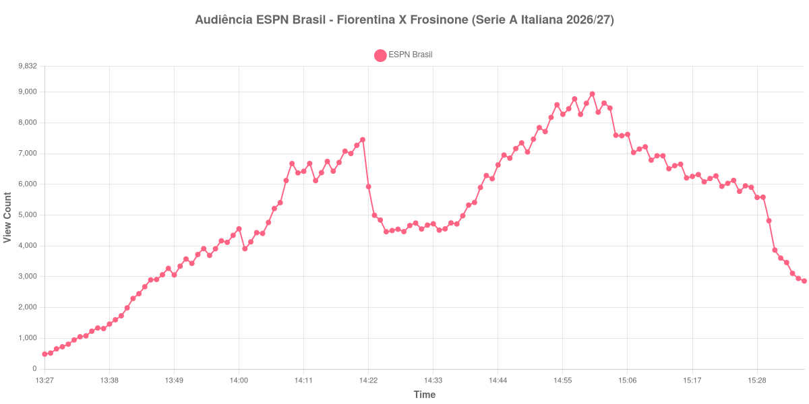

+++
date = 2026-08-31T00:49:00-03:00
draft = false
title = "Confira como foi a audiência de Fiorentina X Frosinone na ESPN Brasil - 29-08-2026"
author = 'Instituto Cambacica de Audiência'
summary = "Veja como foi a audiência de Fiorentina X Frosinone na ESPN Brasil"
tags = ['YouTube', 'Analytics', 'Audiência', 'ESPN Brasil', 'Fiorentina', 'Frosinone', 'Serie A Italiana']
categories = ['Audiência']
canais = ['ESPN Brasil']
campeonatos = ['Serie A Italiana 2026']
data_evento = 2026-08-29
+++

Neste texto, vamos informar os resultados da audiência em tempo real obtidos na ESPN Brasil, durante a transmissão de Fiorentina X Frosinone, apresentada como parte de Serie A Italiana 2026/27, em 29/08/2026. Não foi possível confirmar a cronologia completa do evento em fontes independentes; por isso, adotamos o formato curto e não atribuímos à curva horários de jogo, placares ou outros fatos não demonstrados pelos dados.

A audiência começou a ser medida às 29/08/2026 13:27:55 (Horário de Brasília). Os dados abaixo partem do primeiro registro disponível e o recorte vai até o último dado coletado. Os principais pontos da audiência são (em aparelhos conectados):

* **Início da Medição (13:27:55): 483**
* **Final da Medição (15:36:55): 2.859**

O pico de audiência foi às 15:00:55, com **8.938** aparelhos conectados simultâneos.

Durante a coleta de Fiorentina X Frosinone na ESPN Brasil, os dados começaram em 483 aparelhos, chegaram ao pico de 8.938 e terminaram em 2.859. Sem cronologia confirmada, não relacionamos essas mudanças a momentos específicos do evento.

Não encontramos cauda de VOD nesta medição. Os números representam o contador da transmissão ao vivo, não visualizações acumuladas do vídeo gravado.

No gráfico a seguir, mostramos a evolução da audiência entre o primeiro registro da medição e o último registro coletado, num total de 130 registros:

Para você verificar os metadados desta medição, você pode consultar o [repositório contendo o CSV com os dados e com os prints do minuto a minuto da medição](https://github.com/institutocambacica/audiencias_29_30_08_2026/tree/main/2026-08-29_fiorentina-x-frosinone_FT7dVuIwiNg).

---

*Para mais informações sobre nossa metodologia, visite nossa página [Sobre](/sobre).*
