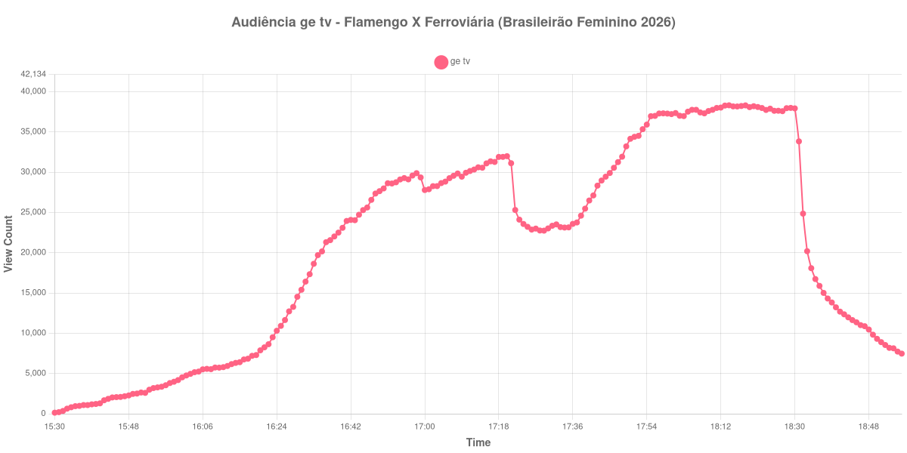

+++
date = 2026-08-31T00:59:00-03:00
draft = false
title = "Confira como foi a audiência de Flamengo X Ferroviária na ge tv - 29-08-2026"
author = 'Instituto Cambacica de Audiência'
summary = "Veja como foi a audiência de Flamengo X Ferroviária na ge tv"
tags = ['YouTube', 'Analytics', 'Audiência', 'GETV', 'Flamengo', 'Ferroviária', 'Brasileirão Feminino']
categories = ['Audiência']
canais = ['GETV']
campeonatos = ['Brasileirao Feminino 2026']
data_evento = 2026-08-29
+++

Neste texto, vamos informar os resultados da audiência em tempo real obtidos na ge tv, durante a transmissão de Flamengo X Ferroviária, apresentada como parte de Brasileirão Feminino 2026, em 29/08/2026. Não foi possível confirmar a cronologia completa do evento em fontes independentes; por isso, adotamos o formato curto e não atribuímos à curva horários de jogo, placares ou outros fatos não demonstrados pelos dados.

A audiência começou a ser medida às 29/08/2026 15:30:55 (Horário de Brasília). Os dados abaixo partem do primeiro registro disponível e o recorte vai até o último dado coletado. Os principais pontos da audiência são (em aparelhos conectados):

* **Início da Medição (15:30:55): 131**
* **Final da Medição (18:56:55): 7.467**

O pico de audiência foi às 18:14:55, com **38.303** aparelhos conectados simultâneos.

No registro de Flamengo X Ferroviária na ge tv, a audiência inicial foi de 131 aparelhos e o teto foi de 38.303. No final da coleta, o contador registrava 7.467 aparelhos conectados.

Não encontramos cauda de VOD nesta medição. Os números representam o contador da transmissão ao vivo, não visualizações acumuladas do vídeo gravado.

No gráfico a seguir, mostramos a evolução da audiência entre o primeiro registro da medição e o último registro coletado, num total de 207 registros:

Para você verificar os metadados desta medição, você pode consultar o [repositório contendo o CSV com os dados e com os prints do minuto a minuto da medição](https://github.com/institutocambacica/audiencias_29_30_08_2026/tree/main/2026-08-29_flamengo-x-ferroviaria_FqXzlx4JOiI).

---

*Para mais informações sobre nossa metodologia, visite nossa página [Sobre](/sobre).*
