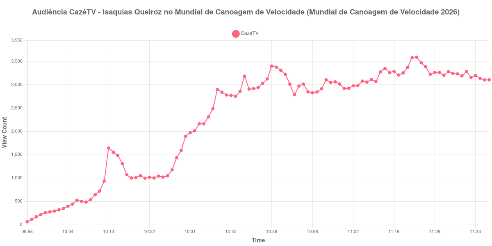

+++
date = 2026-08-31T00:33:00-03:00
draft = false
title = "Confira como foi a audiência de Isaquias Queiroz no Mundial de Canoagem de Velocidade na CazéTV - 29-08-2026"
author = 'Instituto Cambacica de Audiência'
summary = "Veja como foi a audiência de Isaquias Queiroz no Mundial de Canoagem de Velocidade na CazéTV"
tags = ['YouTube', 'Analytics', 'Audiência', 'CazeTV', 'Isaquias Queiroz no Mundial de Canoagem de Velocidade', 'Mundial de Canoagem de Velocidade']
categories = ['Audiência']
canais = ['CazeTV']
campeonatos = ['Mundial de Canoagem de Velocidade 2026']
data_evento = 2026-08-29
+++

Neste texto, vamos informar os resultados da audiência em tempo real obtidos na CazéTV, durante a transmissão de Isaquias Queiroz no Mundial de Canoagem de Velocidade, apresentada como parte de Mundial de Canoagem de Velocidade 2026, em 29/08/2026. Não foi possível confirmar a cronologia completa do evento em fontes independentes; por isso, adotamos o formato curto e não atribuímos à curva horários de jogo, placares ou outros fatos não demonstrados pelos dados.

A audiência começou a ser medida às 29/08/2026 09:55:55 (Horário de Brasília). Os dados abaixo partem do primeiro registro disponível e o recorte vai até o último dado coletado. Os principais pontos da audiência são (em aparelhos conectados):

* **Início da Medição (09:55:55): 63**
* **Final da Medição (11:37:55): 3.105**

O pico de audiência foi às 11:21:55, com **3.590** aparelhos conectados simultâneos.

Durante a coleta de Isaquias Queiroz no Mundial de Canoagem de Velocidade na CazéTV, os dados começaram em 63 aparelhos, chegaram ao pico de 3.590 e terminaram em 3.105. Sem cronologia confirmada, não relacionamos essas mudanças a momentos específicos do evento.

Não encontramos cauda de VOD nesta medição. Os números representam o contador da transmissão ao vivo, não visualizações acumuladas do vídeo gravado.

No gráfico a seguir, mostramos a evolução da audiência entre o primeiro registro da medição e o último registro coletado, num total de 103 registros:

Para você verificar os metadados desta medição, você pode consultar o [repositório contendo o CSV com os dados e com os prints do minuto a minuto da medição](https://github.com/institutocambacica/audiencias_29_30_08_2026/tree/main/2026-08-29_isaquias-queiroz-no-mundial-de-canoagem-de-velocidade_qWWO3s6wolA).

---

*Para mais informações sobre nossa metodologia, visite nossa página [Sobre](/sobre).*
