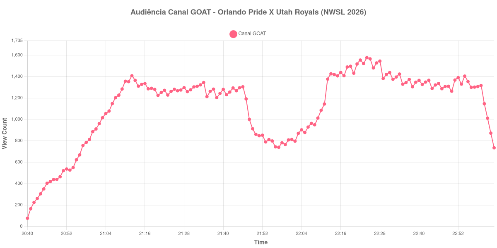

+++
date = 2026-08-31T01:25:00-03:00
draft = false
title = "Confira como foi a audiência de Orlando Pride X Utah Royals no Canal GOAT - 29-08-2026"
author = 'Instituto Cambacica de Audiência'
summary = "Veja como foi a audiência de Orlando Pride X Utah Royals no Canal GOAT"
tags = ['YouTube', 'Analytics', 'Audiência', 'Canal-GOAT', 'Orlando Pride', 'Utah Royals', 'NWSL']
categories = ['Audiência']
canais = ['Canal GOAT']
campeonatos = ['NWSL 2026']
data_evento = 2026-08-29
+++

Neste texto, vamos informar os resultados da audiência em tempo real obtidos no Canal GOAT, durante a transmissão de Orlando Pride X Utah Royals, apresentada como parte de NWSL 2026, em 29/08/2026. Não foi possível confirmar a cronologia completa do evento em fontes independentes; por isso, adotamos o formato curto e não atribuímos à curva horários de jogo, placares ou outros fatos não demonstrados pelos dados.

A audiência começou a ser medida às 29/08/2026 20:40:55 (Horário de Brasília). Os dados abaixo partem do primeiro registro disponível e o recorte vai até o último dado coletado. Os principais pontos da audiência são (em aparelhos conectados):

* **Início da Medição (20:40:55): 77**
* **Final da Medição (23:03:55): 735**

O pico de audiência foi às 22:24:55, com **1.577** aparelhos conectados simultâneos.

Na curva de Orlando Pride X Utah Royals no Canal GOAT, a coleta partiu de 77 aparelhos conectados e alcançou o máximo de 1.577. O último registro válido marcou 735 aparelhos.

Não encontramos cauda de VOD nesta medição. Os números representam o contador da transmissão ao vivo, não visualizações acumuladas do vídeo gravado.

No gráfico a seguir, mostramos a evolução da audiência entre o primeiro registro da medição e o último registro coletado, num total de 144 registros:

Para você verificar os metadados desta medição, você pode consultar o [repositório contendo o CSV com os dados e com os prints do minuto a minuto da medição](https://github.com/institutocambacica/audiencias_29_30_08_2026/tree/main/2026-08-29_orlando-pride-x-utah-royals_s7EpDERoBbI).

---

*Para mais informações sobre nossa metodologia, visite nossa página [Sobre](/sobre).*
