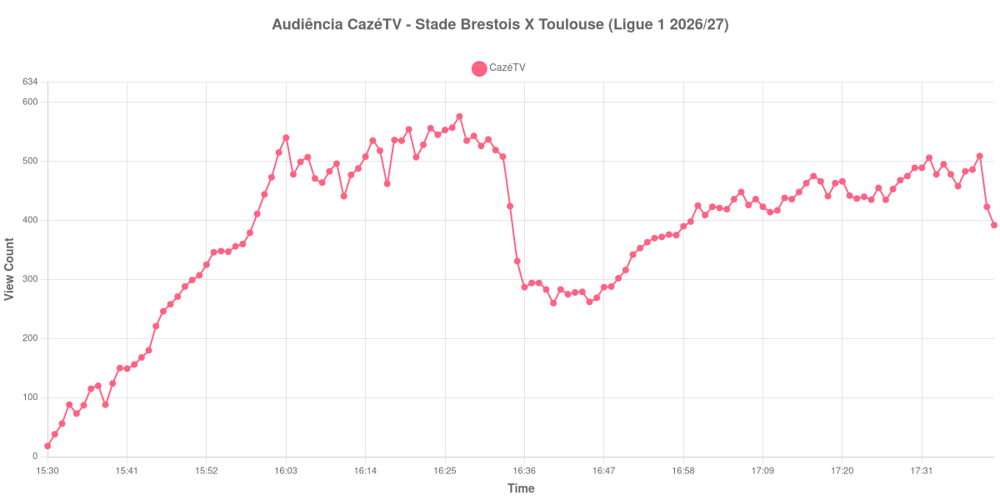

+++
date = 2026-08-31T01:03:00-03:00
draft = false
title = "Confira como foi a audiência de Stade Brestois X Toulouse na CazéTV - 29-08-2026"
author = 'Instituto Cambacica de Audiência'
summary = "Veja como foi a audiência de Stade Brestois X Toulouse na CazéTV"
tags = ['YouTube', 'Analytics', 'Audiência', 'CazeTV', 'Stade Brestois', 'Toulouse', 'Ligue 1']
categories = ['Audiência']
canais = ['CazeTV']
campeonatos = ['Ligue 1 2026']
data_evento = 2026-08-29
+++

Neste texto, vamos informar os resultados da audiência em tempo real obtidos na CazéTV, durante a transmissão de Stade Brestois X Toulouse, apresentada como parte de Ligue 1 2026/27, em 29/08/2026. Não foi possível confirmar a cronologia completa do evento em fontes independentes; por isso, adotamos o formato curto e não atribuímos à curva horários de jogo, placares ou outros fatos não demonstrados pelos dados.

A audiência começou a ser medida às 29/08/2026 15:30:55 (Horário de Brasília). Os dados abaixo partem do primeiro registro disponível e o recorte vai até o último dado coletado. Os principais pontos da audiência são (em aparelhos conectados):

* **Início da Medição (15:30:55): 18**
* **Final da Medição (17:41:55): 392**

O pico de audiência foi às 16:27:55, com **576** aparelhos conectados simultâneos.

Para Stade Brestois X Toulouse na CazéTV, o maior valor do período observado foi 576 aparelhos. A comparação segura é com os próprios limites da medição: 18 no início e 392 no encerramento.

Não encontramos cauda de VOD nesta medição. Os números representam o contador da transmissão ao vivo, não visualizações acumuladas do vídeo gravado.

No gráfico a seguir, mostramos a evolução da audiência entre o primeiro registro da medição e o último registro coletado, num total de 132 registros:

Para você verificar os metadados desta medição, você pode consultar o [repositório contendo o CSV com os dados e com os prints do minuto a minuto da medição](https://github.com/institutocambacica/audiencias_29_30_08_2026/tree/main/2026-08-29_stade-brestois-x-toulouse_roifcZ1JwDE).

---

*Para mais informações sobre nossa metodologia, visite nossa página [Sobre](/sobre).*
