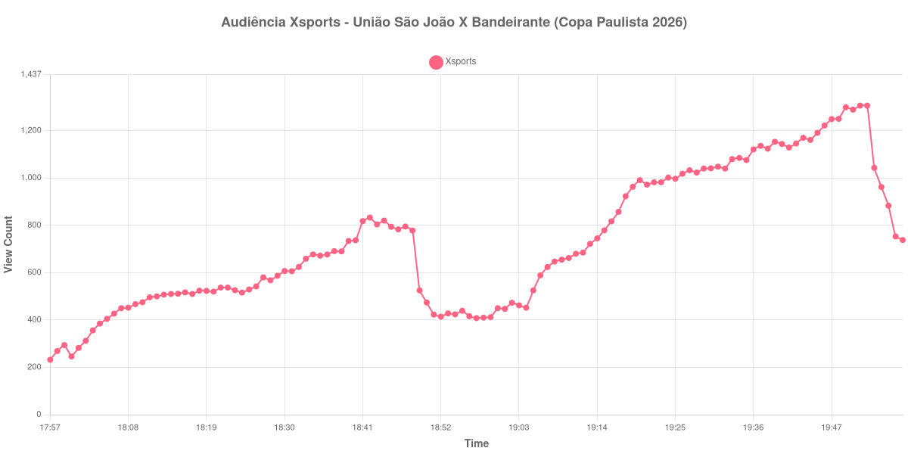

+++
date = 2026-08-31T01:21:00-03:00
draft = false
title = "Confira como foi a audiência de União São João X Bandeirante na Xsports - 29-08-2026"
author = 'Instituto Cambacica de Audiência'
summary = "Veja como foi a audiência de União São João X Bandeirante na Xsports"
tags = ['YouTube', 'Analytics', 'Audiência', 'Xsports', 'União São João', 'Bandeirante', 'Copa Paulista']
categories = ['Audiência']
canais = ['Xsports']
campeonatos = ['Copa Paulista 2026']
data_evento = 2026-08-29
+++

Neste texto, vamos informar os resultados da audiência em tempo real obtidos na Xsports, durante a transmissão de União São João X Bandeirante, apresentada como parte de Copa Paulista 2026, em 29/08/2026. Não foi possível confirmar a cronologia completa do evento em fontes independentes; por isso, adotamos o formato curto e não atribuímos à curva horários de jogo, placares ou outros fatos não demonstrados pelos dados.

A audiência começou a ser medida às 29/08/2026 17:57:55 (Horário de Brasília). Os dados abaixo partem do primeiro registro disponível e o recorte vai até o último dado coletado. Os principais pontos da audiência são (em aparelhos conectados):

* **Início da Medição (17:57:55): 232**
* **Final da Medição (19:57:55): 738**

O pico de audiência foi às 19:51:55, com **1.306** aparelhos conectados simultâneos.

Durante a coleta de União São João X Bandeirante na Xsports, os dados começaram em 232 aparelhos, chegaram ao pico de 1.306 e terminaram em 738. Sem cronologia confirmada, não relacionamos essas mudanças a momentos específicos do evento.

Não encontramos cauda de VOD nesta medição. Os números representam o contador da transmissão ao vivo, não visualizações acumuladas do vídeo gravado.

No gráfico a seguir, mostramos a evolução da audiência entre o primeiro registro da medição e o último registro coletado, num total de 121 registros:

Para você verificar os metadados desta medição, você pode consultar o [repositório contendo o CSV com os dados e com os prints do minuto a minuto da medição](https://github.com/institutocambacica/audiencias_29_30_08_2026/tree/main/2026-08-29_uniao-sao-joao-x-bandeirante_N9Xe24yq0Fw).

---

*Para mais informações sobre nossa metodologia, visite nossa página [Sobre](/sobre).*
