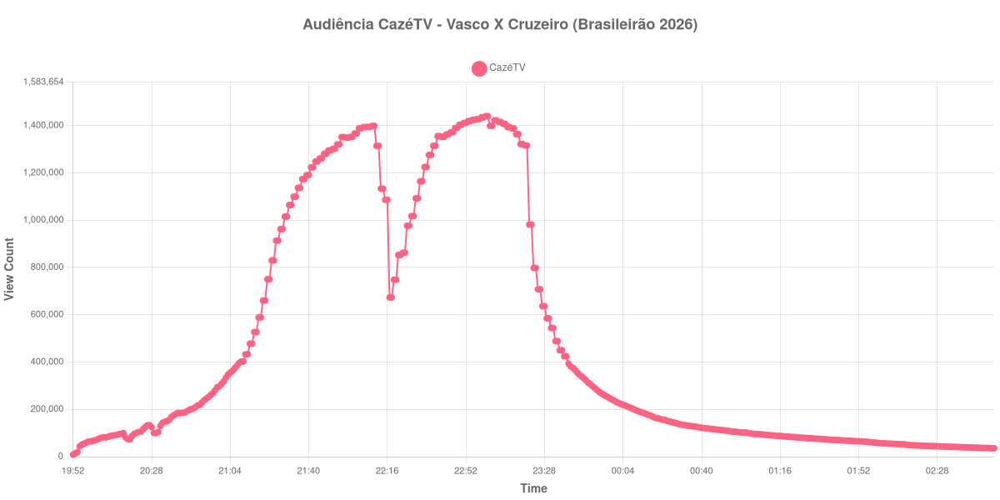

+++
date = 2026-08-31T01:23:00-03:00
draft = false
title = "Confira como foi a audiência de Vasco X Cruzeiro na CazéTV - 29-08-2026"
author = 'Instituto Cambacica de Audiência'
summary = "Veja como foi a audiência de Vasco X Cruzeiro na CazéTV"
tags = ['YouTube', 'Analytics', 'Audiência', 'CazeTV', 'Vasco', 'Cruzeiro', 'Brasileirão']
categories = ['Audiência']
canais = ['CazeTV']
campeonatos = ['Brasileirao 2026']
data_evento = 2026-08-29
+++

Neste texto, vamos informar os resultados da audiência em tempo real obtidos na CazéTV, durante a transmissão de Vasco X Cruzeiro, apresentada como parte de Brasileirão 2026, em 29/08/2026. Não foi possível confirmar a cronologia completa do evento em fontes independentes; por isso, adotamos o formato curto e não atribuímos à curva horários de jogo, placares ou outros fatos não demonstrados pelos dados.

A audiência começou a ser medida às 29/08/2026 19:52:55 (Horário de Brasília). Os dados abaixo partem do primeiro registro disponível e o recorte vai até o último dado coletado. Os principais pontos da audiência são (em aparelhos conectados):

* **Início da Medição (19:52:55): 8.651**
* **Final da Medição (02:54:55): 35.606**

O pico de audiência foi às 23:01:55, com **1.439.685** aparelhos conectados simultâneos.

No registro de Vasco X Cruzeiro na CazéTV, a audiência inicial foi de 8.651 aparelhos e o teto foi de 1.439.685. No final da coleta, o contador registrava 35.606 aparelhos conectados.

Não encontramos cauda de VOD nesta medição. Os números representam o contador da transmissão ao vivo, não visualizações acumuladas do vídeo gravado.

No gráfico a seguir, mostramos a evolução da audiência entre o primeiro registro da medição e o último registro coletado, num total de 423 registros:

Para você verificar os metadados desta medição, você pode consultar o [repositório contendo o CSV com os dados e com os prints do minuto a minuto da medição](https://github.com/institutocambacica/audiencias_29_30_08_2026/tree/main/2026-08-29_vasco-x-cruzeiro_3nJN6ljCXHQ).

---

*Para mais informações sobre nossa metodologia, visite nossa página [Sobre](/sobre).*
