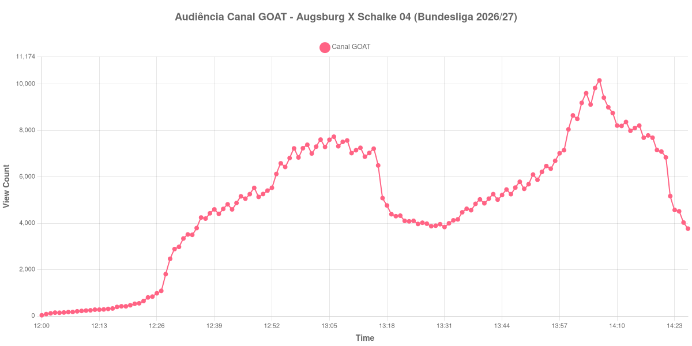

+++
date = 2026-08-31T01:55:00-03:00
draft = false
title = "Confira como foi a audiência de Augsburg X Schalke 04 no Canal GOAT - 30-08-2026"
author = 'Instituto Cambacica de Audiência'
summary = "Veja como foi a audiência de Augsburg X Schalke 04 no Canal GOAT"
tags = ['YouTube', 'Analytics', 'Audiência', 'Canal-GOAT', 'Augsburg', 'Schalke 04', 'Bundesliga']
categories = ['Audiência']
canais = ['Canal GOAT']
campeonatos = ['Bundesliga 2026']
data_evento = 2026-08-30
+++

Neste texto, vamos informar os resultados da audiência em tempo real obtidos no Canal GOAT, durante a transmissão de Augsburg X Schalke 04, apresentada como parte de Bundesliga 2026/27, em 30/08/2026. Não foi possível confirmar a cronologia completa do evento em fontes independentes; por isso, adotamos o formato curto e não atribuímos à curva horários de jogo, placares ou outros fatos não demonstrados pelos dados.

A audiência começou a ser medida às 30/08/2026 12:00:55 (Horário de Brasília). Os dados abaixo partem do primeiro registro disponível e o recorte vai até o último dado coletado. Os principais pontos da audiência são (em aparelhos conectados):

* **Início da Medição (12:00:55): 33**
* **Final da Medição (14:26:55): 3.769**

O pico de audiência foi às 14:06:55, com **10.158** aparelhos conectados simultâneos.

No registro de Augsburg X Schalke 04 no Canal GOAT, a audiência inicial foi de 33 aparelhos e o teto foi de 10.158. No final da coleta, o contador registrava 3.769 aparelhos conectados.

Não encontramos cauda de VOD nesta medição. Os números representam o contador da transmissão ao vivo, não visualizações acumuladas do vídeo gravado.

No gráfico a seguir, mostramos a evolução da audiência entre o primeiro registro da medição e o último registro coletado, num total de 147 registros:

Para você verificar os metadados desta medição, você pode consultar o [repositório contendo o CSV com os dados e com os prints do minuto a minuto da medição](https://github.com/institutocambacica/audiencias_29_30_08_2026/tree/main/2026-08-30_augsburg-x-schalke-04_UvBWc4V6pD8).

---

*Para mais informações sobre nossa metodologia, visite nossa página [Sobre](/sobre).*
