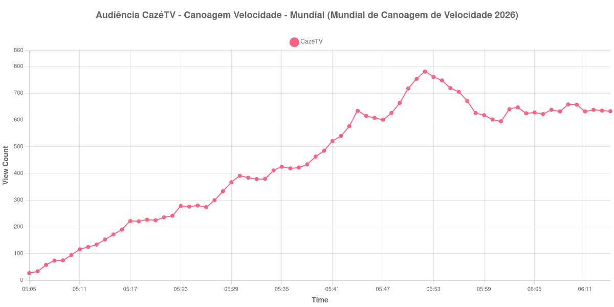

+++
date = 2026-08-31T01:33:00-03:00
draft = false
title = "Confira como foi a audiência de Canoagem Velocidade - Mundial na CazéTV - 30-08-2026"
author = 'Instituto Cambacica de Audiência'
summary = "Veja como foi a audiência de Canoagem Velocidade - Mundial na CazéTV"
tags = ['YouTube', 'Analytics', 'Audiência', 'CazeTV', 'Canoagem Velocidade - Mundial', 'Mundial de Canoagem de Velocidade']
categories = ['Audiência']
canais = ['CazeTV']
campeonatos = ['Mundial de Canoagem de Velocidade 2026']
data_evento = 2026-08-30
+++

Neste texto, vamos informar os resultados da audiência em tempo real obtidos na CazéTV, durante a transmissão de Canoagem Velocidade - Mundial, apresentada como parte de Mundial de Canoagem de Velocidade 2026, em 30/08/2026. Não foi possível confirmar a cronologia completa do evento em fontes independentes; por isso, adotamos o formato curto e não atribuímos à curva horários de jogo, placares ou outros fatos não demonstrados pelos dados.

A audiência começou a ser medida às 30/08/2026 05:05:55 (Horário de Brasília). Os dados abaixo partem do primeiro registro disponível e o recorte vai até o último dado coletado. Os principais pontos da audiência são (em aparelhos conectados):

* **Início da Medição (05:05:55): 27**
* **Final da Medição (06:14:55): 633**

O pico de audiência foi às 05:52:55, com **781** aparelhos conectados simultâneos.

Na curva de Canoagem Velocidade - Mundial na CazéTV, a coleta partiu de 27 aparelhos conectados e alcançou o máximo de 781. O último registro válido marcou 633 aparelhos.

Não encontramos cauda de VOD nesta medição. Os números representam o contador da transmissão ao vivo, não visualizações acumuladas do vídeo gravado.

No gráfico a seguir, mostramos a evolução da audiência entre o primeiro registro da medição e o último registro coletado, num total de 70 registros:

Para você verificar os metadados desta medição, você pode consultar o [repositório contendo o CSV com os dados e com os prints do minuto a minuto da medição](https://github.com/institutocambacica/audiencias_29_30_08_2026/tree/main/2026-08-30_canoagem-velocidade_KUrfwvkMAy8).

---

*Para mais informações sobre nossa metodologia, visite nossa página [Sobre](/sobre).*
