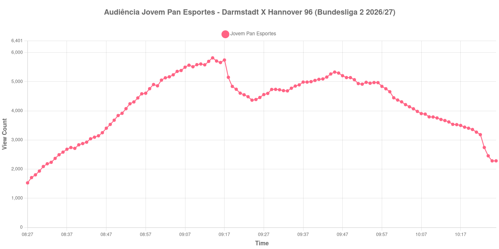

+++
date = 2026-08-31T01:37:00-03:00
draft = false
title = "Confira como foi a audiência de Darmstadt X Hannover 96 na Jovem Pan Esportes - 30-08-2026"
author = 'Instituto Cambacica de Audiência'
summary = "Veja como foi a audiência de Darmstadt X Hannover 96 na Jovem Pan Esportes"
tags = ['YouTube', 'Analytics', 'Audiência', 'Jovem Pan Esportes', 'Darmstadt', 'Hannover 96', 'Bundesliga 2']
categories = ['Audiência']
canais = ['Jovem Pan Esportes']
campeonatos = ['Bundesliga 2 2026']
data_evento = 2026-08-30
+++

Neste texto, vamos informar os resultados da audiência em tempo real obtidos na Jovem Pan Esportes, durante a transmissão de Darmstadt X Hannover 96, apresentada como parte de Bundesliga 2 2026/27, em 30/08/2026. Não foi possível confirmar a cronologia completa do evento em fontes independentes; por isso, adotamos o formato curto e não atribuímos à curva horários de jogo, placares ou outros fatos não demonstrados pelos dados.

A audiência começou a ser medida às 30/08/2026 08:27:55 (Horário de Brasília). Os dados abaixo partem do primeiro registro disponível e o recorte vai até o último dado coletado. Os principais pontos da audiência são (em aparelhos conectados):

* **Início da Medição (08:27:55): 1.529**
* **Final da Medição (10:26:55): 2.285**

O pico de audiência foi às 09:14:55, com **5.819** aparelhos conectados simultâneos.

Durante a coleta de Darmstadt X Hannover 96 na Jovem Pan Esportes, os dados começaram em 1.529 aparelhos, chegaram ao pico de 5.819 e terminaram em 2.285. Sem cronologia confirmada, não relacionamos essas mudanças a momentos específicos do evento.

Não encontramos cauda de VOD nesta medição. Os números representam o contador da transmissão ao vivo, não visualizações acumuladas do vídeo gravado.

No gráfico a seguir, mostramos a evolução da audiência entre o primeiro registro da medição e o último registro coletado, num total de 120 registros:

Para você verificar os metadados desta medição, você pode consultar o [repositório contendo o CSV com os dados e com os prints do minuto a minuto da medição](https://github.com/institutocambacica/audiencias_29_30_08_2026/tree/main/2026-08-30_darmstadt-x-hannover-96_m7H50k7aPT4).

---

*Para mais informações sobre nossa metodologia, visite nossa página [Sobre](/sobre).*
