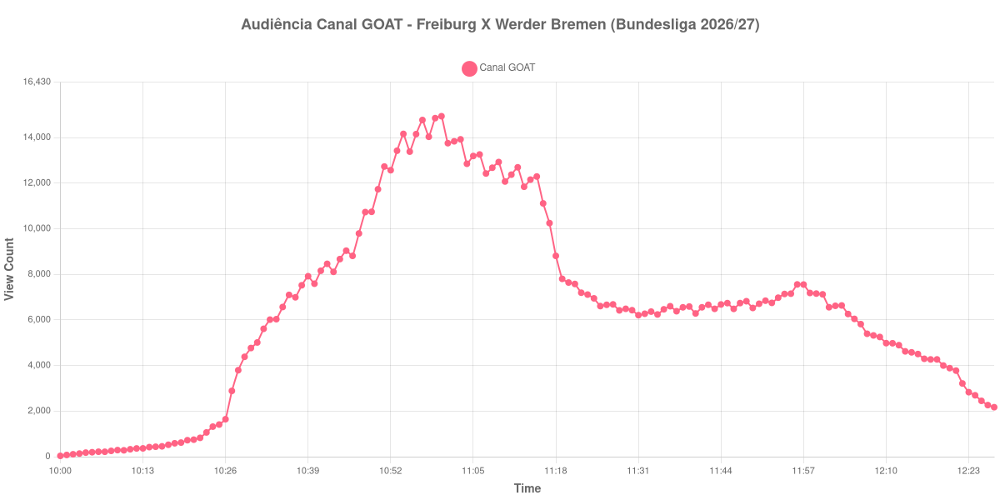

+++
date = 2026-08-31T01:45:00-03:00
draft = false
title = "Confira como foi a audiência de Freiburg X Werder Bremen no Canal GOAT - 30-08-2026"
author = 'Instituto Cambacica de Audiência'
summary = "Veja como foi a audiência de Freiburg X Werder Bremen no Canal GOAT"
tags = ['YouTube', 'Analytics', 'Audiência', 'Canal-GOAT', 'Freiburg', 'Werder Bremen', 'Bundesliga']
categories = ['Audiência']
canais = ['Canal GOAT']
campeonatos = ['Bundesliga 2026']
data_evento = 2026-08-30
+++

Neste texto, vamos informar os resultados da audiência em tempo real obtidos no Canal GOAT, durante a transmissão de Freiburg X Werder Bremen, apresentada como parte de Bundesliga 2026/27, em 30/08/2026. Não foi possível confirmar a cronologia completa do evento em fontes independentes; por isso, adotamos o formato curto e não atribuímos à curva horários de jogo, placares ou outros fatos não demonstrados pelos dados.

A audiência começou a ser medida às 30/08/2026 10:00:55 (Horário de Brasília). Os dados abaixo partem do primeiro registro disponível e o recorte vai até o último dado coletado. Os principais pontos da audiência são (em aparelhos conectados):

* **Início da Medição (10:00:55): 35**
* **Final da Medição (12:27:55): 2.170**

O pico de audiência foi às 11:00:55, com **14.936** aparelhos conectados simultâneos.

Durante a coleta de Freiburg X Werder Bremen no Canal GOAT, os dados começaram em 35 aparelhos, chegaram ao pico de 14.936 e terminaram em 2.170. Sem cronologia confirmada, não relacionamos essas mudanças a momentos específicos do evento.

Não encontramos cauda de VOD nesta medição. Os números representam o contador da transmissão ao vivo, não visualizações acumuladas do vídeo gravado.

No gráfico a seguir, mostramos a evolução da audiência entre o primeiro registro da medição e o último registro coletado, num total de 148 registros:

Para você verificar os metadados desta medição, você pode consultar o [repositório contendo o CSV com os dados e com os prints do minuto a minuto da medição](https://github.com/institutocambacica/audiencias_29_30_08_2026/tree/main/2026-08-30_freiburg-x-werder-bremen_bonYhm2lrUo).

---

*Para mais informações sobre nossa metodologia, visite nossa página [Sobre](/sobre).*
